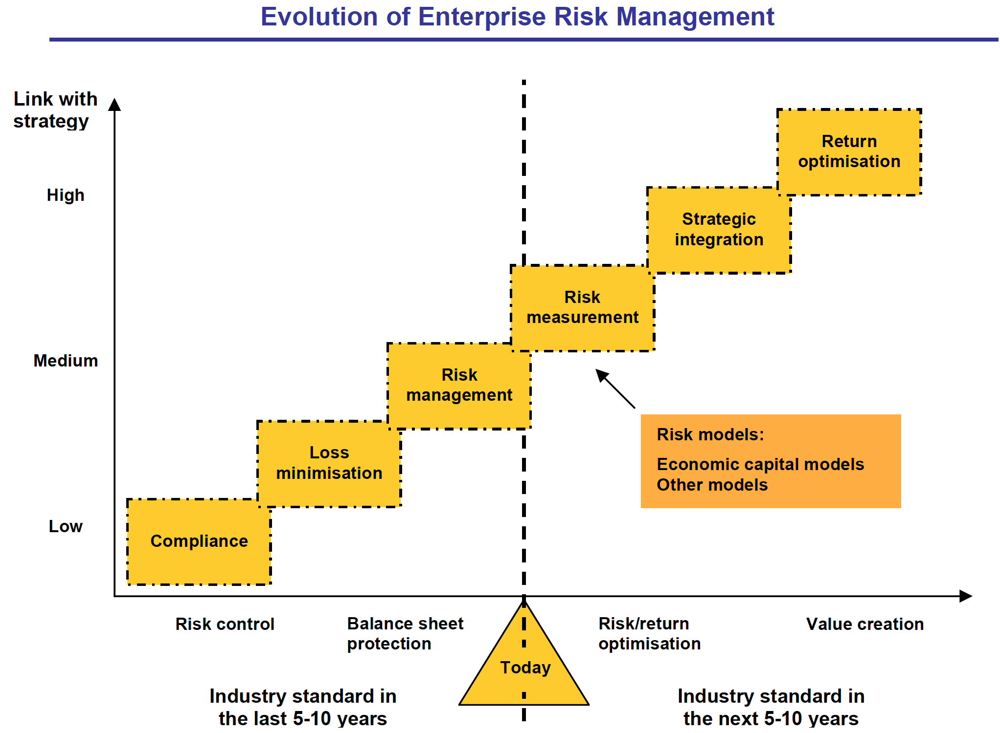

## Module Objective

Describe the concept of ERM:

* Define what does ERM mean
* Describe the difference concepts of ERM
    * Holistic approach
    * Downside and upside risk
    * Measurement of risk
    * Quantifiable risks
    * Responses to risk and risk management

## ERM Considerations

There is always a **cost** with reducing risk

* Implementing EMR without embracing its ethos can **increase the bureaucracy** of the organization

RM needs to **complement** `existing competitive advantage` of the organization

* Need to consider the additional workload added to the BU with RM

Need to understand the risk and business side of the organization before applying ERM

## Traditional RM

RM $\neq$ ERM

Company can engage in traditional RM without engaging in ERM

***Typically applied in a silo approach***

* Applied within individual departments or BU
* Each parts of a business work independently

***Problem with the silo approach***

* Misses the **interactions** between risks from different BUs
* Diversification or concentration of risk from comment risk between different silos
* Risks can fall through the cracks or **mismanaged** due to the `lack of ownership`

***Risk management is the process of***:

* **Identifying** the risks faced
* **Assessing** the likelihood of these risks materializing and their impact
* How to **deal with** each risk
    * `Retain`? If so the risk needs to be `monitored`
    * `Remove`, `reduce` or `transfer` the risk
    
**Key objective**:  
Maximize risk adjusted return

## ERM

### Definitions

1. Lam 2014

    ***Risk***:  
    A `variable` that can cause `deviation` from an expected outcome
      
    ***ERM***:  
    A **comprehensive** and **integrated** `framework` for managing `key risks` in order to:
    
    * *Achieve* **business objectives**
    * *Minimize* unexpected earnings **volatility**
    * *Maximize* **firm value**

2. COSO 2004

    ***ERM*** is a `process`:
      
    * *Effected by* an entity's:
        * **Board of directors**
        * **Managment**
        * **Other personnel**
    * *Applied in*: 
        * **Strategy setting**
        * **Across the enterprise**
    * *Desinged to*: 
        * **Identify** potential `events` that may affect the entity
        * **Manage risk** to be *within* its `appetite`
        * Provide reasonable **assurance** regarding the `achievement of entity objectives`

3. ISO 31000

    ***Risk***:  
    *Effect* of **uncertainty** on `objectives`
      
    ***Risk management***:  
    Coordinated activities to **direct** and **control** an organization with regard to `risk`

4. CAS ERM Research Committee: Overview of Enterprise Risk Management 2002

    ***ERM***:
    
    * Discipline by which an organization in any industry **assesses**, **controls**, **exploits**, **finances**, and **monitors** `risks from all sources` 
    * To **Increase** the organisation’s short- and long-term **value** to its `stakeholders`

### ERM Framework

Formalized process of details on how to accomplish the following:

* **Recognize** the `context`
* **Identify** the `risks`
* **Assess** and **comparing** the `risks` *with* `risk appetite`
* Deciding on the **extent** to which risks are `managed`
* Taking the **appropriate action**
* **Reporting** on and **reviewing** the `action taken`

### History of ERM

### ERM Implementation

**DO** $\Rightarrow$ Companies need to take a strategic view about how ERM aligns with the insurer’s `values`, `culture` and `approach`

**AVOID** $\Rightarrow$ Risk management frameworks developed in a `piecemeal` or `ad hoc` manner is unlikely to garner broad-based support across the organisation and will more likely reinforce a view that ERM is something more akin to a `compliance exercise`

#### Enabling environment

...for implementing ERM

* Demonstrable **executive management support** is critical

* Strong and direct **linkages** must be made *between* `ERM` and the company’s `business strategy` and its `day-to-day operations`

* The company must establish **clear accountabilities** for the various aspects of risk management, *distinguishing* between those in `line management` roles and those in `risk management` roles

#### Board's Role

... in ERM implementation

***Key to implementation***:  
Buy in and support from the Board  
$\therefore$ Needs to **inform the board** about issues they `want` and `need` *to know*

* ERM is one of the few truly enterprise wide business capabilities that both **provides an opportunity to change the way an organisation does business**  
$\hookrightarrow$ **BUT** also can be ‘used’ to drive certain agendas that may not be aligned to the business imperatives, and stakeholder needs

* The `output` of ERM **may not suit all** stakeholders

    $\therefore$ Board buy-in with management is critical
        
    $\hookrightarrow$ Ensure `needs` and `expectations` are met and the ERM investment delivers **maximum** `return` and **minimizes** any `agency/stakeholder bias`

* The Board is well placed to:  
Take a `strategic` and `holistic` perspective to **ensure long term sustainability** of the ERM investment

#### Key learnings

... for ERM Implementation

* Setting **clear objectives** for the delivery of `expected outcomes` associated with the ERM project

* Assigning `experienced` and `suitably` skilled **resources** using a rigorous selection process

    * Esp. w.r.t. `project leadership` and `change management roles`
    
* *Sufficient detailed* **planning upfront** to reflect realistic effort / time frames

* Implementing rigorous processes to:

    1. Tightly **manage scope**
    
    2. **Gated criteria** for `milestones` and `cost/benefits`

* **Appropriate project governance**:

    Clear **executive-level ownership** and **accountability** for delivery of all project aspects 

* *Realism* about:

    1. **expected “pain”** through early stages of implementation and **support required**
    2. **complexity**, **cost** and **time frames**

* *Thorough* **risk management** / **mitigation strategies** and **support processes**

* Culture that demands: 

    1. **Objective** and **transparent** `project reporting`
    
    2. **Rapid escalation** (and welcoming) of “bad news”  
    $\Rightarrow$ problems get addressed earlier and at less cost

### Key Concepts of ERM

No universal definition of ERM, just various central themes and general agreement on the overall concept

* From IAA: **holistic**, **integrated**, **top-down**, **strategic approach** and **value-driven**, **aligning strategy**

#### 1. Holistic Approach

This is one of the main additional elements of ERM to traditional RM

**Holistic consideration** of risk information relating:

1. `Past events` (e.g. losses)
2. `Current performance` (e.g. risk indicators)
3. `Future outcomes` (e.g. the risk profile or risk assessment)

Considering the `risks of the enterprise` **as a whole** (concern with all risk faced by the enterprise)

* Can appreciate the **concentration** of risk that arise from *variety of sources* within the enterprise
* Account for **diversification** across the enterprise

RM techniques are *applied* **consistently** across the whole enterprise  
(e.g. *Common* `definitions`, `classifications` and `recording` of risk)

* This is necessary for RM to operate effectively
* Ensure all risks are **covered consistently** in terms of the way they are `identified`, `reported` and `treated`

| ***Structure***
|
|       From **top down** (lead by the `board`)  
|
|       $\hookrightarrow$ **Coordinate** through `risk management function` (e.g. IRM) that is lead by a `CRO`  
|       $\hookrightarrow$ **Incorporate** into the day to day operations of `all personnel`

***Ensures***

* All risks faced by an enterprise are considered
    * Taken into account **links** *between risks* from different parts of the business
* **Same risk appetite** for the whole enterprise

#### 2. Upside & downside Risk

**Risk**:  
Uncertainty and volatility

**Upside risk**:  
Better than expected outcome

* Important to consider both upside and downside risk when outcomes is not symmetrical

***ERM and Upside Risk***:

* ERM should allow company to **exploit** upside risks (opportunities)

    Need to thoroughly understand the risks the company faces to determine if there's **capacity** to take on more risk

* ERM can **create value** by seizing suitable opportunities to **optimize** `risk-adjusted return` (In addition to minimizing effect of downside risk)

* **Integrate** `RM` and `measurement` into the `business processes` and strategic `decision making`

    * **Value creation** is one of the additional elements of ERM to traditional RM
    
#### 3. Quantifiable Risks

Risk that can be measured in some way

**Measurement of risk** (after the risk is identified)

* E.g. `ranking`, `assessment` of the *absolute* levels of risk
* To determine whether the *level of risk* is **acceptable?**

Good risk measurement practices are essential to ERM

* **Severity**  
Financial impact of a risk
    * e.g. risk of counter-party default, risk of interest rate $\Delta$
* **Frequency**:  
Likelihood of its occurrence over a given time horizon

#### 4. Unquantifiable Risks

Risk that cannot be measured

* E.g. due to **unidentifiable** `loss distribution`;  
**difficult to assess** `nature` of the risk
* Often these are **operational risks**, e.g. terrorist attack on firm HQ

Important to consider these risks and assess them in a *qualitative* way

* E.g. consider the likelihood and severity into low, mid, high

ERM is concerned:

1. **Behaviors** (the risk management "culture")
2. **Risk control processes**

#### 5. Risk Responses

Need to consider responses after identification (and quantified)

* Doing nothing can be a response as well as mitigating the risk

**Retain**:  
Company is happy to live with the risk

* E.g. small risk; type of risk the company is well place to deal with
* Or just the other options are unfeasible

**Remove**:

* e.g. Cease production of a risk LoB

**Reduce**:

* Either reduce in potential severity or frequency

**Transfer**:

* e.g. Purchase insurance or outsourcing (like IT or security)
* Need to compensate the party assuming the risk