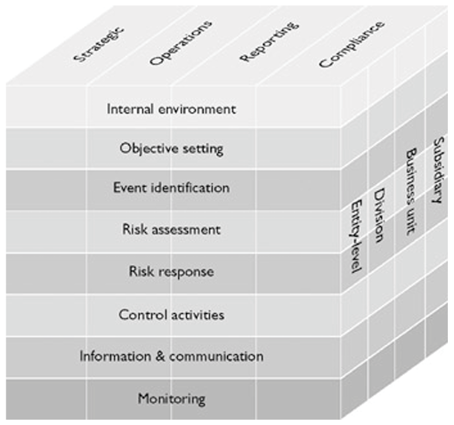

## Module Objective

Understand risk frameworks in regulatory environments

* Role of regulators in ERM and effective management of the supervisor relationship
* Basel Accord and SII frameworks incl. underlying principles and approaches to RM
* Understand SOX and other regulatory risk frameworks and their underlying principles
* Demonstrate an awareness of how different parts of an organization and different parts of a portfolio may be subject to different capital adequacy standards

This discuss external risk frameworks (regulators and credit rating agency etc) that can influence an organization's approach to ERM

External parties may prescribe or limit a company's activities or demand certain standards (e.g. capital requirement) to minimize risk to various stakeholders

* External risk frameworks are usually applied as a whole
* They can be mandatory (Basel Accords), advisory (ISO 31000) or voluntary (S&P credit rating criteria)

## External superivision

***Prudential supervisory processes***:

* **Oversight** (e.g. financial)
* **Licensing**
* Requirement to **maintain minimum standards** (e.g operational)
* Procedures of **monitoring** compliance with standards and licences
* Processes to **take action** against those who fail to comply

### Supervising and Controlling Parties

Different parts of the organizations can be subject to different regulatory regimes and capital standards

* **International** business are regulated by different territories

* Subsidiaries that operate in **different industry sectors** (Finance vs manufacturing) or **different areas** within the same sector (banking vs insurance)

* Subsidiaries or portfolios within the **same sector** that are subject to different regulatory requirements (insurer vs captive)

* Subsidiaries that a new ventures or acquisitions and are at **different life cycle stages**

#### Categories of Supervisors 

In addition to government

***Professional bodies***

* Ensure members are **adequately trained** (through exams)

* Ensure members **maintain their competence**, through CE

* Some can **discipline members** that fail to maintain appropriate standards

* e.g. Institute and Faculty of Actuaries (IFA)

***Professional regulators***

Profession with statutory responsibilities are likely to be subject to external regulation

* **Setting standards**

* **Monitoring adherence** to the standards

* **Disciplining** non-adherence

* e.g. Financial Reporting Council (FRC); Chartered Financial Analyst Institude

***Industry bodies***

* **Promote the interest** of their members through `lobbying` and other activities (e.g. `research projects`)

* These bodies have a clear bias

* e.g. Bristish Bankers' Association (BBA); British Sandwich Association (BSA); Association of British Insurers (ABI)

***Industry regulators*** (e.g. PRA, FCA, LSE)

* Act on **behalf of government** to **protect the public** by controlling the activities of firms and individuals operating in a particular industry

* Goal is to **prevent problems occurring** rather than punishing

* e.g. Prudential Regulation Authority (PRA); Financial Conduct Authority (FCA); London Stock Exchange (LSE)

#### Different Regulatory Regime

***Functional regulation***  
Different authorities oversee different activities (e.g. UK)

***Unified regulation***  
Single regulator covers a broad range of activities (e.g Australia)

* Pros:
    * *Easier* to regulate **conglomerates**
    * **Ensure consistency** in approach across activities
    * *Limits* incentive for **regulatory arbitrage**  
    (Firm picking the most favorable environment)
    * Economies of **scale**
    * Better **sharing of ideas** between regulatory staff
    * **Improved accountability**  
    (Less chance of buck-passing between regulators)

### Supervisions of Insurers

Aspects considered by a supervisor when *developing* their **understanding of an insurer**

* **Governance** arrangements

* **Business plans**

* **Financial reports**

* **RM strategies and processes**

#### Engagement with Supervisors

***Reasons to engage proactively*** with their supervisors

* `Insurer-regulator relationship` should be a **key component of an insurer's ERM framework**

* Proactively engaging regulators **reduce the level of risk a supervisor places on a particular insurer** as regulatory engages in risk-based regulation (focusing on riskiest companies)

* `Regulators` are also *well place* to **advise on what is best practice** (as they see a wide range of RM practices), more likely to benefit from such advice with proactive engagement

***Ways to best engage with supervisors*** for an `international insurer`

* **Link** the insurer's `regulatory strategy` with `corporate strategy`

* Implement a **transparent** and **comprehensive** `regulatory strategy` and **communicate** to the regulator

* *Ensure* that the principles of the insurer's `regulatory strategy` are **understood**, **accepted** and **adopted throughout the organization**

* When feeding back to a regulator on its proposal, *ensure* **feedback focuses on the important issues** and is **unbiased** and **practical**

* **Adopt best practice** *before* it becomes mandatory

* Be **proactive**

* **Communicate** *regularly* and *openly*

### Supervision of UK Financial Services

Prudential Regulation Authority (PRA)

Financial Conduct Authority (FCA)

London Stock Exchange (LSE)

#### FCA and PRA

FCA and PRA was previously combined in the **Financial Services Authority** (FSA)

***Prudential Regulation Authority***:

* Part of Bank of England

* Responsible for:

    1. Prudential regulation and supervision of banks, building societies, credit unions, insurers, investment firms
    
    2. Sets standards and supervises financial institutions at the level of the individual firm

***Financial Conduct Authority***:

* Regulates the **financial services industry** in the UK

* **Aim**:  
    
    1. Protect consumers
    
    2. Ensure stability of industry
    
    3. Promote healthy competition

FCA has the **UK Listing Authority (UKLA)** which:

* *Ensures* that listed companies **comply** with certain standards set out in the **Listing Rules**

* Requires that listed companies comply with certain **disclosure rules** on an ongoing basis

* Ensures that companies either comply with the **Combined Code of Corporate Governance 2003**, or state why they are not

* **Has power to suspend trading** in a company's share or cancel their listing

#### London Stock Exchange (LSE)

* Has 2 main traded markets:

    1. Main market
    2. Alternative investment market (AIM)

* There are >300 companies that are traded as "members"

    i.e. they deal directly with one another through the exchange, other companies have to deal with member firms, who then hedge their own positions)

* *Regulated* by the **Office of Fair Trading** (OFT)

    Services must comply with certain standards such as EU market standards set out in the **Investment Services Directive** (ISD)

## Basel Accords

Focus here is on the 3 pillars

Banks are **regulated by the country** they are based in (e.g. PRA for UK) but countries also **adopt recommendations** from European and international organizations

**Basel Committee on Banking Supervisions**: publishes the Basel regulations (for supervising banks)  
(BCS is under Bank for International Settlements BIS) 

***Key aim*** for each of the Basel accords:
 
* **Basel I** (1998): set **minimum capital requirements** for banks

* **Basel II** (2004): intended to **supersede Basel I**

* **Basel III**: developed post 2008 to **works alongside Basel II** and focuses primarily on specific `liquidity`, `systemic` and `counterpart risks`

### 3 Pillars of the Basel Accords:

***Pillar 1:***

* Minimum **regulatory capital** based on credit, market and op-risk exposed

***Pillar 2:***

* Deals with the issues of **Supervisory review**, which relates to the bank's internal risk management processes  

* Supervisors will *assess* the bank's **internal systems**, **processes** and **risk limits**

    Ensure that the bank has set aside **sufficient capital** for its risks  
* **Liquidity** and **concentration** risk is a particular focus

***Pillar 3:***

* Deals with the level of **disclosure** that the bank is required to undertake to the public and the market  

* Purpose is to **facilitate market discipline** on firms *through* **appropriate pricing for capital**

### Basel II Criticism

**Too much emphasis** on a **single number** that aggregates a wide variety of risks

* Some risk (e.g. op-risk) are **difficult to quantify**

* Some risk (e.g. liquidity) are only given **cursory consideration**

**Costly to implement** esp. if banks want to use internal model (to take advantage of the more beneficial capital regimes)

**Risk-herding**:  
Since banks all measure risk the same way, they might try to protect themselves in the same way at the same time of crisis

`Market value` may **undervalue certain assets** (e.g. gov fixed income)

Implied levels of **confidence could be spurious** as some securities (e.g. CDOs) have not existed for very long

**Pro-cyclicality**:  
Systemic risk that assets may need to be sold if their market value falls, which forces price even lower

**Overconfident** in risk control due to the complexity of the risk modeling

* More complex calculations $\neq$ more reliable calculations

### Basel III Responses

**Strengthens the capital requirements** for banks

* **Limiting cross-holding** in other financial institutions and associated to **limited systemic risk**

Introduces a **conservation buffer** to provide breathing space in times of financial stress

*Changes* the **minimum ratios** of `Tier 1` and `Tier 2` capital

Allows some **flexibility** in `capital requirements` in times of financial crisis to **limit pro-cyclicality**

**Criticism**:  
Continue to use risk-weighting **dependent upon subjective rating agency assessments**

## Solvency II

Again main focus is on the 3 pillars

SII is applicable to insurers operating in the EU with many similarity to Basel II

### SII Goal

Introduce economic **risk-based** solvency requirements

More comprehensive requirement of both the **asset and liability** side risks

Requirement to hold capital against **market, credit, op, underwriting risk**

Emphasis on the fact that **capital is not the only (or best) way** to militate against failures

More **prospective** focus

Streamlined approach which aims to *recognize* the **eonomic reality** of how groups operate

### SII Pillars

***Pillar 1***

**Quantitative** requirements

* Designed to *capture* **u/w**, **credit**, **market**, **op**, **liquidity** and **event** risks

* Can use `standard formula` or `internal model`

* **Thresholds**:

    **Solvency Capital Requirement** (SCR):  
    Below which regulatory action is taken
    
    **Minimum Capital Requirement** (MCR):  
    Below which authorization if foregone

***Pillar 2***

**Qualitative** requirements on undertakings such as **risk management** as well as supervisory activities

Carry out **Own Risk and Solvency Assessment** (ORSA) to quantify their ability to continue to meet the SCR and MCR in the near future

***Pillar 3***

Covers supervisory **reporting** and **disclosure**

### ORSA

***Purpose***:  
Provide board and sr mgmt of an insurance company with an assessment of

1. **Adequacy** of its risk management
2. `Current`, and likely `future` **solvency position**

ORSA ***requirements***:

* *Identify* the **risk exposed**

* *Identify* the **RM processes and controls** in place

* *Quantify* its ongoing **ability to continue to meet is solvency capital requirements** (both MCR and SCR)
    
    * *Projections* of **financial position** over terms longer than that normally required to calculate regulatory capital requirements

* *Analyse* `quantitative` and `qualitative` elements of its **business strategy**

* *Identify* the **relationship** between `RM` and the `level` and `quality` of `financial resources` **needed** and **available**

ORSA is now part of the International Association of Insurance Supervisors (IAIS) standards

* Overall principles are equivalent across jurisdictions with some different details

ORSA can be a ***tool for***:

* *Improving* insurance **business practice**

* Allowing regulators to *enhance* their **assessments** of the ability of insurance companies to **withstand stress events**

### Basel II vs. SII

***Similarity***:

1. **3 pillars** and each deals with similar aspects of the company's risk (capital, supervisory and disclosure)

2. Largely **risk-based** (vs SI was volume based)  
e.g. allocate capital to business areas that run the highest risk (can deal with embedded options, guarantees, and other non-volume related risk)

3. Designed to be suitable for **multi national** firms

4. The approaches to regulation are **consistent** for both banking and insurance business

***Differences***: contagion risk

* Basel II is based on the concept that market participants are dependent on one another and there is **significant contagion** risk in the banking sector

* SII was not designed with systemic risk in mind as it is considered unlikely

## Sarbanes Oxley

The 2002 SOX legislation was driven by the sudden collapse of Enron and WorldCom due to serious failing in their accounting reports

***Goal of SOX***:  
Improve the reliability of corporate disclosures to protect shareholders

***Key features*** of SOX:

* Formation of the **Public Accounting Oversight Board** (PAOB)
    
    * To *inspect* **published account** of quoted firms, and
    
    * To **prosecute** any accountancy firm deems to be in breath of the regulations
    
* **Increased accountability** of CEOs and CFOs of public companies
    
    * **Required to certify** that the financial statements do not contain any untrue facts and are personally responsible for financial disclosures in the financial reports

* Each published report must contain an **internal control report** (ICR) which commits management to maintain proper **internal controls** and **review their effectiveness**

* Requirement for external auditors to **report on the assessment made by the management**

* Made it **illegal for management to interfere** with the `audit process`

* Make it **illegal to destroy records or documents** with intent to influence an investigation

* Primary legislation, not voluntary code as in the UK

***Key themes for management to consider*** as part of their **governance, risk and compliance** (GRC) system

* Are `controls` **identified** and **documented**?

* Are `controls` **consistent** across the business?

* Do controls **address the critical factors**?  
(i.e. the right controls in place?)

* Do the controls **include RM**?

* What **testing procedures** are required before signing off the ICR

### COSO ERM Framework

SOX requires demonstration of adequate internal controls

* Many companies use COSO ERM framework (voluntary) to **demonstrate adequate internal controls**

COSO (Committee of Sponsoring Organizations of the Treadway Commission) issued a set of **definitions and standards** against which organizations can **assess their internal control**

***Principles*** of the COSO framework

1. `Risk` represents **opportunity** as well as **downside**

2. `ERM` is a **parallel** and **iterative** process

3. **Everyone** at all levels **has a role** in RM

4. Any RM process is imperfect

5. Implementation of RM must **balance cost with potential benefit**

***Dimensions*** of the COSO cube

1. ERM **components/process** (e.g. risk assessment, monitoring)

2. In each **business objective** covered by the framework (e.g. operational, strategic)

3. And at each **business level** of application (e.g. subsidiary, unit)

## Swiss Solvency Test

SST is a risk-based regulatory capital regime which has been fully in-forces in Switzerland since 1/1/2011

* Market consistent approach

* Similar requirements as SII Pillar 1

**Difference**
    
* Calibrates to 99% TVaR (instead of 99.5 VaR)
    
* Extreme scenarios have to be evaluated and the impact on the target capital has to be estimated