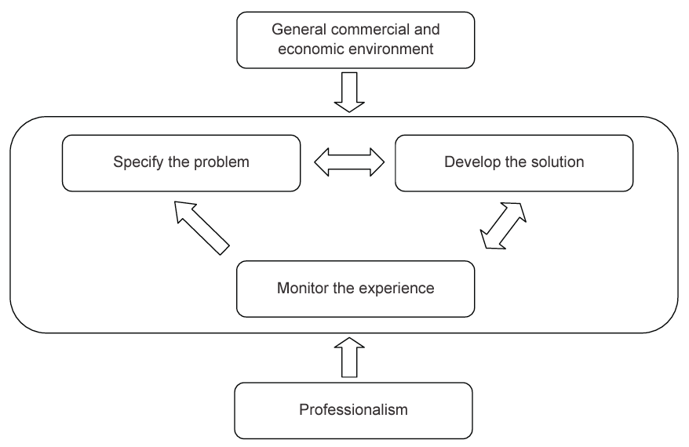
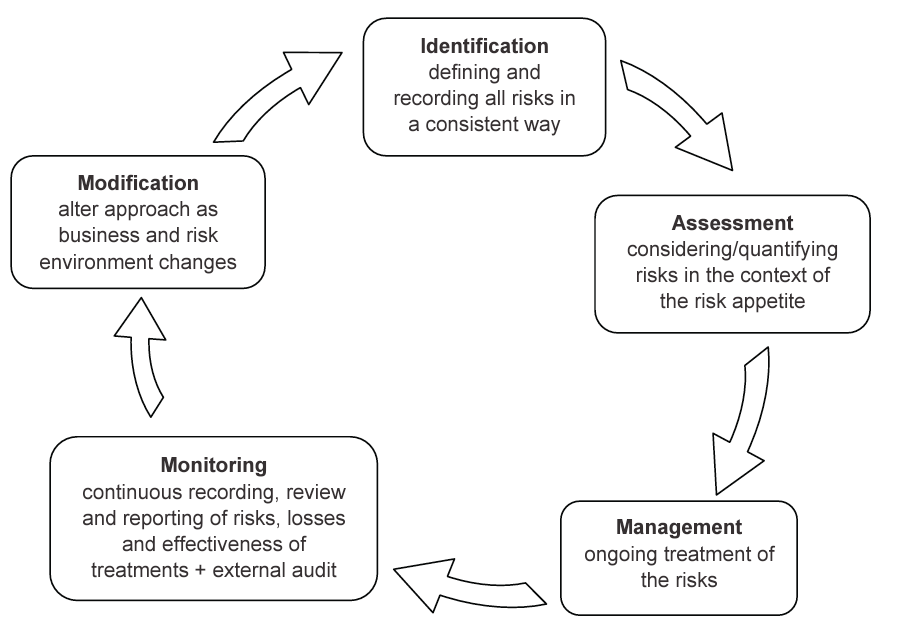

## Module Objective

Describe and assess the elements and structure of a successful RM function

* ERM **roles and responsibilities** of the people within an organization
* How the `different groups` should **interact**
* **Recommand a structure** for an organization's RM function

Describe how `financial` and `other risk` and `opportunities` **influence the selection of strategy**

Discuss the application of the **RM control cycle**, including the relevance of external influences and emerging risks

***

Focus is on some **high level processes and structures** that support effective RM

1. Look at how the overall strategy of a company may be influenced by risks, and how implementation of RM control cycles can enable it to deal appropriately with such risks

2. Consider how RM might be organized within a hierarchical role-based structure

## Corporate Strategy

The degrees to which `risks` are **embraced** or **mitigated** forms an important part of the overall **corporate strategy**

***Corporate Strategy***

* Involves *assessing* its `value chain`, `core competencies` and the `risk/return economies` of the overall business to decide **where in the value chain it ought to compete**

* Strategy covers a wide range of different corporate decisions

    (e.g. `sales growth`, `product choices`,`distribution`, `target markets` etc)

***Where RM comes into play***

* Risk **organiztion**, **retention**, and **transfer** can form *part of* the **overall business strategy** of the organization even thought they have a transactional context

* The degree to which risks are embraced or mitigated can be a key part of the overall strategy above, e.g.:

    * How much risky products to undertake
    * How much risk transfer or hedging to use
    * Managing the company's borrowing and gearing (leverage) ratio

***Problem with taking on too much risk***

Companies that takes on and retain more risk can achieve higher return but might find themselves **in difficulties more often**

* Problems in one area can quickly **disrupt operations** in other areas, reducing future profits further

* Company that is in difficulty may take decisions that **adversely affect some stakeholders**  
$\hookrightarrow$ Can reduce the profitability and value of the company

***Cost of financial distress***

* Encourage management to take **actions that conflict** with the `interest of other stakeholders`, e.g.:
    
    * Produce poor quality goods
    
    * Operating in unsafe environment 
    
    * Cut back on long term investment
    
    * Exiting promising LoB
    
    * Liquidating operations that was adequate

* **Volatility in earnings** can also *affect* the share price and ability to take advantage of **tax credits**

***Companies that can benefit from active RM***

Probability of financial distress can directly affect the value of a company

Companies that benefit most from active RM:

* Offer products with high added value (e.g. having high production quality)

* Offer products for which there are high costs of switching to another line

* Offer products for which the value to customers depends on complementary services or products supplied by other independent companies

* Have high sales growth opportunities

***Managing uncertainty***: **Horizon Scanning** and **Flexibility**

Attention is increasingly being paid to the management of uncertainty in the widest sense

* World is highly unpredictable
* Unexpected pressures may develop quite suddenly and have major impacts on organizations

**Systematic management of corporate uncertainty** is becoming more prevalent

1. Techniques (horizon scanning) to ensure potential problems are spotted early so that appropriate mitigating actions can be taken
    
    * **Horizon scanning**:

        Knowledge gathering to try to spot pressures at the earliest opportunity and to give the organization **time to adapt**

2. Embedding **resilience** and **flexibility** into corporate structures
    
    * Help deal with problems that aren't spotted sufficiently early to facilitate appropriate mitigation
    
    * Since adaptation is not always possible, some organizations are looking strategically at structural change so they become more flexible and can better withstand pressures when they arise
    
    * Particularly applies to **financial robustness** and flexibility
    
    * **Operational flexibility** examples:
    
        * Increase use of outsourcing
    
        * Spread operations over various sites/countries
    
        * Shift distribution channels
    
        * Move away from grouping individuals into specialist teams and operating more using multi-discipline project teams
        
## Risk Management Control Cycles

**Control Cycle**:

* One way of developing and implementing strategies to manage risk
* The cycle should be capable of taking account of changes in risk

Will discuss key points about control cycles from a number of different sources

Process and cycles are typically developed to meet an organization's specific needs (so no single right answer)

### Actuarial Control Cycle

Applying the actuarial control cycle to risk management to get the ERM process

### ERM Process

The cyclical structure of the process through analysis (+ identification of risk), quantification, management, monitoring, and modification is directly applicable to ERM

All the key components are discussed in details in later modules

Need **well defined risk metrics** and **risk reporting** systems to ensure the the **monitoring** stage is *robust*

## Organizational Structures Supporting ERM

### 3 Lines of Defence

1. **Line management staff in the BU**
    
    * Accountable for *measuring* and *managing* risk in `individual BUs` on a **daily basis**
    
    * Should be in *line with* the company's stated `risk appetite` and `risk policies`

2. **CRO and risk management team**
  
    * **Centralized** RM function and compliance team
  
    * Accountable for **establishing** `risk and compliance programs` and `policies`
  
    * **Supporting and monitoring** the `line management` and **reporting** to the `Board`

3. **Board and audit function**
  
    * *Accountable* for **effective governance** of the `RM process`, **setting RM strategy**, **approving policies**, and **ensuring that ERM is effective**
    
The Risk Management Function (RMF) doesn't have to be one department

* Can be a virtual team comprising distinct functions from different parts of the business
* But it's best to have a Central Risk Function CRF headed by a CRO