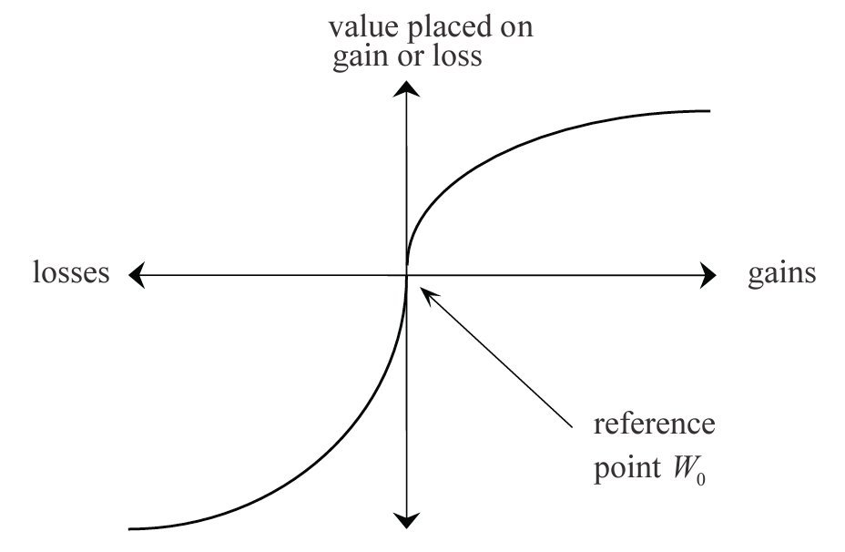
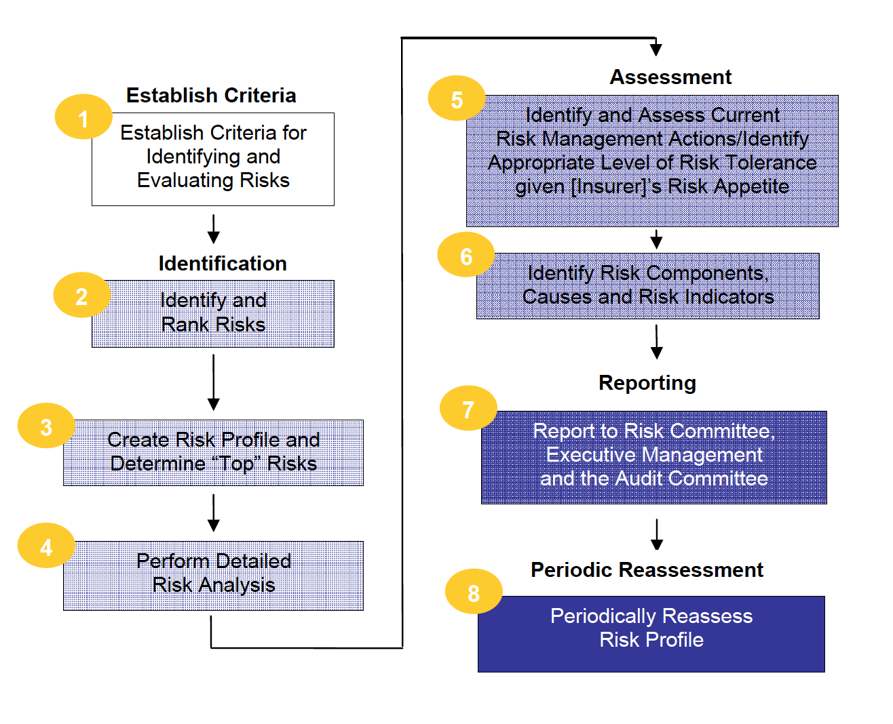
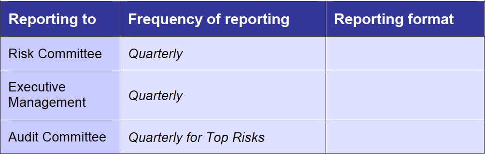

## Module 9 Objective

Describe how to *determine* a company's **risk appetite**, **risk capacity** and **risk objectives**

* Describe how a board might *express* and *communicate* its `expectations` and `requirements` by means of a **risk policy** (including risk appetite statement)

* Consider how an organization may *assess* and *describe* its **risk appetite**

* Consider how an organization maybe make use of a risk appetite statement when managing its risks (including establishing **risk tolerances**)

***Exam note:***  

* Will need to demonstrate how to **articulate** a desired `risk appetite` and `profile`

* Demonstrate understanding of how **business decisions** both *reflect* and *instigate* changes in the `risk profile`, particularly taking into account the **balance between risk and reward**

## Terminology

Definitions varies, so best to focus on the underlying principles

***Risk Exposure***  
Maximum loss that can be suffered if a risk event occurs

***Risk Profile***  
*Complete description* of the risk exposures of an organization

* Includes: Risk that might emerge in the future and that will affect the current business of the organization

***Risk Appetite***  
Reflecting the setting of `targets` and `limits` across the organization as a whole  
+ the breakdown of these high level statements into more detailed risk tolerances

* Degree of risk that an org. is **willing to accept** in order to *achieve objectives*

* Lam regards risk appetite as a desire/target level of risk

***Risk Tolerance***  
A more *detailed* set of statements (from risk appetite), many `quantitative` or `statistical` in nature  
(May apply to specific categories of risk and/or units of business)

* How much risk the org. is prepared to retain or how much variability it is prepared to withstand

* Note that IAA use risk tolerance to refer to higher level board statements

* Lam regards risk tolerance as the maximum for the organization

* There is also another level down (more operational), the risk metrics, that is discusses in Module 10

***Risk Limits***  
Group of `guidelines` that set limits on *acceptable actions* that might be taken today

* Each BUs need to work within the risk limits to be deemed working within it permitted risk tolerances

* Risk limits can be a component of risk capacity

***Risk Capacity***  
Volume of risk that an organization can take as measured by some `consistent measure` (e.g. economic capital)

* If there's spare capacity, then we can take positive actions that add economic value to the organization w/o breaching existing risk tolerances or risk limits

***

Note that IAA and Lam uses different terminology from the above

Regardless of the definitions, the ***key is to establish risk management policy*** with clear statements as to:

* **Upper bound** for risk exposures

    (can be driven by regulators, legislative limits, or stakeholders preferences)

* **Current** `risk exposures`

* **Desired** `risk exposures`  
(Risk targets)

* **Breakdown** of the `upper bound` and `risk targets` into more **detailed statements**

* **Detailed operational guidelines** for managers so that they can ensure the boundaries are not breached

The risk appetite (amount of risk the organization is willing to take) can be considered as the lower of the organization's risk capacity and its desired risk exposure/profile

* $\text{Risk Appetite} = \mathrm{min}[\text{Risk Capacity}, \text{Desired Risk Exposure/Profile}]$

Operationally, risk managers should ensure that the people they work with all have a **common understanding** of the terminology being used in discussions

* Failure to do so is an example of an operational risk

## Utility Functions

Utility function is an **expression of risk aversion**

* Useful when considering a companies' `risk appetite`

***Utility Function***

$u: \mathbb{R} \rightarrow \mathbb{R}$

Measure of happiness (or satisfaction) as a function of wealth ($W$)

Different org. or indiv. will have their own utility function $u$

* Each will gain a certain amount of satisfaction from a given amount of wealth

$\therefore$ Each will have a different attitude to potential gains or losses when presented with a certain risk/reward opportunity

**Features**:

1. Monotonically increasing

    (i.e. more is better)

2. Concave down so the amount of marginal utility decreases with marginal increase in wealth

    (e.g. people are risk averse)

**Absolute risk aversion**:

$a(W) = - \dfrac{u''(W)}{u'(W)} > 0$

**Relative risk aversion**:

$r(W) = W \times a(W)$

### Common utility functions

***Quadratic***

$u(W) = \alpha W - \dfrac{1}{2}W^2$

* Maximize expected wealth subject to volatility

* **Increasing** `absolute` and `relative` risk aversion  
(i.e. $a(W)$ increase with $W$)

***Exponential***

$u(W) = - \dfrac{e^{-\alpha W}}{\alpha}$

* **Constant** `absolute` risk aversion  
(i.e. $a(W) = \alpha$)

* **Increasing** `relative` risk aversion

***Power***

$u(W) = 
  \begin{cases}
    \dfrac{W^{1-\alpha}}{1-\alpha} & \alpha > 0, \alpha \neq 1 \\
    \mathrm{ln}(W) & \alpha = 1 \\
  \end{cases}$

* **Decreasing** `absolute` risk aversion

* **Constant** `relative` risk aversion  
(i.e. $r(W) = \alpha$)

***

***Advantages of power utility function***

* **Increasing** absolute risk aversion of quadratic is **unintuitive**
   
    * This is unlikely to be realistic as it implies an investor with a risky and risk-free asset would choose to **decrease the nominal amount** of the portfolio held in the `risky asset` if they experience an *increase in wealth*

* **Constant relative risk aversion** of the power function is intuitively attractive
  
    * The implication is that investor with a risky and risk free asset will choose to **keep unchanged their asset allocation** if they experience an *increase in wealth*
    
### Prospect Function

S-shaped and measured **relative** to some starting reference point $W_0$

* Above $W_0$ the utility curve is concave in $W$
* Below $W_0$ the curve is convex

***Advantages of a prospect function***

* It consider the investor's starting point for their wealth $W_0$
 
    * More realistic: Decision makers tend to be **risk seeking** when `facing losses` and **risk averse** when `facing gains`

* At **either end the curve flatten** (0 risk aversion):

    Reflecting **ambivalence to extremes** of additional gains/losses in wealth

## Risk Management Policy

**Risk management policy**:  
Sets out how an org. will manage each category of risk to which it is exposed

Includes the following 3 sections

1. ***Objective and definitions***

    * **Aim** of the ERM activities

        (e.g. how it **links** to the company's `objectives` and `strategy`, `benefits`, `success criteria`)
    
    * Statement of the organiztion's philosophy as to risk management (e.g. **guiding principles**) and **desired risk culture**

    * Risk categories and definitions (**risk taxonomy**)

2. ***Risk management structure***

    * **Role** of `risk managers`

        (e.g. CEO, CRO, exec. mgrs, risk sponsors, risk owners, risk committee members)

    * **Structure** of the `corporate governance`

    (e.g. committee roles, delineation of accountabilities)

3. ***Risk management processes and benchmarks***

    * **Overview of each stage** of the risk management process

    * **Risk appetite** and **tolerance statements**

    * **Risk policy standards**, to ensure risk policies are consistent across the org.

***

Policy generally cover a **similar time period** to that of the company's `business plans` (3 to 5 years) and should be reviewed at least annually

***IAA appendix 6*** [^IAAAppexdix6] has an outline of the ***contents and structure of a typical risk management policy***

[^IAAAppexdix6]: IAA Example ***Topics and structure of a typical risk management policy***

    1. ***Introduction***
        
        a. Definitions of Risk and Enterprise Management
        
        b. Objective of Enterprise Risk Management
        
    2. ***Risk Management Policy***
        
        a. Objectives of Risk Management Policy
        
        b. Categories of Risk and Definitions

            Example risks for an insurer:

            * Operational
            
            * Corporate and strategic
            
            * Underwriting and pricing
            
            * Reserving
            
            * Liquidity
            
            * Credit
            
            * Market
            
            * Legal and compliance
            
            * Financial
            
        c. Potential Benefits of ERM
        
        d. Success Criteria

    3. ***Risk Management Structure***
    
        Include organisational chart along with details on the roles of each position.
        
        a. Risk management organisational structure

            i. Role of Risk Committee

                e.g., Performs centralised oversight, policy-setting, information gathering, and communication to executive management and Board of Directors.

            ii. Role of CEO
            
            iii. Role of CRO
            
            iv. Role of Executive Management
            
            v. Role of Risk Sponsors

                e.g., Represents each of the Company’s major business units and support functions, and to whom given risks are “assigned” for helping to ensure that the Committee’s objectives are carried out

            vi. Role of Risk Owners
            
                e.g., Individuals responsible for managing a specific risk or risks.
                
            vii. Role of Risk Manager
            
            viii. Role of Monitors
            
                e.g., The company’s risk control processes are monitored at the Risk Owner and Risk Committee level, as well as by risk control functions (e.g., Internal Audit, Compliance, and Legal)

    4. ***Risk Identification and Assessment Process***
    
        Define the enterprise identification and assessment process.

        a. Overview of the risk assessment process

            The overall risk assessment process is illustrated in the following diagram. Each of the steps is explained further below.
            
            
            
        b. Step 1 – Establish Criteria

            i. Risk Ranking Criteria
            
            ii. Current Risk Management Action Effectiveness Score
            
            iii. Risk Appetite
            
            iv. Risk Tolerance
            
        c. Step 2 – Identify, Assess and Rank Risks
        
        d. Step 3 – Create Risk Profile and Determine “Top” Risks
        
        e. Step 4 – Perform Detailed Risk Analysis
        
        f. Step 5 – Identify and Assess Current Risk Management Actions /Identify Appropriate Level of Risk Tolerance Given Insurer’s Risk Appetite

            i. Identify and Assess Current Risk Mitigating Actions
            
            ii. Identify Appropriate Level of Risk Tolerance Given Insurer’s Risk Appetite
            
        g. Step 6 – Identify Components, Causes and Risk Indicators (applicable
to Top Risks only)

        h. Step 7 – Report to Risk Committee, Executive Management and the
Audit Committee

        i. Step 8 – Periodically Reassess Risk Profile

    5. ***Risk Reporting***

        Define the risk reporting process and include example template where applicable.
        
        a. Format and timing of the risk reporting

        For Example:

        
        
    6. ***Appendices***
        
        * Appendix A: Risk Committee Charter
        
        * Appendix B: List of Risk Committee members
        
        * Appendix C: Risk Register Template
        
        * Appendix D: Risk Ranking Criteria (Likelihood and Consequence)
        
        * Appendix E: Current Risk Management Action Assessment Criteria
        
        * Appendix F: Risk Profile
        
        * Appendix G: Sensitivity Analysis for Top Risks
        
        * Appendix H: Top Risk Management Actions Report
        
        * Appendix I: Effectiveness in Light of Risk Tolerance
        
        * Appendix J: Risk Status Report – Top Risks
        
        * Appendix K: Risk Status Report – Remaining Risks
        
        * Appendix L: Risk Content Report
        
    7. ***Glossary of Terms***

## Expressing Risk Appetite

***Risk appetite***:  
Degree of risk that an org. is willing to accept in order to achieve objectives

* Reflect the org. capacity to absorb risk

***Factors that impact the company's risk appetite***:

* **Objective** and **culture**

    * Consideration of the `level` and `types` of risk that are *desired* in order **to meet objectives**

        (incl. objectives of value creation and growth)

* *Current* **overall business environment**

* How **successful** the company is *currently*

* **Risk tolerance** 

    (i.e. how much risk the org. is prepared to retain or how much variability it is prepared to withstand)

***Desired risk profile***

* **Clearly articulated** `risk appetite` can then be translated into a **desired risk profile** for the org.

* Difficult task for multinational org. with numerous semi-autonomous subsidiaries

***Roles of the risk mangers (and all managers)***:

* Work towards the desired risk profile

    By taking actions at the `org. level`, at the level of `individual LoB`, and with *reference* to `individual risk categories`

***Key role of the RM function***:

* *Establish* at `Board level` the company's **appetite** for risk

* **Translate** this guidance into a set of **risk tolerances** for the whole of the org.
  
    * Can be difficult to set tolerances with many subsidiaries
  
    * One way to spread the risk appetite is to **require business units to bid** for a chunk of the company's overall risk appetite

### Board's Role

Successful RM operation requires the **active interest of the Board**  
(e.g. *establishing* `risk appetite` and `risk tolerance`)

***Board's expression of its risk appetite*** 

* Need not to be complex

* Can be expressed as a short and clear set of statements related to *one or more* **measure of risks**
  
    * Company's **solvency level**
    
    * **Credit rating**
    
    * **Earnings**
    
    * Ability to pay **dividends**
    
    * **Economic value**
    
    * etc

* The statement often needs to be translated into a more **probabilistic statement** (as breaches can not be completely prevented)

* **Examples**:
    
    The solvency level *SCR* should stay above *140%* with *99.5%* probability over *one year* horizon  
      
    Probability that the company's credit rating is reduced from AAA to A or worse in the next 12 months should be < 1%
    
    *Earnings volatility* over the next year should be no more than *Y%*
    
    Company is prepared to lose *\$Y* (earnings or economic value) with probability of no more than *0.5%* over the next 12 months and *\$Z* with a probability of *0.1%* over the next 5 years

* Board may express their risk appetite using a **combination** of statements linked to **several metrics**

Lam shows one potential template for a risk appetite statement subdivided by risk type (strategic, financial, operational, compliance, reputational, etc)

### Example of Risk Appetite Statements

From [Lloyd's banking](http://www.lloydsbankinggroup.com/globalassets/documents/investors/2014/2014_lbg_annual_report.pdf)

***Credit risk***:

Credit risk appetite is described and reported on a monthly basis through a suite of Board metrics derived from a combination of accounting and credit portfolio performance measures, which include the use of credit risk rating systems as inputs...

The metrics cover but are not limited to geographic concentration, single name customer concentration, mortgage exposure, Loan to Value ratios (LTVs), higher risk sector concentration, limit utilization, leveraged exposure, equity exposure, affordability and the quality of new lending

***Conduct risk***:

The Group has no appetite for systemic unfair customer outcomes arising from any of its activities: through product design, sales or other after sales processes

***Operational risk***:

The Group’s Operational risk appetite is designed to safeguard the interests of customers, internal and external stakeholders, and shareholders. Appetite is expressed through six high level statements summarized below, each of which are defined with limits and triggers approved by the Board, and are regularly monitored by executive and Board risk committees

**Financial loss**: The Group does not expect to experience cumulative fraud or operational losses above a defined level of budgeted Group income, or individual losses above a defined amount

### Different Stakeholders

Different stakeholders have **different risk tolerance**  
(e.g. bondholders have lower risk tolerance than equity investors)

Board might state different objectives each with different stakeholders in mind

* **Policyholders and regulators**: `Solvency level`

* **Equity investors**: `Earnings` and `dividends`

* **Investors and regulators**: Maximize `economic value` while subject to one or more constraints that focus on the `policyholders` or `regulators`

***Risk tolerances of different stakeholders***

* Difficult to determine

* Possible to use utility (or prospect) function but that can be equally difficult to express

## Translating Risk Appetite to Action

Translate risk appetite to action by developing a **risk tolerance statement**

Pre-req:

1. Develop a risk management policy (w/ risk appetite statement)

2. Identify its exposure to material risk

### Establishing Risk Tolerances and Risk Limits

Senior risk manager (w/ discussion w/ Board) needs to translate the higher level statements of `risk appetite` to more detailed set of `risk tolerances` and `risk limits` across the enterprise

***Risk tolerance statement***:  
Describes the **level of risk** that the insurer is **willing to bear**

* Generally apply at the whole **org. level**

    Can also apply to specific categories or risk or specific BUs

* *Connected* with company's **strategy**

* Based on similar **time horizon** to the company's **business plan**

Needs to be done in a **holistic** way to take advantage of synergies and to avoid unanticipated concentration of risk

***Cover the company's attitude to all risks***:

* **Quantifiable**:  

    Might be expressed in **probabilistic** terms
      
    (e.g. no more than 0.5% that losses attributable to market risk should exceed $100M over the next 12mo)
    
    * Should have a statement for **each category of risk** and a full set of statements for **each combination** of category of `risk` and `BU`

* **Non-quantifiable**:

    Still need a clear statement on what is acceptable
      
    (e.g. prohibit people with criminal records from assurance function, thereby constraining exposure to certain unquantifiable operational risk)

### Risk Limits

Statements of risk limit is manifested through expressing the `risk tolerance statement` in a way that can be **easily understood** and **implemented** by all staff

* *Translates* the risk tolerance levels into **operational limits** for each **major category of risk**

    Taking into accounts any **links** between these categories

* Limits can be set a **multiple levels** within the org.

    Give **guidance to managers** about the maximum level of risk their unit(s) may take

### Using Risk Appetite, Tolerances and Limits

***Use of risk tolerance***:

* Assessing the viability of proposed projects  
(e.g. compare the riskiness of a proposed project and compare to the overall risk tolerance)

***Consideration at the company level***:

* Need to have system in place in order that new opportunities are *not* thwarted by *local* `risk tolerance` and `risk limits`

* A process needs to be in place that considers the impact of the opportunity at the **organization level**, with appropriate adjustment to the company's **complete specification** of `risk tolerances` and `risk limits` if the new opportunity is considered to be to the company's benefit