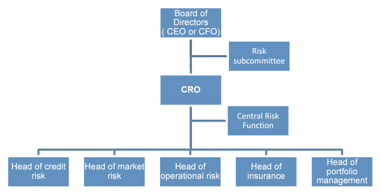

## Module Objective

Discuss the framework for risk management and control within a company

* Describe governance issues including market conduct, audit and legal risk

Describe and assess the elements and structure of a successful risk management function, including the **ERM roles and responsibilities** of the people within an organization, and how the different groups should **interact**, and recommend a **structure for an organization's risk management function**

***

Recall **Module 4**:  
Risk subcommittee should have at least one risk management expert, usually the CRO

Recall **Module 8**:  
3 lines of defense, risk management function and role of CRO

This module will deep dive into:

* **Role and responsibilities** of the `CRO`

* **Issues to consider** when *establishing* a `risk management function` (RMF) or `central risk function` (CRF)

    * How to **embed risk management** within an organization

    * Issues regarding the **relationship** between `business managers` and `risk management staff`

* Compliance

* Audit

## CRO

Need to have effective **risk governance structure** at **Board level**

***CRO's role***

* *Improve* the **effectiveness** of an org.'s RM function
  
    * **Filling in any gaps** in the `skill`, `knowledge` and/or `experience` **in a management team**
    
    * **Providing additional resources** for a risk management function
    
    * Being **prepared to escalate issues directly to the Board** w/o fear or prejudice to their own job security or remuneration

### Corporate Structure

CRO will either:

* Site **on the Board**, or; 

* **Report to the Board through the CEO or CFO**

    * May mean conflicts of interest inhibit communication to the Board
    
    * Add "dotted" lines can help address this if there is a clear **risk escalation rules** and **communication protocols** are established

CRO needs to have an **unambiguous relationship** with other C-suites

### Risk Subcommittee

* **Assumed responsibility** from the Board to **risk management strategy** and **policies** and **monitoring**

* **Independent** from the **day-to-day business**

* Those appointed to it should be **suitably qualified**

* Need to have **clearly defined** and **distinct accountabilities**, **responsibilities**, and **relationships** between the `Board`, `risk subcommittee`, `CRO` and `line management`

* **Board needs to retains overall accountability** for risk management even with the risk subcomm.

* **Delegation** should go to the **risk subcomm.** (and not the audit subcomm.)

### CRO Responsibilities

CRO is *accountable to the Board* for **developing**, **implementing** and **maintaining** an **ERM strategy**

* **Managing** the *various* `risk functions`

* Providing **leadership** and **direction**

* **Designing** and **implementing** and **ERM framework** across the company

* Ongoing **risk policy development**

* Risk **reporting** (both internal and external)

* **Allocating capital** across the firm

* **Communicating with stakeholders** about the org.'s risk profile

* **Developing systems** to `analyze`, `monitor` and `manage` risk

IAA appendix 5 for more on the roles and responsibilities of CRO [^CRO] and job specification [^CROSpec] 

[^CRO]: Chief Risk Officer

    The Chief Risk Officer will oversee market risk, asset/liability management, credit risk, investment risk, operational and supervisory risk and actuarial issues throughout the organisation and service the Risk Committee and its sub-committees. In accordance with the organisation’s Operating Philosophy, the role of the Chief Risk Officer is to provide:
    
    * Policy Guidance and establish Minimum Standards for the conduct of risk management activities throughout the organisation
    
    * Oversight of risk management activities across the organisation to ensure Minimum Standards are met, including monitoring of aggregate risk data

    * Lead the risk committee and ensure it adheres to its charter
    
    * Functional leadership for the organisation’s specialist personnel involved in risk management activities throughout the organisation to ensure a professional cadre of risk management personnel operates at high standards throughout the organisation
    
    * Monitor leading practice trends to ensure the organisations ERM program continually evolves
    
    * Research capability to ensure the organisation is kept abreast of the latest developments and harnesses such developments for the benefit of the organisation

    * Ensure there is an independent view on the effectiveness and efficiency of the risk management arrangements

    * Liaise with ratings agencies and provide the relevant information as required

    * Provide additional services deemed necessary by the organisation or at the request of individual operating units that does not conflict with their role

    * The Chief Risk Officer where necessary, challenges business decisions on key risk areas and has the ability to escalate issues that cannot be resolved with individual operating units to the Operating Units Managing Director / Chief Executive Officers. In the very rare event that a matter of significant business risk cannot be resolved with an Operating Unit Managing Director, then the matter is referred to the Chief Executive
    
    In addition the Operating Unit Managing Directors / Chief Executive Officers ensure that appropriate consultation takes place with the Chief Risk Officer on all issues involving organisational policy or otherwise within their remit

[^CROSpec]: Generic Role Specification

    ***Principle Role & Accountability***:
    
    The Chief Risk Officer is responsible for the leadership, direction and coordination of the Group-wide application of risk management at INSURER including line management responsibility for [Group Risk Management, Internal Audit, Health, Safety, Welfare and Environment.] and to ensure that the principles and requirements of managing risk are consistently adopted throughout the Group, and to establish a risk management framework and appropriate resource to assist the Group in its realisation of business objectives
and continual development

    ***Principle Responsibilities:***
    
    **Policy and Strategy**:
    
    a) To design and oversee the group-wide risk management strategy, aligning all risk management and associated internal control activities to support the delivery of shareholder value in the INSURER Group.
    
    b) To present INSURER Group risk management policy for discussion and approval by the INSURER Group Risk Management Committee and/or INSURER Group Board

    c) To canvass senior management views on the continual development of risk management across the Group and review whether organisational structure to support the INSURER Group risk management strategy remains appropriate
    
    d) To maintain awareness of trends and developments in risk management that may be significant to the INSURER Group and its operating subsidiaries
    
    e) To oversee the procurement of all Group insurance, broker and underwriter contracts and where appropriate, identify professional advisors to support the delivery of best practice risk management across the INSURER Group
    
    f) To facilitate the integration of risk management policy and strategy into all INSURER Group business strategy and activity, including the consideration of risk management in investment decisions
    
    g) Ensure that appropriate information regarding risk and internal controls is provided to the investment market including shareholders in conjunction with the Chairman and Chief Executive Officer
    
    h) To liaise with the Supervisors on existing regulations, new regulations and emerging regulations. Liaison will include participation in providing feedback to the Supervisors on framework and principles as well as responding to the
Supervisors questions and requests

    **Risk Identification & Assessment**:
    
    a) To monitor and report to the INSURER Group Risk Management Committee on the total level of INSURER Group risk exposure

    b) To maintain independent challenge on risk and assurance issues through the management of INSURER Group risk and assurance functions
    
    c) Ensure that risk identification and assessment activities performed across the INSURER Group and operating subsidiaries are reviewed and challenged where necessary and appropriate escalation procedures are in place at the
highest level

    **Management and Reporting Framework**:
    
    a) To be responsible for management and co-ordination of Group Risk Management [(to include Group Insurance), Internal audit and Health, Safety, Welfare and Environment (including Corporate Social Responsibility).]

    b) To ensure appropriate risk management and reporting frameworks are in place across the INSURER Group and operating subsidiaries, commensurate with risks to Group
    
    c) To provide an annual INSURER Group risk management performance report to the INSURER Chief Executive Officer. 
    
    **Reporting and Stakeholder Engagement**
    
    
    a) To monitor the overall risk management performance at Group level and to ensure the effective and timely reporting of risk management information within the Group operating subsidiaries and at Group level
    
    b) To be an attendee of the INSURER Group Risk Management Committee and ensure that the Committee engages in the development of best practice risk management across the INSURER Group

    c) To present, discuss and challenge Strategic Risk Review summary reports, reporting key risks and associated internal control procedures, to the INSURER Group Risk Management Committee.

    d) To represent INSURER Group risk management positions, strategy and experiences at internal and external forums to maintain a high reputation.

    e) To develop and maintain appropriate engagement processes with INSURER Group stakeholders, and ensure that equivalent and consistent risk management processes are implemented within INSURER Group operating subsidiaries.

    f) With Strategy & Communications and others as appropriate, to advise the investment community, Credit Rating Agencies, on risk management performance, particularly with reference to Socially Responsible Investment.

    **Line Support and Knowledge Sharing**
    
    a) To facilitate risk management knowledge and best practice sharing across the Group, with reference to external indices and benchmarks as appropriate.

    b) To Chair the INSURER Group Risk Management Co-ordinators Forum, providing expertise and support and communicating risk and associated internal control procedures arising from the INSURER Group Risk Committee and act as an information conduit for the Forum to the Risk Management Committee

    c) To support senior management with any aspect of risk management development and oversee key risk management training initiatives including key senior management training and to incorporate risk management into employee induction programmes

### Key Skills Required

***Key skills** required of CRO

1. **Business acumen**

2. Act professionally in the **long term interests of the org.**

3. Relevant **industry experience and knowledge**

4. **Leadership**:  

    To **develop the ERM vision**
      
    Recruit/retain a risk management team

5. **Communication** skills:

    Influence and persuade the business about ERM

6. **Stewardship**:

    Ability to act as a guardian of the org.'s assets

7. **Technical competence**:

    To manage financial and operational risks

8. **Consulting skills**:

    To influence and educate the Board and implement policy

Addition criteria for a risk management expert from Lam (not on syllabus) [^AddCrit]

[^AddCrit]: Addition criteria for a risk management expert from Lam

    * Understanding risk management and governance:
    
        Setting risk appetite, risk policies and reporting

    * Knowledge of relevant regulation and legislation
    
    * Experience of identifying, assessing and managing risk
    
    * Knowledge of ERM and business inter-dependencies

    * Ability to lead, advise the Board and challenge management on risk strategies

### Initial Priorities

**Bring together** *existing* disparate risk related teams or functions to **operate under a common framework**

***Initial priorities***

* Establish clear **understanding** of the company's **risk tolerance**

* **Align management's compensation** with *prudent risk management*

* Have **risk reporting channels**

    So that risks are assessed and information about them is shared in a timely manner

* Assess **gaps** in the `skills`, `capability` and `experience of the team`

* Determine which part of the insurer's business increase its overall **value**

* **Link** risk management to `capital management`, `pricing` and `reserving`

* Provide **quality information** to stakeholders

    Information shouldenables stakeholders to assess the financial condition of the insurer

* Establish **robust governance** structures

* Determine **appropriate** risk management **operating model**

***Requirements of the CRO***

* Establish close working **relationship with the CFO**
    
    Both have a role to play to **make earnings more predictable** and less likely to reduce in future

* Have **authority within the organization**  
(On, or close to the Board)

* **Understand** the insurer's `key stakeholders` and `drivers of performance`

## Risk Management Function

RMF can be a team with distinct functions from different part of the business

### Central Risk Function

***Dedicated CRF*** is key for successful governance models

* *Reports to the Board* through the CRO

* Team of *specialist* risk managers (or just 1 in a small org.)

* CRF **does not manage risk itself**  
(It's responsibilities of line managers)

***Roles of CRF***:

* **Advice the Board** on risk

* **Assess the overall risk** being run by the business  
(Accounting for hidden risks and correlations and general uncertainty)

* **Compare** the `overall risk` being run by the business with its `risk appetite`

*  Act as a central focus point for **staff to report new and enhanced risks**

* Give **guidance to line managers** about the `identification` and `management` of risks

* Make **suggestions for risk responses**

* **Monitor** progress on risk management

* Pull the **whole picture** together

### Relationship Between Lines of Defence

Recall from Module 8

* 1st line: line management staff in the BUs
* 2nd line: CRO, CRF and compliance team
* 3rd line: Board and IA

#### Relationships between 1st and 2nd

***1. Offence vs defence***

* Setup in **opposition** of each other
    
    BU *maximize* **income**
    
    RM *minimize* **losses**

* **Disadvantage**:
  
    * **Destructive** relationship
    
    * **Damaging** to the org. as BU and RM have opposing objectives and incentives

***2. Policy and policing***

* BU **operate within rules** set by RM function

    Policed by the `RM`, `audit` and `compliance functions`

* **Disadvantage**:
  
    * **Policies can become outdated** 
    
        As the RM function is **not in touch** with *day-to-day operation*
    
    * Audit and compliance review do no occur continuously so may fail to identify problems
  
    * Friction between line management and RM as each **fails to understand the others POV**
  
    * Line management may have **little incentive to report problems**, policy violations and issues where it is uncertain whether a violation has occurred
        
        Issue is mitigated somewhat by arguments of "greater good" or if incentives are linked to policy compliance and reporting violations

***3. Partnership***

* **RM staff are integrated into the BU**

    2 functions share some measures of performance

* BU and RM staff work together in a **client-consultant type relationship** to manage risk

    * BU must recognize the benefit to long term performance of a RM function

    * RM staff must recognize the importance of their role as consultants (i.e. meeting the needs of the BU)

* **Disadvantage**:

    * **Independence may suffer**

    * **Difficult** for RM staff who are integrated into the BUs to have a **corporate oversight role**

***

***Appropriate governance structure depends on***:

* **Structure** of **existing** `committees` and `decision making bodies`

* **Size** and **nature** of the business

* **Risk faced** by the business

* **Autonomy** and **accountability** of the elements in the current corporate structure

    e.g. if individual BU are run autonomously, the RM function needs to support each individual BU, rather than only operating at the "whole organization" level
    
***Mix organizational structures***

* Large business' RM function may need to **split** between `central team` and `units embedded` in each BU

* Important to ensure there is **no "silo" mentality**

    * **Matrix reporting framework**: 
    Each member reports to a number of people across the business
    
        Can help avoid the silo mentality
    
Risk management committees should include both BU and RM staff

### Challenges in Relationship Management

4 **key challenges** in managing the relationship between BU and RM staff

1. Conflict and **conflict resolution**
  
    Conflict arise from **different perspective of risk**  
    (Opportunity for profit or loss?)
  
    * `BU` will want to *increase volumes* and pricing based on **marginal cost**;
    
    * `Finance` will want to *grow revenue* and *control risk* and argue for **full cost pricing**

2. Management of **RM staff within BUs**
  
    * RM staff embedded may **not be trusted** by BU staff  
    (stuck between 2 opposing sides) 
  
    * Best if the **RM staff report to the BU head** and have a **dotted line to CRO**
  
    * CRO should have input into the performance review of the risk management staff embedded in BU

3. Aligning **incentives**
  
    * Can reduce conflict
  
    * In practice it is difficult to design a suitable performance measurement and incentive systems

4. **Measuring operational risks**
  
    * Op risk can be **difficult to assess** and take into account in performance measurement systems
  
    * Important to ensure a **common taxonomy** around op-risk to help minimize the risk of confusion

### Skill Required within Risk Function

***5 key skills***

1. Project management

2. Change management

3. Relationship management

4. Technical expertise

5. Implementation

## Line Management

***Sustainable*** **ERM framework** *requires support by*:

* **Process for engaging** with BUs

* **Common risk taxonomy**

* **Standard risk management processes**

* **Appropriate incentives** for employees (linked to agreed behaviors)

* Clear **monitoring** and risk **reporting**

Risk management should be incorporated into line management processes (incl. business strategy, new product dev., product pricing, business performance measurement and remuneration)

### Business Strategy

RM should be considered when developing the plans and strategy for each BU (i.e. **ask risk-foucsed questions**)

* What risk may **prevent** us from achieving our objectives?

* How to **assess and monitor** these risk?

* How to **mitigate or transfer** these risk?

* What level of **risk adjusted performance** to expect?

* What **risk limits/tolerances** should be adopted?

* Who will **measure and monitor** the risks involved?

***Benefits of addressing the questions above***:

* BU will **focus on their key risks** and way to mitigate them

* Management receives **advance warning** of *changes in the risks* to which the company is exposed

* Encourage `RM` and `line management` staff to **work together** at **early stage** in a project to address risk and business issues

* **Promote effective risk management** by **linking** `high level business objectives` and `risk appetite` to `risk reporting`  
(e.g. KRIs linked to KPIs)

### New Product/Business Development

Product development decisions rely on many assumptions about the business (e.g. likely sales, cost, etc)

***Manage risk of unrealized assumptions***

* Set **trigger points** for each assumption that will trigger a specific action or plan when breached

* Set **specific risk committee** for new product and business development, particularly when expanding into new/foreign markets

### Product Pricing

Pricing should **account for all cost of risk**

1. Expected losses

2. Cost of capital

3. Cost of risk transfer

Inaccurate pricing can lead to (adverse) selection

### Measuring Business Performance

BU's **performance should be risk adjusted** (as with the BU's goals)

***Balanced scorecard***:  
*Integrates* `business` and `financial reporting` and should also **incorporate risk assessment** along with 

* Finance

* Key stakeholders

* Growth

* Learning

* Internal business processes

### Risk Incentive Compensation

**Disclose link** between `executive compensation` and `RM`

* incl. salaries, incentive based comp. and stock options

Comp. arrangements should **discourage excessive** or **inappropriate risk taking**

* If practical, **clawback provisions** should be implemented to recoup incentive based comp. if risk taking, with hindsight was deemed excessive

## Compliance

Typically a separate function in financial services

Compliance with relevant laws, rules and regulations is a **responsibility for all companies and their employees**

### Complaince Process

Requires good knowledge of the legislationand other rules that the org. must comply

* e.g. stock exchange reg., accounting standards, etc

* Traded companies need to observe market conduct standards

* Need systems to prevent abuse

* M&A requires additional compliance

***Consequence of failings***

* Loss of reputation

* Entail providing insider information to outside investors

* Provision to the market of false or misleading information

***Non-compliance***

* If not fully compliance, **risk of non-compliance must be identified**

    Plan should be drawn up for achieving compliance within a suitable timescale

* Need to decide whether to **notify regulators** in case of non compliance

* Need to **monitor progress** towards compliance and take corrective action if necessary

* Penalties for non compliance can be severe

    e.g. see example on employee killing someone driving on company business

## Audit

### Internal Audit

IA **review the risk management process** (on top of checking financial transactions and information)

***IA responsibilities***:

* **Monitor compliance** with `laws` and `regulations`

* Check for **system errors**

* Look for **non-observance** of `internal governance codes`

* Examine key spreadsheets to be free of errors

* **Examine procedures** for paying insurance premiums on time, observing insurance conditions, and ensure that there is no risk of an org. being left uncovered when a claim arises

* Review the **effectiveness of risk management decisions** and **investigate risk management failures**

###External Audit

Validation of the RM process by a separate entity

* May be **required by regulator** (Basel II, SII)

* Potentially provides an **additional source of learning**