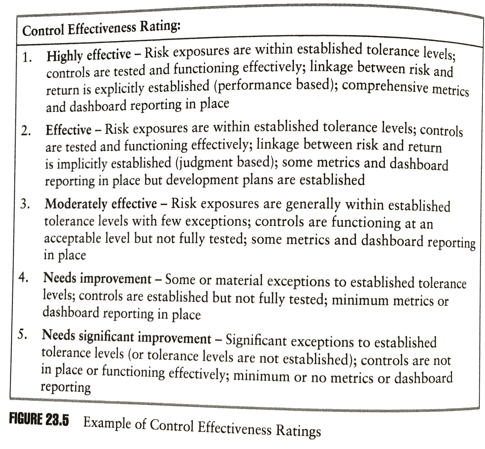

## Module Objective

Discuss the framework for risk management and control within a company

* Discuss the **cultural aspects** of risk assessment and management including the **problems of bias**

Discuss the application of the risk management control cycle

* Relevance of **external influences** and **emerging risks**

Discuss how to **identify** **risks** and their **causes** and **implication**

Explain what is meant by **risk** and **uncertainty** and discuss different definitions and **concepts of risk**

***

ERM involves all risks faced by an organization

**First step**: To determine and understand what risks the org. face

* ***Process of risk identification*** 

    Incl. considerations of why each risk **arises** and an **initial assessment** of the impact it could have on the org.

Module focus on the first part of the risk management control cycle

1. **Business analysis**:  

    Need to understand and know the specific characteristics of the org. and its operating environment before risk can be identified comprehensively

2. **Risk identification**:  

    Systematic process to identify the risks to which the org. is exposed

3. **Initial assessment of risk**:  

    Initial evaluation of the risks (quant. & qual.) to facilitate prioritization of appropriate risk management actions

***Key discussion***:

* Implementation

* Methods and outputs of the process

* Issues involved in identifying emerging risks (the problem of bias)

(Again, this only covers up-to the initial assessment)

Note: language on identification, assessment, evaluation, quantification can be use as being distinct or overlap in meaning

## Risk Identification and Assessment Process

6 steps of a comprehensive **risk identification** and **initial assessment** process

1. ***Business analysis***

    *Ensure* that the company has **clear business objectives**  
    (Or else difficult to establish what risks can impact on their achievement)

    Analyse its **operation** and its **wider environment**

    * **Business plan**
    
    * Company's **structure** and system of **internal controls**
    
    * *Current* and *projected* **accounts** and accounting ratios
    
    * **Market information** (e.g. competitors actions and market share)
    
    * **Resources available** to the company
    
    * Legislative and **regulatory constraints**
    
    * General **economic environment**

2. ***Identify the risks***

    Identify up & down side risk **structurally**
      
    Start with a review of the **findings of the business analysis** to identify any areas or `risk`, `uncertainty` or `opportunity`
      
    See [next section](#risk-iden) for risk identification methods

3. ***Obtain agreement***

    Obtain agreement (with other stakeholders?) on the **risks faced**, **relationships** between them, and identify **individuals who will be responsible** for each risk and its management

4. ***Evaluate the risks***

    Evaluate in terms of **likelihood** and **severity** over a given time frame
      
    Can be done for both **gross** and **net of existing controls**
      
    Enable risks to be **prioritized** for further implementation of controls

5. ***Produce a risk register***

    **Record the results** of this process in one place
      
    Next section will further discuss elements of the [register](#risk-register)

6. ***Review the risk register regularly***

    Especially in times of change to ensure that it **remains up to date** and reflects the current risks faced by the company

### Benefits of the Process

Important first step in the RM process:

* *Enhances* **awareness** and **transparency** of risks

* Helps **transfer knowledge** and **improve understanding** across the org.

* Acts as a firm **base for subsequent risk analysis**, quantification and prioritization

* **Enhances the quality of reporting** to the Board and senior management

$\therefore$ Helps improves business decision making

### Requirements

Requirements to gain the benefits above:

* Need **senior sponsorship** of the RM program

* Be **consistent** on the standards used **overtime**

* Ensure **quantitative and qualitative** data is used so as to develop a comprehensive risk profile for the whole org.

* **Integrate** risk identification with the entire RM process

* **Demonstrate added value** (on top of meeting regulatory requirements)

### Risk Assessment Process

4 stage risk identification and assessment process (expansion of step 2 above)

1. ***Foundation setting***

    * *Get* **executive sponsorship**
    
    * *Organize* and *plan* for **resources**  
    (e.g accountabilities and deadlines)
    
    * *Define* a **risk taxonomy**
    
    * *Build* a customized [**risk identification and assessment tool**](#risk-tool)
    
    * **Educate** and train project teams and management

    **Potential pitfall**:

    * Lack of senior management buy-in and participation
    
    * Bad resources planning and allocation
    
    * Insufficient preparation lead to an inefficient or ineffective process
    
2. ***Risk identification, assessment and prioritization***

    * **Understand** `business objective`, `risk appetite`, `regulatory` and `policy requirements`

    * Undertake **risk assessments**
    
        * Top down (e.g. interviews)
        
        * Bottom-up (e.g. workshops)

    * Produce [risk reports and risk maps](#risk-concepts)
  
    * **Prioritize** risk

    **Potential pitfall**:

    * Lack of clear business objectives or risk appetite

    * Focusing on consequences rather than **causes** of risk

    * **Inconsistent estimate** of frequency and severity

3. ***Deep dives, risk quantification and managment***

    * Detailed assessments of of the **top risks** (prioritized from step 2.)

    * *Produce* **risk tolerance** statements and **track KRIs**

    * *Determine* **risk management strategies** and the **total cost of risk** (for pricing purpose)

    **Potential pitfall**:

    * Lack of prioritization of key risk
    
    * **Insufficient risk quantification**
    
    * Risk assessment **not translated into value adding action**

4. ***Business and EMR integration***

    * **Link risk assessment** with both `strategic planning` and `business review processes`

    * **Integrate risk assessment** into *everyday business operations*  
    (e.g. pricing and capital allocation)

    * Conduct **scenario analysis** and **stress testing**

    * **Report** on risk

    * Creating and maintaining **loss/events databases**

    * Establish appropriate **risk-escalation policies**

    **Potential pitfall**:

    * **Restricting integration** to low level reports
    
    * **Failure to fundamentally change the business attitude** to risk management

***

See Lam App to Ch.23 with the **risk assessment self evalulation** checklist

* How well developed and mature is the copany's risk identification and assessment

* Degree of integration of RM across the org.

## Risk Identification and Recording {#risk-iden}

### Risk Identification Tools {#risk-tool}

1. ***SWOT Analysis***

    * Framework for generating ideas in a **structured** and comprehensive ways

    * Consider `strengths`, `weakness`, `opportunities`, and `threats`

    * Establish what risks the company faces

2. ***Risk Checklist***

    * **List of risk** identified in the **past** or from **external source**

        Need to make sure the information is relevant and up to date

3. ***Risk Prompt List***

    * List of different **categories of risk** to consider and examples of each

        * Can be produced at an industry wide level

    * List `situations` and `events` that have **previously emerged** and that should be considered

    * Similar to risk trigger questions

    * e.g. PEST(ELI) analysis that covers:   
    `Political`, `economic`, `social`, `technology` (`environmental`, `legal` and `industry`) risks

4. ***Risk Taxonomy***

    * Structured way of **classifying risks** and *breaking* them down into **components**

    * Help to *ensure* that those involved in the process have a **common understanding of the terms used** in risk identification

    * **Less project specific** than a `checklist` and **less industry specific** than an `industry prompt list`

5. ***Case Studies***

    * Can help to understand the impact of risks in a specific context

6. ***Process Analysis***

    * Build **flow charts** that detail **business process** and **links** between them

    * Help identify the **risks that arise at each stage**

    * **Particularly suited to op-risk**

***

***Advantages*** of the tools above:

* Provide a **clear structure** for the risk identification process

* *Improve* the **quality of the output** (vs a less structured process)

***Disadvantage*** of the tools above:

* Results may still **not be comprehensive**  
(e.g. due to bias in the process or the participants)

### Risk Identification Techniques

Activities must be **well planned** and supported by a **positive risk culture**

***Factors to consider on techniques***:

1. **Who**

    * Input is needed from **all areas of the business** to identify all risks and dependencies

    * Select a diverse mix of people (role, experience and seniority)

2. **How**

    * Workshop, questionnaires

    * Workshop types e.g. brainstorming

    * External help in facilitation of workshops or design of questionnaires

***

***Risk identification techniques***

1. ***Brainstorming***

    Group of people generating ideas in a **free form** way

    * **Facilitated** by an external consultant
    
    * Requires all participants to be in the same location at the same time

    **Potential disadvantage**:

    * If poorly run, can lead to **group think**

    * **Uneven participation** can lead to an incomplete or biased identification of risks
    
    **Mitigation**:
    
    * Participants should come from various departments across the org. and have **different backgrounds**
    
    * **Outsiders** can bring fresh ideas even in specialist areas

2. ***Independent group analysis***

    * Each risk is **presented** by a member of the group and is then **discussed* by the group

    * Each member then **rank each of the risk independently**
      (to avoid group think)
      
    * Results are combined to form an **overall ranking**

    **Potential disadvantage**:

    * **Unbalanced group** may produce a biased list of risk and rankings

3. ***Surveys***

    Use online surveys to generate a wide range of responses cheaply and without collusion between participants

    * Doesn't need everyone at the same place

    **Potential disadvantage**:

    * Problem of **framing**
        
        * Risk that the way the question is asked influences the response (can be mitigate by pilot surveys to help improve the design)
    
    * Poor **response rates**
    
    * Quality of the survey is only as good as both the **design and analysis of the response**
    
        e.g MC is easier to analyze but limit the range of possible responses

4. ***Gap analysis***

    * Type of questionnaire designed to identify the company's **current and desired risk exposures**

    * `Line manager` might be best to identify the **current risk** while the `Board` is best to identify **desired risk**

    **Potential disadvantage**:

    * **Difficult and costly** to engage the Board in such a process

5. ***Delphi technique***

    A structured communication technique where the participants **answer questionnaires in 2 or more rounds**

    * After each round, a facilitator provides an anonymous summary of the output from the previous round as well as the reasons they provided for their judgement

    * Participants then revise their earlier answers in light of the replies of other members of the panel

    **Intention**:
    
    During the revise process the range of answers will decrease and the group will converge towards a consensus

    **Potential disadvantage**:

    * Time consuming and costly

6. ***Interviews***

    Individuals are interviewed and the results collated by an independent external reviewer

    * Can immediately clarify on responses

    **Potential disadvantage**:

    * **Time consuming** and expensive  
    $\hookrightarrow$ Restrictions on the number of interviews

    * Having multiple interviewers can lead to **inconsistencies**

7. ***Working groups***

    Small numbers of **interested individuals** are tasked with **considering a specific risk** (or group of risk)

    * Members are normally **specialists**

    * Scope can extend to analysis of the risk identified, esp. if they are unquantifiable

    **Potential disadvantage**:

    * Identification will be **narrow** rather than comprehensive (As they are all specialist)
      
    * Specialist might want to work at a **higher level of precision than the cost is justified**

### Risk Register {#risk-register}

Risk should be collated in a risk register once identified

***Key elements of risk register***

* Labeling or **numbering system** to risk can be identify easily

* **Category** of risk

* **Description** of each risk (that is clear and understandable to all)

* **Initial** assessment of the **likelihood** and **impact** over an applicable time frame

* **Risk response action**  

    (retain, remove, reduce, or transfer)
    
    Its cost and expected residual/secondary risk

* Individual involved in *monitoring* and *managing* the risk  
(**Risk owner**)

* Document **control information**  
(e.g. when was the last update and by whom)

## Risk Concepts and Initial Risk Assessment Techniques {#risk-concepts}

### Risk Concepts

***Exposure***:

* **Maximum loss** that can be suffered if an event occurs
* Not limited to monetary damage

***Volatility***

* Measure of variability within the **range of possible outcome**
* For market risk, it is referred to as the $\sigma$ of returns

***Probability***

* Likelihood that an event occurs

***Severity***

* Loss that is likely to be incurred if an event occurs
* Severity is generally lower than exposure
* Combine with frequency we get the expected cost of risk

***Time horizon***

* Length of time for which an organization is exposed to a risk, or
* Time required to recover from the event

***Correlations***

* Degree to which differing risks behave similarly in response to common events
* Risk concentration results in high risk correlations
    * Can be reduce by risk limits and checks and balances

***Capital***

Capital is held for:

* Manage cash flow (**working capital**)

* Facilitate growth (**development capital**)

* Cover unexpected losses arising from exposure to risk (**risk capital**)

***Purpose of risk capital***

* **Financial strength** is judged by reference to the relative levels of risk and risk capital

* For **debt holders**:  
      
    Provides **protection** against unexpected events  
    
    Determines **credit rating**

* For **equity holders**:  

    **Risk adjusted returns**: Returns should be judged relative to the level of risk capital (to adjust for risk)

* **Allocation** of risk capital to operational units enables risk adjusted profitability to be determined and creates and "internal capital market" within the org.

### Initial Risk Assessment Techniques

Simple techniques for initial assessment

#### Likelihood / Severity

***Categorization***

See if the probability (or severity) of the risk event **falls within some pre-set categories**

* Number of categories depend on the level of accuracy required from the exercise + extent the probabilities (severity) can be accurately estimated

* Can use different probability distribution depending on the data available

**Example**

* Score frequency and severity:
      
    0-25%, 25%-50%, etc

    low/mid/high, etc

* Multiply together for a risk rating

#### Risk Mapping

Plots each risk on the risk map

* Axes are the frequency and severity

* Technique is used to **illustrate the effect** that each risk might have on an org.

* Need to include all risks faced by the org.

* A is the current level and A' is the residual level

* Probability axis doesn't have to be continuous, can be broad like low/mid/high

***Benefits***

* Get people together across org. to **talk about risk**

* *Improves* the enterprise's **understanding** of the risk it faces

* *Improves* the **effect of its RM activities**

* Shows which **risk require further attention**

* Excellent **visual tool for reporting** to the Board on risk

* Can show before (**inherent risk**) and after (**residual risk**) to highlight the **effectiveness of its risk control**

#### Control Effectivenss - Heat Maps

Plot **risk severity** against **control effectiveness** to show where action needs to be taken

***Factors to rank risk controls*** according to their perceived **effectiveness**

* Risk exposures are **within tolerance** levels

* **Controls are in place**

* Risks are **linked to potential impact on return**

* **Risk metrics/dashboard reporting** is established

## Emerging Risks

Emerging risks are important and need to be fed into the overall control cycle along with any other external events and influences

**Definition**:  
**Developing** of already known risks which are subject to *uncertainty* and *ambiguity* and are therefore difficult to quantify using traditional risk assessment techniques

* $\Delta$ **nature of an existing** or **known risk**, or

* $\Delta$ **underlying effectiveness** of risk management approaches of an existing or known risk, or

* **Development of a new risk**  
(No explicit allowance in existing framework)
    
    Generally with much higher level of uncertainty
    
***Reasons why emerging risks are importants***:

* Knowledge of such risks will **influence corporate strategy**

* May **affect the profitability** of the organization

* May yield **opportunities for a new product**

***4 Key inter-related trends*** that give rise to emerging risk management challenges

* **Globalization**:  

    Increased **interdependence** of the world's economies and market

* **Technology**:  

    **New operational risks** from technology driven business

* **Changing market structures**:  

    As markets are **deregulated and privatized**

* **Restructuring**:  

    Effects of M&A and acquisition, joint ventures, outsourcing and business re-engineering

### Examples

Emerging risks of the past are known risks today  
(e.g. cost of guaranteed annuity rates, health damage from asbestos)

Emerging risk could include ***potential impact*** of:

* Significant **shift in power** between *world economies* (and collapse of previously secure nations)

* **Contagion** in asset markets

* **Claims from unexpected sources**

    * Nanotech
    * Mobile phone use
    * GMO food
    * Cyber
    * Terrorism (shifts in level and sources)
    * Climate change
    * Prolonged power blackouts
    * Emerging infectious and pandemic diseases
    * Unexpected changes in mortality or longevity
    * etc.

* Change in ways **information** is **stored** and **distributed** due to social media

* **Unexpected behavior** of **financial guarantees embedded products**

* **Non linear dependencies** between current known risks

### Emerging IT Risks

Due to increase reliance on computers and internet

1. Cyber security

2. Cloud computing

3. Social media

### Identification and Analysis

Additional issues arise from emerging risk than the standard process (identification, analysis, etc)

* Need a more **holistic view** to identify emerging risk

* Need to **consider all possible impacts** of the new risk before it can be reduced to the more structured approach like the other risk

***Horizon Scanning***

* Key tool for identifying emerging risk

* Systematic search for potential developments over the longer term

* Emphasis on **changes that are at the edges of current thinking**

* **Requires input from experts** that understand the underlying drivers and the tech/science/econ/socioecon aspects

    * Alternatively (expert not available or too costly) can rely on relevant external sources (e.g. academic journals)

***Weighing different underlying evidence***

* There won't be definitive study on the emerging risk

    $\therefore$ need to assess from different angles and sources

* Need to weight RM decisions according to the credibility and reliability of the underlying evidence

* Important to **continue monitor developments** in relevant research to refresh past decisions

* **Beware of alarmist media reports**

    * Useful for alerting of potential areas of further investigation

    * Should not be used as a basis for decision making

***Additional source of uncertainty***

* Added layer of uncertainty for companies impacted by likely **future legal approaches** to the emerging factors

    Active identification and consideration of such emerging risks will ready company to meet and react to such risks

* Analysis of **trends** is important
 
    * **Monitor regulatory and lobbying activity** in the sector by relevant experts

    * Important to **keep dependencies in mind** as changes can lead to reduction in diversification

## Bias

***Problem of bias***:  
Risks not being identified, assessed or reported in a true and honest way

* Can be due to **lack of supportive risk culture** (o rsub optimal culture)

* Often in the context of **project appraisal**

### Sources of Bias

***Intentional*** bias:  
e.g. deliberate underestimation of risk to achieve a specific personal goal

***Unintentional*** bias:  
e.g. inaccurate assessment of risk due to lack of experience or time

***Encountering bias***:

* Reporting to the Board about the ongoing risks facing the enterprise

* Project appraisal where the project champions tend to minimize the risks in hope of getting approval

***Ways in which bias are introduced into project appraisal*** (by accident or design):

* Insufficient care to the identification or analysis of risk

* Omission of key risks (Accidental or deliberate)

* Incorrect assumptions of independence

* Underestimate likelihood due to inadequate past experience

* Deliberately over optimistic cash flows (or just guessing)

* Not accounting for future economic cycle

* Inadequate attention to risk with new technologies

* Not considering all the effects of the project on the sponsor's other business

* Credit taken for benefits not directly attributable to the project

* Assumptions not correspond with sr mgmt's view of the world in the future

* Spreadsheets error lead to failures of logic

### Behavioral Finance

Study of ***unintentional bias in finance***

* Looks at how a variety of **mental biases** and **decision making errors** affect financial decisions

* Relates to the psychology that underlies and drives financial decision making behavior

* Evidence suggest that investors do not always act rationally contrary to tradtional economic theory assumptions

***3 types of behavioral bias***

1. ***Overconfidence***:

    People Tend to overestimate their own abilities, knowledge and skills

2. **Anchoring**:  

    People based perceptions on past experience or "expert" opinion

3. **Representative heuristics**:

    People find more probable those things that they find easier to imagine

[Other examples](http://www.sias.org.uk/view_paper?id=BehaviouralFinance) 

### Avoiding Bias

**Built in checks and balances** can prevent the danger above

***Key step to minimize the risk of bias***:

* **Validate the appraisal work** (esp. cash flow) by competent and independent checking

* **Reference** where possible to the outcomes of **similar projects**

***Build in additional capital cost***:

* **Load in a %** to the capital cost based on past experience

* **Reduce estimated return**

    * **Caveat**: 
    
        If the project is to proceed, it give the PMO a large contingency allowance in the capital cost  
        $\therefore$ reducing incentives to keep capital costs to a minimum