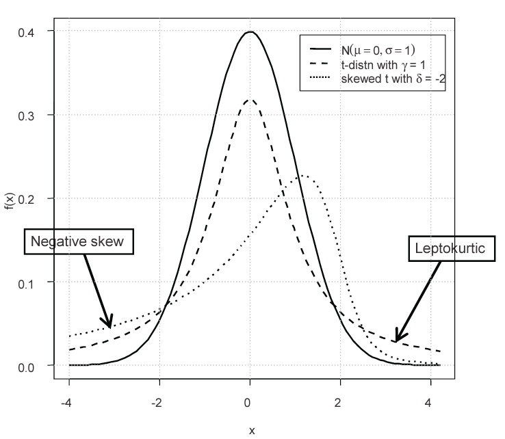
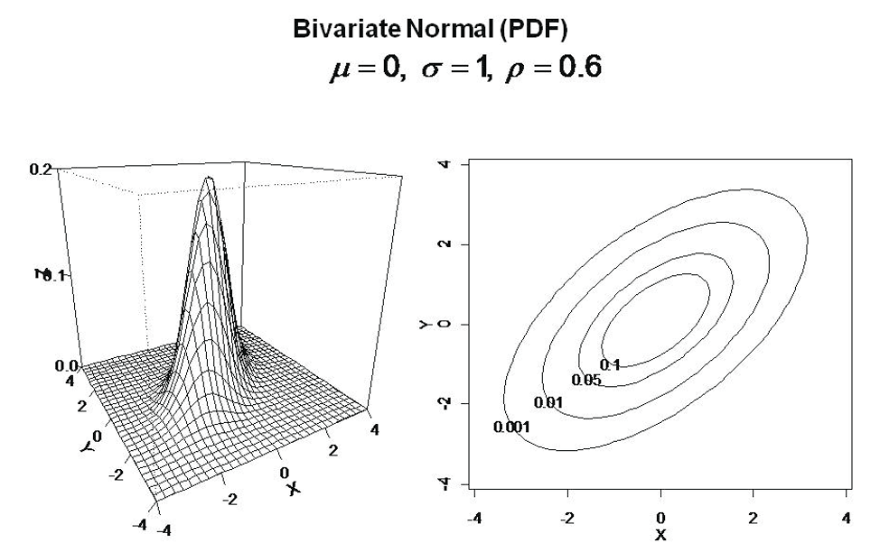
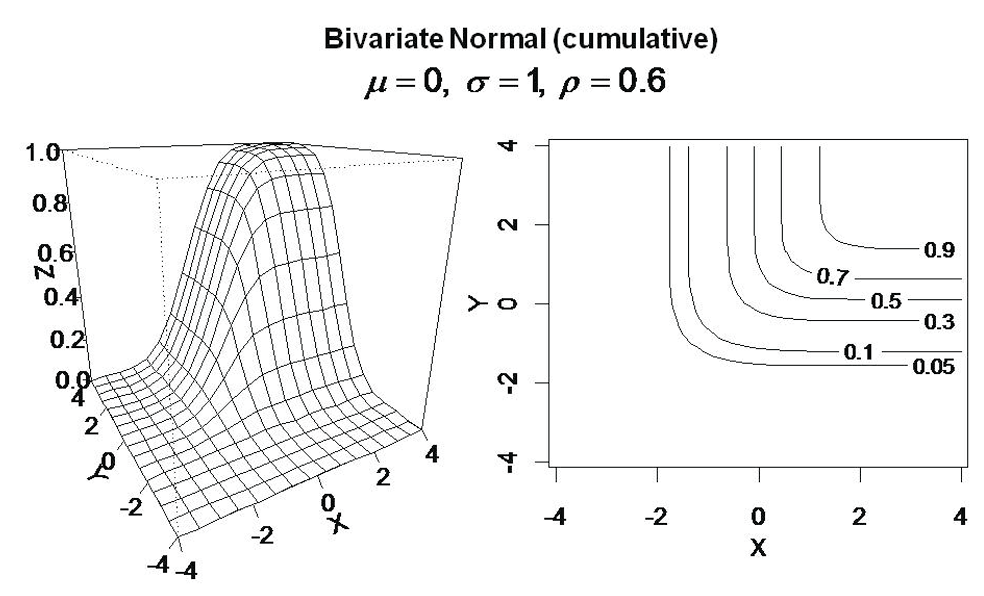
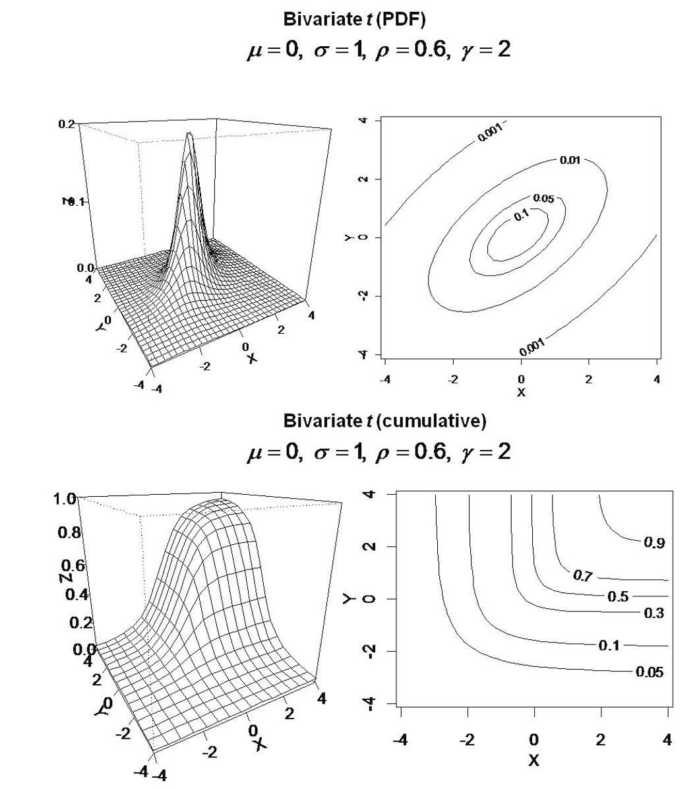

## Module Objective

Analyze univariate and multivariate financial and insurance data (incl. asset price, credit spreads and defaults, interest rates and insurance losses) using appropriate statistical methods

Recommend a specific choice of model based on the results of both quantitative and qualitative analysis of financial or insurance data

***

Exam notes:

* For the quantitative elements, it is required to demonstrate understanding of the ideas behind the methodologies and how they are implemented rather than learning the details of the theory
* Should practice the methods in this module using suitable software
* Techniques introduced here to model specific risk types of risk will be covered later
* Focus of the exam is on testing the understanding of the material and their ability to apply the techniques described in the Core Reading in practical situations and scenarios
* Formula for any required probability distributions (incl. means, variance, generator functions and expressions of copulas), if not already given in the Formulae & Tables book will be provided in the question

Should not get bogged down in the maths!

Focus on gaining an appreciation of:

* Shapes of the differing distributions (esp. their skewness and the fatness of their tails) so that when given observed data, you can suggest what distribution might be appropriate to fit
* How to check if your observed data match a given distribution using relevant test statistics
* How to simulate random numbers from these distributions for subsequent modeling
* How observed data may be mixture of different but related distributions - hence the need to be able to combine distributions and achieve a specified degree of correlation

## Recall: Prereq

***Moments of a Distribution***

$\mu_n$ is the n^th^ moment about the mean: $\mu_n = \mathrm{E}\left[(X - \mathrm{E}[X])^n\right]$

Coefficient of skewness $= \omega = \dfrac{\mu_3}{\sigma^3}$

Coefficient of kurtosis $= \kappa = \dfrac{\mu_4}{\sigma^4}$

* $\kappa = 3$: Mesokurtic
* $\kappa > 3$: Leptokurtic
    * Slender peak, has fatter tails
* $\kappa < 3$: Playkurtic

Excess kurtosis $= \kappa -3$: measure of kurtosis relative to a mesokurtic distribution (e.g. the normal distribution)

***Gamma Function***

$\Gamma(y) = \int \limits_0^\infty s^{y-1}e^{-s}ds$ for $y>0$

* $\Gamma(1) = 1$
* $\Gamma(\alpha) = (\alpha -1)\Gamma(\alpha-1)$ for $\alpha > 1$
* If $\alpha \in \mathbb{Z}$ then $\Gamma(\alpha) = (\alpha -1)!$
* $\Gamma\left(\dfrac{1}{2}\right) = \sqrt{\pi}$

***Matrix Algebra***

* Transpose: $\mathbf{A}'$
* Determinant: $\mid \mathbf{A} \mid$
* Identity: $\mathbf{I}$
* Inverse: $\mathbf{A}^{-1}$
* Matrix of Cofactors: $F$ such that $\mathbf{A}^{-1} = \dfrac{1}{\mid \mathbf{A} \mid}F$
* Orthogonal matrix: If satisfying $\mathbf{A}'\mathbf{A} = \mathbf{A} \mathbf{A}' = \mathbf{I}$
* Covariance matrix: $\boldsymbol{\Sigma}$
* Correlation matrix: $\mathbf{R}$

## Univariate Distribution

Main univariate distributions for analysis of financial time series

See also the standard distributions listed in the yellow pages of the Formulae and Tables for Examinations

Tables contain relevant formula for distributions marked with \#

### Univariate Discrete Distributions

* Binomial^\#^
* Negative binomial ^\#^
* Poisson^\#^

Calculations with these distributions can get unwieldy as the number of observations becomes large

* Use continuous approximations
* Still important that the characteristics of the underlying distribution are understood

### Univariate Continuous Distributions

Distributions with values from $-\infty$ to $\infty$

* Normal^\#^
* Normal mixture
* Student's t^\#^
* Skewed t^\#^

We can still use the above for variables with only non-negative values if the probability of a negative value is very small (e.g. mean is sufficiently positive and the variance is sufficiently low)

Distributions with only non-negative values

* Lognormal^\#^
* Wald^\#^
* $\chi^2$^\#^
* Gamma^\#^ and inverse gamma
* Generalized inverse gamma
* Exponential^\#^
* Fréchet
* Pareto^\#^
* Generalized Pareto

Distribution with finite range

* Uniform^\#^
* Triangular

### Binomial

A $Bin(n,p)$ distribution is the sum of $n$ independent and identical Bernoulli ($p$) trials

R.v. $X \sim Bin(n,p)$ is the \# of success that occur in the $n$ trials

The limiting distribution of the binomial distribution as $n \rightarrow \infty$ is the **normal distribution**

### Negative Binomial

Type 1: R.v. $X$ is the \# of the trial on which the $r$^th^ success occurs, where $r \in \mathbb{Z}$

Type 2: Let $Y$ be the \# of failures before the $r$^th^ success; $Y = X-r$, where $X$ is defined as above

Geometric distribution is a special case of the Type 1 NB distribution with $r=1$

Practical limitations of the Type 1 NB (also limitation of the binomial):

* CDF is laborious to calculate
* $n!$ becomes time consuming to calculate for large values of $n$

Type 2 NB is in the *Tables* and the combinatorial factor is written in terms of the gamma function

### Poisson

Models the number of events (e.g. claims) that occur in a specified interval of time, when the events occur one after another in time in a well defined manner that presumes:

* Events occur singly, at a constant rate
* Numbers of events that occur in separate (i.e. non-overlapping) time intervals are independent of one another
* i.e. The events occur randomly at a rate of $\lambda$ per period
* Such events are said to occur according to a Poisson process

[Poisson limit theorm](https://en.wikipedia.org/wiki/Poisson_limit_theorem)

* Sequence of $Bin(n,p)$, as $n \rightarrow \infty$ and $p \rightarrow 0$ together such that the mean $np$ is held constant at the value $\lambda$
* Limit leads to the distribution of the Poisson variable with parameter $\lambda$
* Subbing $\lambda = np$ into the PDF of the binomial distribution and taking the limits will produces the probability function of Poisson

Poisson can be used as an approximation to the binomial if $p$ is small enough (e.g. with mortality rate)

* Eliminates one of the practical problems with the binomial distribution but the CDF is still laborious summations

### Gaussian

Standard normal

* PDF $\phi$ and CDF $\Phi$
* Location parameter $\mu = 0$
* Scaling parameter $\sigma = 1$

Key features of the normal distribution

* $f(x) > 0$ for $-\infty < x < \infty$
* Based on CLT, it will approximate the distribution of a sufficiently large number of iid r.v.
* It can facilitate simple analytical solutions to complex problems (e.g. when it is used as an approximation to the binomial distribution)

Applications:

* Use for error term ($\epsilon_t \sim N(0,\sigma)$) when modeling random walk
* Standard normal is the distribution of the test statistic $Z = \dfrac{X - \mu}{\sigma}$ used to determine whether the mean of the underlying population is significantly different to an assumed mean $\mu$ when the value of $\sigma$ is known
  * Based on a single observation $X$
* Standard normal is the distribution of the test statistic $Z = \dfrac{\bar{X} - \mu}{\sigma / \sqrt{T}}$ used to determine whether the mean of the underlying population is significantly different from $\mu$, where $T$ is the number of observations and when the value of $\sigma$ is known
  * Based on the sample mean $\bar{X}$
  
Test for normality:

1. Graphical test e.g. QQ plots
2. Statistical tests
    * Jarque-Bera
        * Calculate the skew $\omega$ and kurtosis $\kappa$ with no adjustment for sample bias (Use denominator of $T$)
        * $JB = \dfrac{T}{6}\left(\omega^2 + \dfrac{\kappa}{4}\right)$
        * Distribution of the test statistic tends to $\chi^2_2$ as the number of observations ($T$) tends to $\infty$
    * Anderson-Darling
    * Shapiro-Wilk
    * D'Agostino
    
### Normal Mean-Variance Mixture

$X = m(W) + \sqrt{W}\beta Z$

* $W$: Strictly positive r.v.
* $Z \sim N(0,1)$
* $Z \perp\!\!\perp W$
* $m(\cdot)$: Some function
* $\beta$: Scale factor

***Benefit*** (compare to just normal)

Randomness in both the mean and variance
    
* For a given value of $W$, $X \sim N\left(m(W),W\beta^2\right)$
* So the distribution of $X$ depend on the value of $W$
* Mean is a function of $W$; Variance $\propto$ $W$
* $W$ is not fixed and can be think of as the underlying variable that affects the mean and variance $X$

***Special cases***

Generalized hyperbolic distribution:

* $m(W) = \alpha + \delta W$
* $W \sim GIG(\beta_1, \beta_2, \gamma_{GIG})$
* GIG = Generalized inverse Gaussian

Generalized t

* $m(W) = \alpha$
* $\gamma / W \sim \chi^2_{\gamma}$

Skewed t

* $m(W) = \mu + \delta W$
* $\delta$: Skewness parameter
* $\gamma / W \sim \chi^2_{\gamma}$

### t (Student's, Standard and General)

$X = \alpha + \beta Y$

* $X \sim$ Generalized t w/ $\gamma$ degrees of freedom
  * $\alpha$: Location parameter
  * $\beta$: Scaling parameter
* $Y \sim$ Student's t or standard t w/ $\gamma$ degrees of freedom

Exam note: Formula in the *Table* is for standard t ($\alpha = 0$ and $\beta = 1$)

CDF of the t can not be determined analytically except when $\gamma=1$ (Cauchy distribution)

t is leptokurtic (fatter tail) makes this an important distribution for risk modeling

* Kurtosis of the standard t is > than the normal

The degrees of freedom ($\gamma$) is also a shape parameter  
(determines the kurtosis)

Tails of the *t* follow a power law

* Probability of an event falling approximately in inverse proportion to the size of the event raised to the power of $\gamma + 1$
* For large $y$ you can ignore the 1 in the PDF, which is then $\propto y^{-(\gamma + 1)}$; So for the Cauchy distribution this is the inverse square of the size of the event

***Standard t as nomral mixture***

Define standard t in terms of a ratio of $N(0,1)$ and $\chi^2$

$t_{\gamma} = \dfrac{N(0,1)}{\sqrt{\chi^2_{\gamma} \big/ \gamma}}$

* Basis of the t-test

Rewrite the to has the same form as a mixture distribution

$t_{\gamma} = \underbrace{0}_{m(W)} + \sqrt{\underbrace{\dfrac{\gamma}{\chi^2_{\gamma}}}_{W}} \times \underbrace{1}_{\beta} \times N(0,1)$

* $W \sim$ inverse gamma

***Simulation***

$Y = \alpha + \beta \dfrac{Z}{\sqrt{W \big / \gamma}}$

* Normal mixture and has generalized t with parameters $\alpha$, $\beta$, and $\gamma$
* $Z \sim N(0,1)$
* $W \sim \chi^2_{\gamma}$
* $Z \perp\!\!\perp W$
* $\mathrm{VaR}(Y) \propto 1 \big / W$

***Statistical test of a sample mean***

Testing whether a sample mean ($\bar{X}$) is statistically different from the hypothesized mean ($\mu$) of the source population is performed using the test statistic:

$Z = \dfrac{\bar{X} - \mu}{s \big / \sqrt{T}}$, where $s$ is the s.d of the sample

Test statistic follows the standard t with d.f. $\gamma = T-1$

Rewriting $Z$

$Z = \dfrac{\bar{X} - \mu}{s \big / \sqrt{T}} \Bigg / 
\sqrt{\dfrac{(T-1)s^2 \big/ \sigma^2}{T-1}}$

* $\dfrac{\bar{X} - \mu}{s \big / \sqrt{T}} \sim N(0,1)$
* $(T-1)s^2 \big/ \sigma^2 \sim \chi^2_{T-1}$
* $Z$ is a ratio of standard normal to the square root of a chi-sq divided by the \# of d.f.
* As noted above, that is the standard t

### Skewed t

Same parameters as the general *t* but with the addition of a skew parameter $\delta$ (general t = skewed t with $\delta = 0$)

**Comparison of $N(0,1)$, standard *t* and skewed *t* **

If $\delta < 0$ the distribution is left skewed (longer lower tail); $\delta > 0$ is right skewed

***Simulation***

$Y = \alpha + \beta \dfrac{Z}{\sqrt{W \big / \gamma}} + \delta \dfrac{1}{W \big / \gamma}$

* (Normal mixture) skewed *t* with parameters $\alpha$, $\beta$, $\gamma$ and $\delta$
* Mean is $m(w) = \alpha + \delta \dfrac{1}{W \big / \gamma}$
* Variance (from the $Z$ term) $\propto 1\big/W$
* $Z \sim N(0,1)$
* $W \sim \chi^2_{\gamma}$
* $Z \perp\!\!\perp W$

### Lognormal

$Y = \ln X \sim$ Normal then $X$ is lognormal

Applications of the lognormal

* Applicable to may insurance situation since it takes only positive values
* Can be used to model financial variables (e.g. asset return) w/ assumptions that the log of the variable will follow a random walk with drift $\ln X_t = \mu + \ln X_{t-1} + \epsilon_t$ and the returns are iid

### Wald (or Inverse Gaussian)

Wald distribution describes the time taken for a Brownian motion process to reach a given value

Wald is a special case of GIG

Only takes positive values and have positive skew

It's call inverse Gaussian because its PDF has a similar form to the normal distribution but with $1/x$ included in the power

Key benefits of the Wald is its aggregation properties

* For $X \sim Wald(\alpha, \gamma)$ then $nX \sim Wald(n\alpha, n\gamma)$ for $n>0$
* For $X_n \sim Wald(\alpha w_n, \gamma w^2_n)$ and $X_i \perp\!\!\perp X_j$ then $\sum \limits_{n=1}^N X_n \sim Wald \left( \alpha \sum \limits_{n=1}^N w_n , \gamma \left(\sum \limits_{n=1}^N w_n\right)^2\right)$

### Chi-Squared

$chi^2_{\gamma}$ is the distribution of the sum of $\gamma$ $X \sim N(0,1)$ and so can be simulated as such

$chi^2_{\gamma}$ is a special case of the gamma distribution

The link between the mean ($\mu = \gamma > 0$) and variance ($\sigma^2 = 2\gamma$) limits the application of this distribution

***Chi-squared test***

Can be applied where observations can each be associated with just one of $N$ categories

* Tests examines whether a set of assumed probabilities are incorrect

Let the actual number of observations in the n^th^ category be $T_n$ and $T = \sum \limits_{n=1}^N T_n$

Let $p_n$ be the assumed probability such that the expected number of observations in category $n$ is $Tp_n$

Test statistic: $k = \left( \sum \limits_{n=1}^N X_n^2\right) \sim \chi^2_{N-1}$

* Where $X_n = \dfrac{(T_n - Tp_n)}{\sqrt{Tp_n(1-p_n)}}$

Too large a value suggest that the set of assumed probabilities is incorrect

### Exponential

Has a single scale parameter $\beta$

Distribution provides the expected waiting times between the events of a Poisson process

**Limitations to ERM** due to its characteristics

* Monotonically decreasing nature
* Single parameter
* Low probabilities associated with extreme values

### Gamma and Inverse-Gamma

***Gamma***

Gamma family has 2 positive parameters and is a versatile family

* PDF can take significantly different shapes depending on the parameters

Special cases:

* Exponential is when $\gamma = 1$
* $\chi^2_{2\gamma}$ is when $\beta = 2$

Probabilities fro a gamma is not given in the *Tables* but can be obtained by turning a gamma probability into a $\chi^2$:

* $X \sim Gamma(\beta, \gamma) \equiv \dfrac{2X}{\beta} \sim \chi^2_{2\gamma}$

Aggregation properties:

* If $X_n \sim Gamma(\beta, \gamma_n)$ are all *iid* then $\sum \limits_{n=1}^N X_n \sim Gamma\left(\beta, \sum \limits_{n=1}^N \gamma_n \right)$
* If $X \sim Gamma(\beta, \gamma)$ then $nX \sim Gamma(n\beta, \gamma)$ if $n > 0$

***Inverse-Gamma***

If $Y \sim Gamma$ then $X = \dfrac{1}{Y} \sim$ Inverse-Gamma

Both gamma and inverse gamma can be fitted by equating sample and population moments and solving for the distribution's parameters

### Generalized Inverse Gaussian (GIG)

GIG offers significant flexibility with regard to its shape with 3 parameters: $\gamma$ $\beta_1$ and $\beta_2$

Special limiting cases:

* $\beta_1=0$: $Gamma(2\beta_2, \gamma)$
* $1/\beta_2 \rightarrow 0$: GIG tends to $InverseGamma(\beta_1 / 2, -\gamma)$
* $\gamma = - \frac{1}{2}$: Wald

### Fréchet

Only has a single parameter

Special case of the generalized extreme value distribution

### Pareto

Two parameters

Key features

* Monotonically decreasing
* Tail follows a power law with the shape parameter ($\gamma$) determining the power

***Simulation***

$X = \dfrac{\beta}{U^{\frac{1}{\gamma}}}$

* $U \sim U(0,1)$

Corresponding CDF is $F(x) = 1 - \left( \dfrac{\beta}{x}\right)^{\gamma}$ for $x > \beta$, as $1 - \left( \dfrac{\beta}{\beta \big/ u^{\frac{1}{\gamma}}}\right)^{\gamma} = u$ and by definition $F(x) \sim U(0,1)$

Formula for Pareto CDF in Sweeting and *Table* actually corresponds to $X = \dfrac{\beta}{U^{\frac{1}{\gamma}}} - \beta$

### Generalized Pareto

Three parameter

* More flexible modeling tool
* Applied in extreme value theory (mod 20)

Note:

* Gamma in the Pareto corresponds to the gamma in the generalized form
* $\beta$ in the Pareto corresponds to $\beta \gamma$ in the generalized form shown in Sweeting

Relationships:

* $\gamma = 0$: Exponential
* $\gamma > 0$: Pareto

### Uniform

Assigns equal probability to all outcomes in a range $[\beta_1, \beta_2]$

Everything is in the *Tables* where $a = \beta_1$ and $b = \beta_2$

### Triangular

Can be used in cases where in additional to the upper and lower values, the most likely value is known

* Distribution has lower limit $\beta_1$, mode $\alpha$ and upper limit $\beta_2$
* Mean is the average of the parameter values $\mu = \frac{1}{3}(\beta_1 + \alpha +\beta_2)$
* Can be positively or negatively skewed

## Multivariate

Multivariate distributions are simpler than copulas (more flexible)

Appropriate if limited data is available and/or a lower level of accuracy/flexibility is required

### Multivariable Normal

$\mathbf{X} \sim N_N(\boldsymbol{\alpha}, \boldsymbol{\Sigma})$

$\mathbf{X} = (X_1,...,X_N)'$ a column vector of r.v. has multivariate normal distribution if

$\mathbf{X} = \boldsymbol{\alpha} + \mathbf{C}\mathbf{Z}$

* $\boldsymbol{\alpha} = (\alpha_{X_1},...,\alpha_{X_N})'$  
N-dimensional column vector of location parameters (i.e. means)
* $\mathbf{Z} = (Z_1,...,Z_k)'$  
Vector of *iid* standard univariate normal r.v.
* $\boldsymbol{\Sigma}$: covariance matrix  
Containing the scale and co-scale parameters (i.e. the variances and covariances)
* $\mathbf{C}$: $N \times k$ matrix of constants such that $\mathbf{C}\mathbf{C}' = \boldsymbol{\Sigma}$

Mean:

* $\mathrm{E}(\mathbf{X}) = \hat{\alpha}'$ since $\mathbf{Z}$ are standard normals

Covariance:

* $\mathrm{Cov}(\mathbf{X}) = \mathrm{Cov}(\mathbf{C}\mathbf{Z}) = \mathbf{C} \mathrm{Cov}(\mathbf{Z}) \mathbf{C}' = \mathbf{C}\mathbf{C}' =\boldsymbol{\Sigma}$
* Since $Z_i \perp\!\!\perp Z_j$ so $\mathrm{Cov}(\mathbf{Z})$ is the $k \times k$ identify matrix

The distribution is completely characterized by its mean vector and covariance matrix

Components of $\mathbf{X}$ are mutually independent iff $\boldsymbol{\Sigma}$ is diagonal (i.e. all off diagonal entries are 0)

If the location parameters are all 0 and the scale parameters are all 1 then $\mathbf{X}$ has standard multivariate normal distribution

* Correlation matrix $\boldsymbol{\Sigma} = \mathbf{R}$

***Key limitations*** for purpose of risk management

* Tails of the univariate marginal distributions are too thin
* Joint tails do not assign enough weight to joint extreme outcomes
* Distribution has a strong form of symmetry (elliptical symmetry)

Contour plot of the bivariate normal PDF and CDF

### Testing for Multivariate Normality

Sidenote:

Nomenclature is to use Greek ($\boldsymbol{\Sigma}$, and \boldsymbol{\rho}) for statistics of the distributions and use Roman letters ($\mathbf{S}$, $\mathbf{R}$) for sample statistics

***Standard Estimators of Covariance and Correlation***

$T$ observations $\mathbf{X}_1,...\mathbf{X}_T$ from a $d$-dimensional vector

* i.e. the $t$^th^ observations $\mathbf{X}_t = (X_{t1},X_{t2},...,X_{td})'$

#### Sample mean

Standard method of moments estimator of the location vector $\boldsymbol{\alpha}$

$\begin{align}
    \bar{\mathbf{X}} &= \dfrac{1}{T}\sum \limits_{t=1}^T \mathbf{X}_t \\
    &= \left(\dfrac{1}{T}\sum \limits_{t=1}^T X_{t1}, \dfrac{1}{T}\sum \limits_{t=1}^T X_{t2},...,\dfrac{1}{T}\sum \limits_{t=1}^T X_{td}\right) \\
    &= (\bar{X_1}, \bar{X_2},...,\bar{X_d})'\\
  \end{align}$
  
$\bar{\mathbf{X}}$ is an unbiased estimator for $\mathbf{X}$

#### Sample covariance matrix

Standard method of moments estimator of the covariance matrix $\boldsymbol{\sigma}$

$\mathbf{S} = \dfrac{1}{T} \sum \limits_{t=1}^T (\mathbf{X}_t - \bar{\mathbf{X}})(\mathbf{X}-\bar{\mathbf{X}})'$

$i$,$j$^th^ entry of the sample correlation matrix $\mathbf{R}$ is:

$r_{ij} = \dfrac{s_{ij}}{\sqrt{s_{ii}s_{jj}}}$

* $s_{ij}$ is the $i$,$j$^th entry of the sample covariance matrix $\mathbf{S}$

Remember that the properties of $\bar{\mathbf{X}}$, $\mathbf{S}$, and $\mathbf{R}$ depend on the true multivariate distribution of the observations

#### Mahalanobis Distance

With the standard estimators $\bar{\mathbf{X}}$, $\mathbf{S}$, $\boldsymbol{\alpha}$, and $\boldsymbol{\Sigma}$ we can calculate

$D^2_t = (\mathbf{X}_t - \bar{\mathbf{X}})'\mathbf{S}^{-1}(\mathbf{X}_t - \bar{\mathbf{X}})$ for $t = 1,...,T$

$D_t$ is the **Mahalanobis distance** between $\mathbf{X}_t$ and $\bar{\mathbf{X}}$ at time $t$

For Large $T$ we would expect $D_1^2,...D_T^2$ to behave approximately like and *iid* sample from a $\chi^2_N$ distribution (where $N$ is the dimension of the vector), so we can construct QQ-plots using this distribution

**Mahalanobis angle** between $(\mathbf{X}_s - \bar{\mathbf{X}})$ and $(\mathbf{X}_t - \bar{\mathbf{X}})$:

$D_{s,t} = (\mathbf{X}_s - \bar{\mathbf{X}})'\mathbf{S}^{-1}(\mathbf{X}_t - \bar{\mathbf{X}})$ for $s,t = 1,...,T$

$D_t$ and $D_{s,t}$ are used to calculate the skewness and kurtosis of the sample (and used in tests of multivariate normality)

**Skew-type parameter**: $w_N = \dfrac{1}{T^2}\sum \limits_{s=1}^T \sum \limits_{t=1}^T D_{s,t}^3$

**Mardia's skew test statistic**: $MST = \dfrac{T}{6}w_N \sim \chi^2_{N(N+1)(N+2)/6}$

**Kurtosis-type parameter**: $k_N = \dfrac{1}{T}\sum\limits_{t=1}^T D_t^4$

**Mardia's kurtosis test statistic**: $MKT = \dfrac{k_N - N(N+2)}{\sqrt{8N(N+2)/T}} \sim N(0,1)$

### Generating Multivariate Normal R.V.

#### Cholesky Decomposition

Method of decomposing a matrix

* Then used to generate a set of correlated normal variable from a set of independent standard normal variables

Positive definite matrices are always invertible and can be written in the form: $\mathbf{M} = \mathbf{C}\mathbf{C}'$

* $\mathbf{C}$ is some lower triangular matrix with positive diagonal entries $\begin{bmatrix}
    c_{1,1} & 0 & 0 & \dots & 0 \\
    c_{2,1} & c_{2,2} & 0 & \dots  & 0 \\
    c_{3,1} & c_{3,2} & \ddots &   & \vdots \\
    \vdots & \vdots &  &  & 0 \\
    c_{N,1} & c_{N,2} & \dots & & c_{N,N} \\
  \end{bmatrix}$
  
$\mathbf{C}\mathbf{C}'$ is the Cholesky decomposition for $\mathbf{M}$

* $\mathbf{C}$ is the Cholesky factor and is denoted $\mathbf{M}^{1/2}$

***

To generate a vector $\mathbf{X}$ with distribution $N_N(\boldsymbol{\alpha}, \boldsymbol{\Sigma})$ where \boldsymbol{\Sigma} is positive definite matrix

**Step 1**

Perform a Cholesky decomposition of $\boldsymbol{\Sigma}$ to obtain the Cholesky factor $\boldsymbol{\Sigma}^{1/2}$

**Step 2**

Generate a vector $\mathbf{Z} = (Z_1,...,Z_N)'$ of independent standard normal variables

You can do this using the Polar method or the Box-Muller method

* Algorithms for these methods are given on P.39 of the *Tables*

**Step 3**

Set $\mathbf{X} = \boldsymbol{\mu} + \boldsymbol{\Sigma}^{1/2} \mathbf{Z}$

***

**Example**

For $N = 2$ and $\boldsymbol{\Sigma} = \begin{bmatrix} 1 & \rho \\ \rho & 1 \\ \end{bmatrix}$

$\boldsymbol{\Sigma}^{1/2} = \begin{bmatrix} 1 & 0 \\ \rho & \sqrt{1 - \rho^2} \\ \end{bmatrix}$

$\mathbf{X} = \boldsymbol{\Sigma}^{1/2} \mathbf{Z} =
\begin{bmatrix}
  1 & 0 \\ 
  \rho & \sqrt{1-\rho^2} \\
\end{bmatrix}
\begin{bmatrix}
  Z_1 \\ 
  Z_2 \\
\end{bmatrix}=
\begin{bmatrix}
  Z_1 \\
  \rho Z_1 + \sqrt{1-\rho^2}Z_2 \\
\end{bmatrix}$

If $\mathbf{Z}$ is ta column vector of independent standard normal variables then $\mathbf{X}$ is a column vector of standard normal variables with correlation coefficient $\rho$

#### Principal Component Analysis

PCA (eignevalue decomposition) breaks down each variable's divergence from its mean into a weighted average of independent volatility factors

* Similar to factor based or multi factor modeling techniques in mod 15

***Theory of spectral decomposition***:

For any covariance matrix $\boldsymbol{\Sigma} \: \exists \: \mathbf{V} : \boldsymbol{\Lambda} = \mathbf{V}'\boldsymbol{\Sigma}\mathbf{V}$ is a diagonal matrix

Column vectors of $\mathbf{V}$ are the **eigenvectors** of $\boldsymbol{\Sigma}$

Values of the diagonal of $\boldsymbol{\Lambda}$ are the **eigenvalues** of $\boldsymbol{\Sigma}$

Each pair of corresponding eigenvectors and eigenvalues is described as **principal component**

**Example**: the second PC

$\Delta_2 = \mathbf{V}_2' \boldsymbol{\Sigma} \mathbf{V}_2 = 
\begin{bmatrix}
  V_{1,2} \\ 
  V_{2,2} \\
  \vdots \\
  V_{N,2} \\
\end{bmatrix}'
\begin{bmatrix}
    \sigma_{X_1,X_1} & \sigma_{X_1,X_2}  & \dots & \sigma_{X_1,X_N} \\
    \sigma_{X_2,X_1} & \sigma_{X_2,X_2}  & \dots  & \sigma_{X_2,X_N} \\
    \vdots & \vdots & \ddots & \vdots \\
    \sigma_{X_N,X_1} & \sigma_{X_N,X_2} & \dots& \sigma_{X_N,X_N} \\
  \end{bmatrix}
\begin{bmatrix}
  V_{1,2} \\ 
  V_{2,2} \\
  \vdots \\
  V_{N,2} \\
\end{bmatrix}$

The principal components can be calculated iteratively using the power method

Define $\mathbf{L} = \begin{bmatrix}
    \sqrt{\Delta_1} & 0 & 0 & \dots & 0 \\
    0 & \sqrt{\Delta_2} & 0 & \dots  & 0 \\
    0 & 0 & \ddots &   & \vdots \\
    \vdots & \vdots &  &  & 0 \\
    0 & 0 & \dots & 0 & \sqrt{\Delta_N} \\
  \end{bmatrix}$ to be the diagonal matrix containing the square roots of the eigenvalues
  
**Simulation using principal components**:

Start by generating a vector $\mathbf{Z} = (Z_1,...Z_N)'$ of independent standard normal variables

$\mathbf{X} = \mathbf{V}\mathbf{L}\mathbf{Z} + \boldsymbol{\mu}$ is then a vector of correlated random variables

The resulting vector will be affected by the precise method chosen to generate the principal components

e.g. $\boldsymbol{\mu}$, $\mathbf{L}$, and $\mathbf{V}$ may or may  not be derived from the sample means and sample covariance matrix

The influence of the principal components on the result decreases e.g. the second PC has less influence than the first

In some applications this means that a large proportion of the variability can be simulated by a smaller proportion of the total number of principal components.

In this case, fewer eigenvalues and eigenvectors are used, and fewer independent r.v. need to be generated $\therefore$ reducing the dimensionality of the problem

### Multivariate Normal Mean-Variance Mixture

Let:

* $\mathbf{Z}$ be a column vector the $k$ elements of which are standard normal r.v.
* $W$ be some strictly positive r.v. that is independent of $W$ (?)
* $\mathbf{m}(W)$ be a function of $W$ resulting in a column vector of $N$ elements
* $\mathbf{B}$ is an $N \times k$ matrix of co-scale parameters such that $\mathbf{B}\mathbf{B}'$ is in the form of a covariance matrix

Then $\mathbf{X}$ is said to have a multivariate normal mean-variance mixture distribution if $\mathbf{X} = \mathbf{m}(W) + \sqrt{W}\mathbf{B}\mathbf{Z}$. In which case we have: $X \mid W = w \sim N_N(\mathbf{m})(w), w\mathbf{B}\mathbf{B}')$

Special cases:

* Generalized hyperbolic distribution
    * $\mathbf{m}(W) = \boldsymbol{\alpha} + \boldsymbol{\delta}W$ and $W$ has a generalized inverse Gaussian distribution
* Multivariate t
    * $\mathbf{m}(W) = \boldsymbol{\alpha}$ and $\gamma / W$ is $chi^2_{\gamma}$
* Skewed t
    * $\mathbf{m}(W) = \mu + \delta W$ (? not vector?)($\delta$ is the skewness parameter) and $\gamma / W$ is $chi^2_{\gamma}$
    
### Multivariate t

An *N*-dimensional multivariate t is described by parameters for location ($\boldsymbol{\alpha}$), scale ($\mathbf{B}$) and shape (degrees of freedom $\gamma$)

$\mathbf{X} \sim t_N(\gamma. \boldsymbol{\alpha}, \mathbf{B})$

Contour plot of the bivariate t, highlighting the key differences between it and the bivariate normal (from earlier)

The contours shown above are the same as those shown earlier for the multivariate Gaussian

In this case the increasing gaps, as we move away from the center, indicate the relatively fatter tails of the multivariate t

Significance of the **shape parameter** $\gamma$

* Fatness of the tail is determined by $\gamma$ selected
* The smaller d.f. the fatter the tails
* As $\gamma \rightarrow \infty$ the distribution tends to the multivariate normal
* Multivariate *t* has a fatter tail than multivariate normal in 2 senses:
    1. Marginal distributions have higher probabilities associated with extreme values compared to the normal
    2. Each combination of jointly extreme values has higher probabilities than the multivariate normal
    
Matrix of (co-)scale parameters $\neq$ as the covariance matrix

* $\mathrm{Cov}(\mathbf{X}) = \boldsymbol{\Sigma} = \dfrac{\gamma}{\gamma -2} \mathbf{B}$

The standard multivariate t is defined only by scale and shape parameters and is denoted $\mathbf{X} \sim t_{\gamma, \mathbf{R}}$ where $\mathbf{R}$ is the correlation matrix

#### Generating Multivariate t R.V

Similar to the multivariate normal and starts by generating a vector $\mathbf{Z} = (Z_1,...,Z_N)'$ of independent standard normal variables

Let:

* $\mathbf{B}^{\mathbf{D}}$ be a diagonal matrix consisting of the scale parameters of the marginal t
* $X^2_{\gamma}$ be the value of a r.v. distributed $\chi^2_{\gamma}$

If $\mathbf{X} = \dfrac{1}{\sqrt{X^2_{\gamma} \big / \gamma}} \mathbf{B}^{\mathbf{D}} + \boldsymbol{\alpha}$ then $\mathbf{X} \sim t_N(\gamma, \boldsymbol{\alpha}, \mathbf{B})$ so confirming that the multivariate t can be defined in terms of a normal mixture distribution

### Multivariate Skewed t

An *N*-dimensional skewed multivariate t is described by parameters for location ($\boldsymbol{\alpha}$), scale ($\mathbf{B}$), shape (degree of freedom $\gamma$) and skew ($\boldsymbol{\delta}$)

As for the non-skewed case, the (co-) scale matrix described the correlations between the variables, but is not equivalent to the covariance matrix

$\mathrm{CoV}{\mathbf{X}} = \boldsymbol{\Sigma} = \dfrac{\gamma}{\gamma -2}\mathbf{B} + \boldsymbol{\delta}\boldsymbol{\delta}' \dfrac{2\gamma ^2}{(\gamma - 2)^2(\gamma - 4)}$

Skewed multivariate t r.v. can be generated similarly to the non skewed case using

$\mathbf{X} = \dfrac{1}{\sqrt{X^2_{\gamma} \big / \gamma}} \mathbf{B}^{\mathbf{D}}\mathbf{Z} + \boldsymbol{\alpha} + \dfrac{1}{X^2_{\gamma} \big / \gamma} \boldsymbol{\delta}$

### Spherical and Elliptical

***Spherical***

Multivariate spherical distribution is one where the marginal distributions are:

* Identical, symmetric, uncorrelated with each other (uncorrelated, not necessarily independent)
* e.g. multivariate standard normal and normal mixture

***Elliptical***

If any chosen (fixed) probability can be described by an elliptical relationship between the variables then the distribution is said to be elliptical

* In 2 dimensions, for a given (fixed) correlation ($\rho_{X,Y}$) the variables have an elliptical distribution if $x^2 + y^2 - 2\rho_{x,y}xy = c$ where $c$ is a constant
    * In other words, each constant probability contour describes an ellipse in $(X,Y)$ -space
    * The special case where the correlation is 0 results in a spherical distribution
* e.g. multivariate normal with distinct marginal distribution
* Definition can extend to higher dimensions
    * *N*-dimensional elliptical distribution is one where each constant-probability contour is an *N*-dimensional ellipse