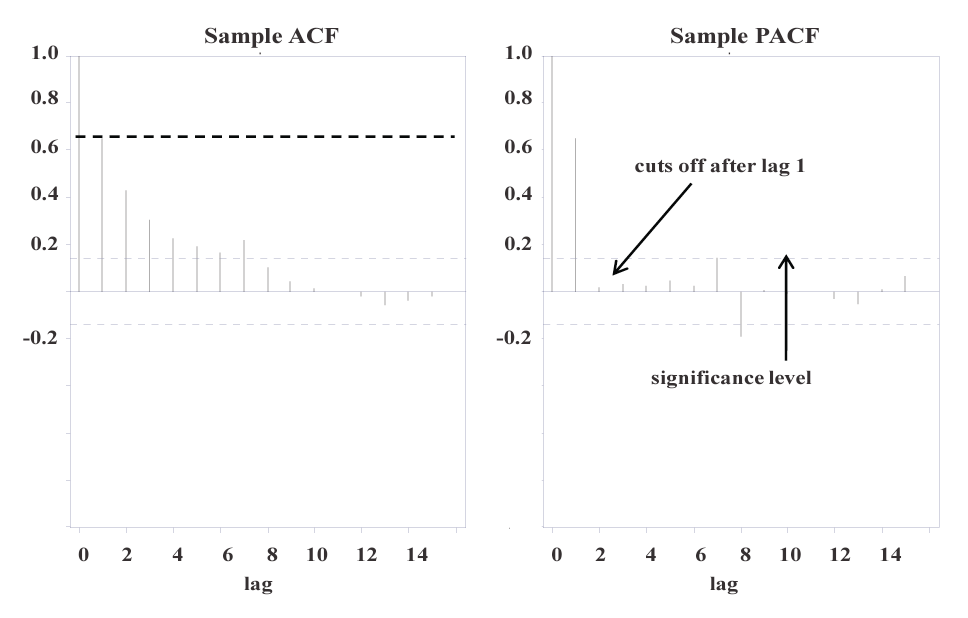

## Module Objective

Analyze univariate and multivariate financial and insurance data (incl. asset prices, credit spreads and defaults, interest rates and insurance losses) using appropriate statistical methods

Recommend a specific choice of model based on the results of both quantitative and qualitative analysis of financial or insurance data

***

Discuss the fitting of distributions to a given set of data and analysis of time series processes

Use of the techniques here to model specific types of risk will be covered in Part 4

Similar focus and note as the previous section

## Definitions

### Strict Stationarity

A process $\{X_t : t= 1,2,...,T\}$ is said to be ***strictly stationary*** if:

* The **joint distribution**:  

    $X_r,X_{r+1},...,X_s$ and 
    
    $X_{r+k}, X_{r+k+1},...,X_{s+k}$
    
    are **identical** for all $r, s, k \in \mathbb{Z}$

### Weak and Covariance Stationarity

A process $\{X_t : t= 0,1,2,...,T\}$ is said to be **covariance stationary** (or **weakly stationary**) if:

1. The **mean** of the process $m(T) = \mathrm{E}(X_t)$ is **constant**, and 

2. The **covariance** of the process:  

    $\mathrm{Cov}(X_r, X_{r+k}) = \mathrm{E}\left[\left(X_r - m(r)\right)\left(X_{r+k} - m(r+k)\right)\right]$  

    **depends only on the time different** $k$

***Weakly stationary*** of order *n* $\Rightarrow$ the moments of subsets of the process are **defined and equal** *up to* the *n*^th^ moment

***Importance of stationarity*** in modeling financial time series

* Stationarity means that the **statistical properties** of the process (incl. the moments and the relationships between observations in different periods) **stay the same over time**

* Important as it determines the **extend to which we can use past data** to try to model the future

* `Strict stationarity` is very restrictive and is **unlikely true in real world data**

* The requirement can be relaxed and we **can still analyze the data under weak stationarity**

**Finite variance** process strict stationarity $\Rightarrow$ Weak stationarity

**Infinite variance** process strict stationarity $\Rightarrow \!\!\!\!\!\! \big/$ Weak stationarity

### White Noise

A process $\{\epsilon_t : t = 0,1,2,...,T\}$ is a ***white noise process*** if it is: 

1. **Covariance stationary**

2. $\forall$ $t \in \mathbb{Z}$: 

    a. $\mathrm{Corr}(\epsilon_t,\epsilon_{t+k}) = \begin{cases} 1 & \text{if } k = 0 \\ 0 & \text{if } k \neq 0 \\ \end{cases}$

    b. $m(t) = \mathrm{E}(\epsilon_t) = 0$
    
***White noise process***

* Every element is **uncorrelated** with any previous observations and the process oscillates randomly **around zero**

* Important concept for modeling financial time series as many financial processes have a random element that cannot be known in advance (which we call white noise)

***Strict White Noise***

A white noise process $\{\epsilon_t : t = 1,2,...,T\}$ is a ***strict white noise*** process if it is:

1. A set of *iid* r.v. with finite variance

2. (Typically) assume $N(0,\sigma^2)$

### Trend and Difference Stationarity

***Trend Stationary***

* Where the observations oscillate randomly around a **steadily changing value** which is a function of time only

    e.g. $X_t = \alpha_0 + \alpha_1 t + \epsilon_t$

***Difference Stationarity and Integrated Processes***

* We can difference successive observations to generate a new process which may be stationary (if the observed TS is not) and model the new process

***Integrated process of order $d$*** ($I(d)$ process)

* One where the process needs to be differenced $d$ times before the result $\Delta^d X_t$ is covariance stationary

    * (Difference stationary process) Integrated process of order 1 ($I(1)$ process) is one where $\Delta X_t = X_t - X_{t-1}$ is covariance stationary

    * Integrated process of order 2 ($I(2)$ process) is one where $\Delta^2 X_t = \Delta X_t - \Delta X_{t-1}$ is covariance stationary (but $\Delta X_t$ is not)

***Dickey-Fuller test*** can help **distinguish** between `trend` and `difference stationary processes`

* Regresses the first difference of the observations onto the preceding observation and a time trend:

    e.g. $\Delta X_t = \alpha_0 + \alpha_1t + \alpha_2X_{t-1} + \epsilon_t$

    * Test statistic $\alpha_2 \big/ s.e.(\alpha_2)$ is compared to the critical values determined by Dickey-Fuller

    * If $\alpha_2$ is (statistically) significantly different to 0 then the series is an integrated process (else trend stationary)
    
## Inter-Temporal Links

Model processes where **observations depend on previously observed values**

### Autoregressive

$AR(1)$ process:

* $X_t = \alpha_0 + \alpha_1X_{t-1} + \epsilon_t$

* Each value depends only on the prior value (plus random error)

* To **avoid negative values**:

    $X_t = \alpha_0 + \alpha_1 X_{t-1} + \sqrt{X_{t-1}}\epsilon_t$

$AR(p)$ process (or p-period, lag p):

* $X_t = \alpha_0 + \alpha_1 X_{t-1}+ \alpha_2 X_{t-2} + \dots +  \alpha_{p} X_{t-p} + \epsilon_t$

* Value depends on $p$ previous values (plus random error)

***Influence of $\alpha_1$ on $AR(1)$ process***

* If $\mid \alpha_1 \mid < 1$

    $\hookrightarrow$ Process is **mean reverting** (\therefore covariance stationary)

    * Mean: $\dfrac{\alpha_0}{1-\alpha_1}$

    * Variance: $\dfrac{\sigma^2}{1 - \alpha_1^2}$; $\sigma^2$ is the variance of the white noise ($\epsilon$)

* If $\mid \alpha_1 \mid > 1$

    $\hookrightarrow$ Process becomes **unstable**

* If $\mid \alpha_1 \mid = 1$

    $\hookrightarrow$ Process is a **random walk**

    * If in addition, $\alpha_0 \neq 0$
    
        $\hookrightarrow$ Process is a random walk **with drift** (this is difference stationary)

***Condition for $AR(p)$ to be (at least) weakly stationary***

* Length of the $p$-dimensional vector containing the roots ($z$) of the following polynomial expression must be > 1:

    $f(z) = 1 - \alpha_1 z - \alpha_2 z^2 - \dots - \alpha_p z^p = 0$

    e.g. For $p=1$: $f(z) = 1 - \alpha_1 z = 0$ and the root is $z = \dfrac{1}{\alpha_1}$

* **Requirement for covariance stationary**: is that **the root lies outside the unit circle**

    For $p=1$ this will be if $\mid \alpha_1 \mid < 1$

### Moving Average

$MA(q)$ process:

* $X_t = \epsilon_t + \beta_1\epsilon_{t-1} + \dots + \beta_q \epsilon_{t-q}$

* A $q$-period (or lag q) moving average process

***Durbin-Watson statistic*** ($d$)

* Used to **test for serial correlation** (i.e. correlation between the values of the process at adjacent times) in an $MA$ process:

    $d = \dfrac{\sum \limits_{t=2}^T (\epsilon_t - \epsilon_{t-1})^2}{\sum \limits_{t=1}^T \epsilon_t^2}$

* Null hypothesis ($H_0$) is that $d=2$ in which case there is no serial correlation

    If $\epsilon_t$ and $\epsilon_{t-1}$ are uncorrelated, $\epsilon_t - \epsilon_{t-1}$ should have twice the variance of $\epsilon_t$ itself

* There are two **critical value** of $d$ that are used:

    A lower ($d_L$) and upper ($d_U$) limit depending on the level of significance

| Test Statistic | Value | Interpretation |
| -------------- | --------------------- | ------------------------|
| $d$ | $d_L$ > Test statistic | Statistically significant **positive** serial correlation |
| $d$ | $d_L$ < Test statistic < $d_U$ | Inconclusive |
| $d$ | Test statistic > $d_U$ | No statistically significant positive serial correlation |
| $4-d$ | $d_L$ > Test statistic | Statistically significant **negative** serial correlation |
| $4-d$ | $d_L$ < Test statistic < $d_U$ | Inconclusive |
| $4-d$ | Test statistic > $d_U$ | No statistically significant negative serial correlation |

### Integrated Moving Average Processes

Combining $AR(p)$ and $MA(q)$ results in an integrated moving average or $ARMA(p,q)$ process:

* $X_t = \left(\alpha_0 + \alpha_1 X_{t-1}+ \alpha_2 X_{t-2} + \dots +  \alpha_{p} X_{t-p}\right) + \left( \epsilon_t + \beta_1\epsilon_{t-1} + \dots + \beta_q \epsilon_{t-q}\right)$

$ARIMA(p,d,q)$ process is one where the $I(d)$ process is an $ARMA(p,q)$ process:

* $\Delta^d X_t = \left(\alpha_0 + \alpha_1 \Delta^d X_{t-1}+ \alpha_2 \Delta^d X_{t-2} + \dots +  \alpha_{p} \Delta^d X_{t-p}\right) + \left( \epsilon_t + \beta_1\epsilon_{t-1} + \dots + \beta_q \epsilon_{t-q}\right)$

### Fitting ARIMA Models

Autocorrelation functions (ACFs) are the most commonly used statistic in time series analysis

***Definitions***:

* Let the mean of the stationary process = $\mathrm{X_t} = \mu$

* **Autocovariance function**

    $\gamma_h = \mathrm{Cov}(X_t,X_{t-h}) = \mathrm{E}\left[(X_t - \mu)(X_{t-h} - \mu)\right] = \mathrm{E}\left[X_tX_{t-h}\right]-\mathrm{E}[X_{t}]\mathrm{E}[X_{t-h}]$

    $\gamma_0 = \mathrm{Var}(X_t)$

* **Autocorrelation function (ACF)**

    $\rho_h = \mathrm{Corr}(X_t, X_{t-h}) = \dfrac{\gamma_h}{\gamma_0}$

* **Partial autocorrelation function (PACF)**

    $\{\phi_h : h=1,2,...\}$ $\triangleq$ the **conditional correlation** of $X_{t+h}$ with $X_t$ *given* $X_{t+1},...,X_{t+h+1}$

    * PACF is defined for **positive lags only** (unlike autocovariance and autocorrelation)

    * PACF may be derived as the coefficient $\phi_{h,h}$ when determining $\mathrm{min} \: \mathrm{E}\left[(X_t - \phi_{h,1}X_{t-1} - \phi_{h,2}X_{t-2} - \dots - \phi_{h,h}X_{t-h})^2\right]$

        * Explanation of the expression above:

            Suppose that at time $t-1$ you are trying to estimate $X_t$ but that you are going to limit your choice of estimatetor to linear functions of the $k$ previous values $X_{t-k},...,X_{t-1}$

            The most general linear estimator will be of the form: $\phi_{k,1}X_{t-1} + \phi_{k,2}X_{t-2} + \dots + \phi_{k,k}X_{t-k}$ where $\phi_{k,i}$ are constants

            We can choose the coefficients to minimize the MSE, which is the expression given above

            The partial autocorrelation for lag $k$ is then the weight that you assign to the $X_{t-k}$ term

#### Box-Jenkins Method

Deduce information about at time series from a **plot of the sample ACF** ${r_h}$ (a function of the lag): **correlogram**

$r_h = \dfrac{\sum \limits){t=h+1}^T (X_t - \bar{X})(X_{t-h} - \bar{X})}{\sum \limits_{t=1}^T (X_t - \bar{X})^2}$

* Separate correlograms might be constructed for a variety of degrees of integration (e.g. d = 0, 1, 2) 

* So as to check visually for both `serial correlation`, `degree of integration` and the `form of model fit`

***Correlograms Interpretation***

Observing patterns in the values of the sample ACF and sample PACF can assist in determining an appropriate model to fit

| | $AR(p)$ | $MA(q)$ | $ARMA(p,q)$ |
| ------ | ------------ | ------------------ | ------------------|
| ACF | Tails off | Cuts off after lag $q$ | Tails off, but with a kink at lag $q$ |
| PACF | Cuts off after lag $p$ | Tails off | Tails off, but with a kink at lag $p$ |

e.g. observing that the ACF suddenly falls below a significant level, and can therefore be regarded as insignificant (referred to as "cutting off"), after lag 3 might indicate an $MA(3)$ process

***Example***

* The above data sample shows the PACF 'cut off' after lag 1

* Suggest the process might be described by an $AR(1)$ model

* If the model is to be fitted then the sample ACF indicates that $\alpha_1 = 0.646$

#### Testing the Fit

1. Use **test statistics** to compare between models under consideration

    (e.g. AIC and BIC in Module 19)

2. Can also consider error terms (**residuals**) arising after having fitted a particular model

    The error terms can be tested to see whether there is any residual structure (i.e. whether or not they are white noise)

    e.g. $AR(1)$ model residual at time $t$: $\hat{\epsilon_t} = X_t - \hat{\alpha_0} - \hat{\alpha_1}X_{t-1}$

    * The first residual when $t=0$, $\hat{\epsilon_0}$ is generally set to 0 or $X_{-1}$ is set to $\bar{X}$

### Predicting with ARIMA

If the values up to time $t$ have been observed then the next value of a series can be predicted using a model with appropriate (fitted) parameters

***Example*** with $ARMA(1,1)$

Estimated value of the process at time $t+1$:

$\hat{X}_{t+1} = \hat{\alpha}_0 + \hat{\alpha}_1 X_t + \hat{\epsilon}_{t+1} + \hat{\beta}_1 \hat{\epsilon}_t$

* $X_t$: observed

* $\hat{\epsilon}_{t}$: calculated

* $\hat{\epsilon}_{t+1}$: estimated (i.e. generated from a normal distribution)

Working forward iteratively, taking expectations and noting that $\mathrm{E}[\hat{\epsilon_{t+k}}] = 0$ yields:

$\begin{align}
  \mathrm{E}[X_{t+h}] &= \hat{\alpha}_0 \left(1 + \hat{\alpha}_1 + \dots + \hat{\alpha}^{h-1}_1 \right) + \hat{\alpha}^h_1 X_t + \hat{\alpha}_1^{h-1} \hat{\beta}_1 \hat{\epsilon}_t \\
  &= \hat{\alpha}_0 \sum \limits_{i=0}^{h-1} \hat{\alpha}^i_1 + \hat{\alpha}_1^h X_t + \hat{\alpha}_1^{h-1} \hat{\beta}_1 \hat{\epsilon}_t \\
\end{align}$

### Modeling Specific Features of the Data

#### Seasonality

Seasonality can be modeled with dummy (**indicator**) variables

e.g. process with 4 seasons: $X_t = \alpha_0 + \alpha_1 d_1 + \alpha_2 d_2 + \alpha_3 d_3 \alpha_4 t + \epsilon_t$

* $d_1$ takes the value 1 if $X_t$ is an observation from the *i*^th^ quarter and 0 otherwise

* No $d_4$ as the 4^th^ quarter is treated as the baseline and this is adjusting up or down to get values for Q1, Q2, Q3

#### Structural Breaks

***Step Change***

Jump in the value of the process can be modeled using a **Poisson variable**

$\Delta X_t = (\alpha_0 - \lambda k) + \epsilon_t + k P_t(\lambda)$

* $P_t(\lambda)$ is a Poisson variable with mean $\lambda$

* $k$ is the size of the jump when it occurs (assumed constant)

* $\epsilon$ is the error term (perhaps assumed normally distributed with variance $\sigma^2$)

* Note that $-\lambda k$ appears in order to maintain the average drift rates as $\alpha_0$

***Altered Rate of Change***

Parameters might be time dependent:

1. `Drift` ($\alpha_0$) and/or `degree of mean reversion` ($\alpha_1$) in the $AR$ model ($X_t = \alpha_0 + \alpha_1 X_{t-1} + \epsilon_t$) might be **dependent upon time**

2. Alternatively, the `rate of trend` ($\alpha_1$) in a trend stationary model ($X_t = \alpha_0 + \alpha_1 t + \epsilon_t$) might be also **dependent upon time**

Time dependencies can be difficult to *determine* by **visual inspection** of the data

* If such a structural break is suspected then the series might be split into two, either side of the suspected break, and a Chow test performed

***Chow Test***

Chow test involves fitting models and calculating the sum of squared residuals (SSR)

1. Calculate the $SSR$ for fitting a model to the **whole series**

2. Calculate $SSR_1$ and $SSR_2$ by fitting the **same model** but with **different parameters** to the 2 sub-series (either side of the suspected break)

3. **Test statistics**:

    $CT = \dfrac{\left(SSR - (SSR_1 + SSR_2)\right)\big/k}{(SSR_1 + SSR_2)\big/(N_1 + N_2 - 2k)}$

    * $N_1$ and $N_2$ are the number of observations in the 2 subseries

    * $k$ is the number of parameters in the model

4. Test statistics has an *F*-distribution with $k$ and $N_1 + N_2 -2k$ d.f.

    $H_0$ is that there is no structural break  
    (i.e. the parameters of the models fitted to the subseries are not significantly different from that of the model fitted to the complete series)

## ARCH and GARCH

Models for series that exhibit **heteroskedasticity**

### ARCH

***Autoregressive conditional heteroskedasticity*** (ARCH)

* Based on **strictly stationary** `white noise process` ($Z_t$) with 0 mean and unit s.d.

* ARCH process is constructed so that the s.d. ($\sigma_t$) varies over time

***Definition*** of $ARCH(p)$ process

The process $\{X_t : t= ..., -2, -1, 0,1,2,...\}$ is an $ARCH(p)$ process if:

$X_t = \epsilon_t = \sigma_t Z_t$

* $\sigma_t^2 = \alpha_0 + \sum \limits_{i=1}^p \alpha_i X_{t-i}^2$

* $\alpha_0 > 0$

* $\alpha_i \geq 0$ for $i = 1,...,p$

* $\{Z_t : t = ...,-2, -1, 0, 1, 2, ...\}$ is strict white noise with mean 0 and variance 1

***Heteroskedasticity and volatility clustering***

* Given the $\{X_t\}$ is weakly stationary 

    $\hookrightarrow$ $\mathrm{E}(X^2_t) < \infty$ and

    $\hookrightarrow$ $\mathrm{Var}\left(X_t \mid F_{t-1}\right) = \mathrm{E}\left(\sigma_t^2 Z_t^2 \mid F_{t-1}\right) = \sigma^2_t \mathrm{Var}(Z_t) = \sigma^2_t = \alpha_0 + \sum \limits_{i=1}^p \alpha_i X_{t-i}^2$

    * $F_{t-1}$ is the history of the process up to time $t-1$

* Conditional variance of $\{X_t\}$ is changing over time

    * Property of heteroscedasticity

    * Function of the previous squared values of the process

    * Large change in the value of the process is often followed by a period of high volatility
    
        $\therefore$ Model incorporates the feature of **volatility clustering**

* Although the conditional variance is changing, we don't know in advance when periods of high and low future volatility will occur 
    
    $\therefore$ Still possible for the $ARCH$ process to be stationary

***Condition for weakly stationary***

* $ARCH(1)$ is weakly (covariance) stationary white noise process iff $\alpha_1 < 1$

    Variance of the process is $\dfrac{\alpha_0}{1-\alpha_1}$

* **Condition** for $ARCH(p)$ to be **weakly stationary**

    Roots of the polynomial $f(z) = 1 - \alpha_1 z - \alpha_2 z^2 - \dots - \alpha_p z^p = 0$ must lie outside the unit circle

***Condition for strictly stationary***

* Result for weak stationarity of an $ARCH(1)$ process above does not depend on the distribution of $Z_t$ but the result for strict stationarity does

* If $Z_t \sim N(0,1)$ then the condition for a strictly stationary solution is approximately $\alpha_1 < 2e^{\eta} \approx 3.562$ where $\eta$ is the Euler-Mascheroni constant (= 0.57721..., usually denoted by gamma)

* For $m\geq 1$ the strictly stationary $ARCH(1)$ process has finite moments of order $2m$ iff $\mathrm{E}(Z^{2m}_t) < \infty$ and $\alpha_1 < \left[\mathrm{E}(\left(Z_t^{2m} \right)\right]^{-\frac{1}{m}}$

    And the XS kurtosis is $\kappa = \dfrac{\mathrm{E}(Z^4_t)(1-\alpha^2_1)}{1-\alpha^2_1\mathrm{E}(Z^4_t)} - 3$

### GARCH {#GARCH}

***Generalized ARCH***

* Volatility is now allowed to depend on *previous* values of **volatility** as well as *previous* **values of the process**

* Periods of high volatility **tend to last for a long time**

    * Also the case for high order $ARCH$ but $GARCH$ produce the effect with a lower number of parameters
    
***Definition***

The process $\{X_t : t = ..., -2, -1, 0, 1, 2, ...\}$ is a $GRACH(p,q)$ process if:

$X_t = \sigma_t Z_t$

* $\sigma_i = \sqrt{\alpha_0 + \sum \limits_{i=1}^p \alpha_i X^2_{t-i} + \sum \limits_{j=1}^q \beta_j \sigma^2_{t-j}}$

* $\alpha_0 > 0$

* $\alpha_i \geq 0$ for $i = 1,...,p$

* $\beta_j \geq 0$ for $j = 1,...,q$

* $\{Z_t : t = ...,-2, -1, 0, 1, 2, ...\}$ is strict white noise with mean 0 and variance 1

***Condition for weakly stationary***

* $GARCH(1,1)$ is weakly stationary iff $\alpha_1 + \beta_1 <1$

    Variance of the process is $\dfrac{\alpha_0}{1-\alpha_1 - \beta_1}$

* **Condition** for $GARCH(p,q)$ to be **weakly stationary**

    If $\sum \limits_{i=1}^p \alpha_i + \sum \limits_{j=1}^q \beta_j <1$

#### Integrated GARCH

***IGARCH***

* Occurs when :

    $\sum \limits_{i=1}^p \alpha_i + \sum \limits_{j=1}^q \beta_j = 1$

* For an $IGRACH(1,1)$ process $\beta_1 = 1 - \alpha_1$

    $\hookrightarrow$ $\Delta X_t^2 = \alpha_0 - (1- \alpha_1)V_{t-1} + V_t$

* sSimilar to $ARIMA(0,1,1)$ model for $\{X_t^2\}$

    Although $\{V_t\}$ is **not white noise**

#### ARMA model with GARCH errors

1. First fit the model to $ARMA$

2. Then fit a $GARCH$ model to the resulting residuals (if residuals are not white noise)

***Definition***

$\{X_t\}$ is an $ARMA(p,q)$ with $GARCH(r,s)$ errors if:

* Weakly stationary

* $X_t = \mu_t + \sigma_t Z_t$ where $\{Z_t\}$ is strict white noise with mean 0 and variance 1

* $\mu_t = \mu + \sum \limits_{i=1}^p \varphi_i(X_{t-i} - \mu) + \sum \limits_{j=1}^q \theta_j (X_{t-j} - \mu_{t-j})$

* $\sigma_t^2 = \alpha_0 + \sum \limits_{i=1}^r \alpha_i (X_{t-i} - \mu_{t-i})^2 + \sum \limits_{j=1}^s \beta_j \sigma^2_{t-j}$

*With*:

* $\alpha_0 >0$, $\alpha_i \geq >0$ for $i = 1,2,...,r$

* $\beta_j \geq 0$ for $j=1,2,...,s$

* $\sum \limits_{i=1}^r \alpha_i + \sum \limits_{j=1}^s \beta_j < 1$

### Fitting GARCH

Most commonly used technique is the **method of maximum likelihood**

***Challenge***

1. PDF of $X_0$ is not known

    We get around this by considering the conditional likelihood given $X_0 = x_0$

2. $\sigma_0$ is not actually observed

    We can choose a starting value for it, which might be the sample s.d. of $X_1,...,X_T$ or just 0

***Testing the fit***

As with $ARMA$ it is good to check the goodness of fit of a GARCH model by **examining the residual**

* e.g. for $ARAM$ with $GARCH$ errors, the $GARCH$ errors will be of the form $X_t = \epsilon_t = \sigma_t Z_t$

Must *distinguish* between ***unstandardized and standardized residuals***

* **Unstandardized residuals**: 

    Residuals $\hat{\epsilon}_1,...,\hat{epsilon}_T$ after having fitted the $ARMA$ part of the model

    * If the $ARMA$ model and parameteriztion are correct then the unstandardized residuals should look like a pure $GARCH$ process

* **Standardized residuals**:

    Reconstructed realizations of the strict white noise process $\{Z_t\}$ that is assumed to drive the $GARCH$ part of the model

    Calculated using:
    
    $\hat{Z}_t = \dfrac{\hat{\epsilon_t}}{\hat{\sigma}_t}$

    Where: $\hat{\sigma^2_t} = \hat{\alpha}_0 + \sum \limits_{i=1}^{p_2} \hat{\alpha}_i \hat{\epsilon}_{t-i}^2 + \sum \limits_{j=1}^{q_2} \hat{\beta}_j\hat{\sigma}_{t-j}^2$

    Need initial values to use the equations above

    * Can set starting $\hat{\epsilon}_t =0$ and $\hat{\sigma}_t = 0$ (or sample s.d. of the observed time series)

    The standardized residuals should behave like strict white noise

    * Test with correlograms and statistical test (portmanteau test and the turning point test)

    * If there is insufficient evidence to reject the hypothesis of strict white noise, the validity of the distribution used to construct the likelihood function (i.e. $f$, the PDF of $Z_t$) can be investigated using **QQ plots** and **goodness of fit test** for the `normal` or `scaled t` distribution

### GARCH Based Volatility Prediction

**Data**: $X_{t-n+1},...,X_t$ from a $GARCH$ model

**Predict**: Values of $\sigma_{t+h}$ for $h \geq 1$ from a fitted $GARCH(1,1)$ model

***Step 1***

* Let $F_t$ be the **infinite history** of the process up to time $t$ 
* Assume that the model is weakly stationary

    $\hookrightarrow$ $\mathrm{E}(X^2_t) = \mathrm{E}(\sigma^2_t) < \infty$:

*Then*:

$\begin{align}
  \mathrm{E}(X^2_{t+1} \mid F_t) &= \mathrm{E}(\sigma^2_{t+1}Z^2_{t+1} \mid F_t) \\
  &= \mathrm{E}\left[(\alpha_0 + \alpha_1 x^2_t +\beta_1 \sigma_t^2)Z^2_{t+1} \mid F_t\right] \\
  &= (\alpha_0 + \alpha_1 x^2_t + \beta_1\sigma_t^2)\mathrm{E}(Z^2_{t+1} \mid F_t) \\
  &= \alpha_0 + \alpha_1 x^2_t + \beta_1 \sigma^2_t \\
\end{align}$

* *Since* $\mathrm{E}(Z^2_{t+1} \mid F_t) = \mathrm{E}(Z^2_{t+1}) = \mathrm{Var}(Z^2_{t+1}) + [\mathrm{E}(Z_{t+1})]^2 = 1$

* *Also note* $\mathrm{E}(X^2_{t+1} \mid F_t) = \sigma^2_{t+1}$

***Step 2***

* Problem with the above is that we don't have infinite history of the process

    * For $\sigma^2_t$:
    
        Approximate using the residual equations in the [GARCH section](#GARCH)
  
    * For $\sigma^2_{t+1}$:
    
        Estimate with the approximate forecast of $X_{t+1}^2$

        $\hat{\sigma}^2_{t+1} = \hat{\mathrm{E}}(X_{t+1}^2 \mid F_t) = \alpha_0 + \alpha_1 X^2_t + \beta_1 \hat{\sigma}^2_t$
    
    * Use above equation to estimate volatility one step ahead recursively

* To estimate $X_{t+h}$ and $\sigma_{t+h}$ given the information up to $t$

    Both $X_{t+h}$ and $\sigma_{t+h}$ are r.v. and:

    $\begin{align}
        \mathrm{E}(X^2_{t+h} \mid F) &= \mathrm{E}(\sigma^2_{t+h} \mid F_t) \\
        &= \alpha_0 + \alpha_1 \mathrm{E}(X^2_{t+h-1} \mid F_t) + \beta_1 \mathrm{E}(\sigma^2_{t+h-1} \mid F_t) \\
        &= \alpha_0 + (\alpha_1 + \beta_1)\mathrm{E}(X^2_{t+h-1} \mid     F_t) \\
    \end{align}$
  
* So in general:

    $\mathrm{E}(X^2_{t+h} \mid F) = \alpha_0 \sum \limits_{i=0}^{h-1}(\alpha_1 + \beta_1)^i + (\alpha_1 + \beta_1)^{h-1} (\alpha_1 X^2_t + \beta_1 \sigma^2_t)$

    * Use this formula by replacing $\sigma^2_t$ by $\hat{\sigma}^2_t$

## Data Frequency

***Problem with time series***: insufficient data may be available to generate statistics based on a long timescale (e.g. annual volatility)

* In such case we may need to **scale up** statistics

    (e.g. estimate annual volatility from monthly volatility)

* If data is available from $N$ groups:

    Each of which is ***iid normal*** with:
    
    * Means $\bar{\mathbf{X}}$
    
    * Covariances given by the $N \times N$ matrix $\boldsymbol{\Sigma}$
    
    $\hookrightarrow$ `means` and `covariances` working over a timescale $T$ times as long are:
    
    * $T \bar{\mathbf{X}}$ and 
    
    * $T\boldsymbol{\sigma}$

* E.g. if data is available based on a monthly timescale then multiplying the means and covariance by 12 will provide the corresponding annual statistics

* Similarly if $\bar{\mathbf{X}} = \mathbf{0}$

    $\hookrightarrow$ Aggregate volatility for the longer timescale can be derived as:
    
    $\sqrt{T}$ multiplied by the corresponding volatility for the shorter timescale

* Applying to VaR

    Annual VaR might be derived from the monthly VaR by multiplying by $\sqrt{12}$  
    (i.e. the square root of time rule)

Such scaling becomes **inaccurate if the data is not *iid* normal**

* e.g. if its skewed or there is serial correlation

* Better approach in such situations is to ***parameterize as stochastic model***

    Using the shorter timescale data and then to derive the longer timescale statistics from a set of simulations