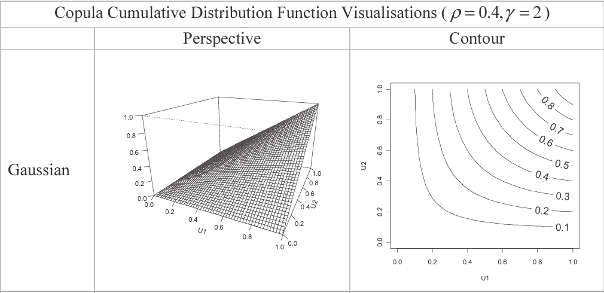

## Module 18 Objective

Demonstrate understanding of the use of copulas as part of the process of modeling multivariate risks, including recommendation of an appropriate copula

***

ERM is interested in all the risk an org faces and ways they interact with each other

Module focus on the ***theory and application*** of copulas

Use of the techniques here to model specific types of risk will be covered in part 5

## Recall: Prereq

***PDF and CDF***

For any r.v. $X$:

* PDF: $f(x) = \Pr(X=x)$

* CDF: $F(x) = \Pr(X \leq x)$

Both have a range of $[0,1]$

***Marginal PDF***

$P(X = x) = \sum \limits_y P(X=x, Y=y)$

$f_X(x) = \int \limits_y f_{X,Y}(x,y)dy$

***Conditional PDF***

$P(X=x \mid Y=y) = \dfrac{P(X=x,Y=y)}{P(Y=y)}$

$f_{X \mid Y = y}(x,y) = \dfrac{f_{X,Y}(x,y)}{f_Y(y)}$

***Expectation***

$\mathrm{E}[g(X,Y)] = \sum \limits_x \sum \limits_y g(x,y)P(X=x,Y=y)$

$\int \limits_y \int \limits_x g(x,y) \: f_{X,Y}(x,y) \: dxdy$

***Covariance***

$\mathrm{Cov}(X,Y) = \mathrm{E}[(X-\mathrm{E}(X))(Y - \mathrm{E}(Y))] = \mathrm{E}(XY) - \mathrm{E}(X)\mathrm{E}(Y)$

***Correlation***

$\mathrm{Corr}(X,Y) = \rho(X,Y) = \dfrac{\mathrm{Cov}(X,Y)}{\sqrt{\mathrm{Var}(X)\mathrm{Var}(Y)}}$

***Sums and Products of Moments***

$\mathrm{E}(X+Y) = \mathrm{E}(X) + \mathrm{E}(Y)$

$\mathrm{E}(XY) = \mathrm{E}(X)\mathrm{E}(Y) + \mathrm{Cov}(X,Y)$

The above 2 equation are also true for functions $g(X)$ and $h(Y)$ of the r.v.

$\mathrm{Var}(X+Y) = \mathrm{Var}(X) + \mathrm{Var}(Y) + 2\mathrm{Cov}(X, Y)$

## Intro to Copulas

### Joint Distribution Functions

For ERM we need to model all the risks an org. faces and their inter-dependencies

* One way to do so is with a **joint distribution function** for *all the risk*

    $P(X_i = x_i:i=1...N) = f_{X_1,X_2,...,X_N}(x_1, x_2,...,x_N)$

* Corresponding **joint (cumulative) distribution functions** (CDF):

    $P(X_i \leq x_i:i=1...N) = F_{X_1,X_2,...,X_N}(x_1, x_2,...,x_N)$

### Why Copulas Are Useful

***Joint distribution functions***

* Each of the org's risk are represented as the **marginal distribution**

    $f_{X_1}(x_1) = \int \limits_{x_2} \dots \int \limits_{x_N} f_{X_1,X_2,...,X_N}(x_1,x_2,...,x_N)dx_2dx_3...dx_N$

* The joint distribution will combine information from the marginal risk distribution with other information on the way in which the risks interrelate or depend on one another

* The joint distribution expresses this dependence of interrelated factors on one another but it does so **implicity** 

    (You can't immediately see the nature of the interdependence by looking at the formula for the join distribution function)

***Copula***:  
Reflect this *interdependence* of factors **explicity**

### What is a Copula

***Copula*** ($C$)

Expresses a multivariate cumulative distribution functions in terms of the individual marginal cumulative distributions

$P(X_i \leq x_i ; i = 1...N) = F_{X_1,...,X_N}(x_1,...,x_N) = C_{X_1,...,X_N}\left[F_{X_1}(x_1),...,F_{X_N}(x_N)\right]$

* $C[\dots]$ is the relevant copula function

* The joint distribution function is expressed explicitly in terms of the marginal distributions and the copula function

***Key Idea***:

$\left\{\left\{\begin{array}{c}\text{Marginal distribution of} \\ \text{each risk factor} \end{array}\right\} \text{combined with {Copula}} \right\} = \left\{\begin{array}{c}\text{Joint distribution of} \\ \text{risk factors} \end{array}\right\}$

* Can think of copula as a CDF in many dimensions. It takes marginal probabilities and combines them so as to produce a joint probability

***N-dimension copula***:

$C(\mathbf{u}) = C(u_1,u_2,...,u_N) = P(U_1 \leq u_1,...,U_N \leq u_N)$

* $u_i = F_{X_i}(x_i)$

    i.e. the letter $u$ is used to denote the values of the individual CDFs, each range from $[0,1]$

* **Domain**:

    $C$ takes in $N$ values in the range $[0,1]$
    
* **Range**:

    Returns another value in the range $[0,1]$
    
    Since it's a distribution function

***Key beneftis***

* We can **deconstruct** the joint distribution of a set of variables into components (`marginal distribution` + `copulas`)

* We can **adjust each component independently** of the others

    e.g. if the marginal distribution change shape w/o affecting the relative order of the data values within each set of observations

    $\hookrightarrow$ The copula does not change (**property of invariance**)
    
### Example

*Given* **joint PDF**: $f_{X,Y}(x,y) = 6x^2y$ for $0 < x$, $y<1$

1. ***Marginal PDF***:

    $f_X(x) = \int 6x^2ydy = 3x^2 \int 2ydy = 3x^2$

    $f_Y(y) = \int 6x^2ydx = 2y \int 3x^2 dx = 2y$

2. ***Marginal CDF***:

    $F_X(x) = x^3$

    $F_Y(y) = y^2$

3. ***Joint CDF***:

    $F_{X,Y}(x,y) = \int \limits_{0}^x \int \limits_{0}^y 6t^2 s ds dt = \int \limits_0^x \left[6t^2 \dfrac{s^2}{2} \right]^y_0 dt = \int \limits_0^x 3t^2y^2 dt = \left[3 \dfrac{t^3}{3} y^2 \right]^x_0 = x^3 y^2$

4. ***Copula corresponding to the joint PDF***:

    $u = F_X(x) = x^3 \Rightarrow  x = u^{\frac{1}{3}}$

    $u = F_Y(y) = y^2 \Rightarrow  x = v^{\frac{1}{2}}$

    $F_{X,Y}(x,y) = x^3y^2 = uv = C_{X,Y}[u,v]$

    * The joint CDF can be described fully by $C_{X,Y}[u,v]$ and the marginal distributions

## Copulas as Probabilities

Consider how copulas relate to probability distributions and review the concept of dependence

### Basic Properties of Copulas

***Copulas property 1***

*Increasing* the **range of values** for the `variables` must *increase* the **probability** of observing a combination within that range

$C(u_1,u_2,...,u_N)$ is an increasing function of each input variable

* e.g. $C(u_1,u_2,u_3^*,u_4) > C(u_1,u_2,u_3,u_4)$ for $u^*_3 > u_3$

* Extension of the result for a univariate probability distribution function where:  

    $F(X^*) = P(X \leq x^*) > P(X \leq x) = F(x)$ if $x^* > x$

***Copulas property 2***

If we "integrate out" all the other variables (by setting CDFs equal to the maximum value of 1 so as to include all possible values), we will just have the marginal distribution of variable $i$

$C(1,...,1,u_i,1,...,1) = u_i$ for $i=1,2,...,d$ and $u_i \in [0,1]$

***Copulas property 3***

This property ensures that a valid probability (i.e. non-negative) is produced by the copula function for any valid combination of the parameters

For all $(a_1,...,a_N)$ and $(b_1,...,b_N)$ with $0 \leq a_i \leq b_i \leq 1$:

$\sum \limits_{i_1 = 1}^2 \sum \limits_{i_2 = 1}^2 \dots \sum \limits_{i_N = 1}^2 (-1)^{i_1+\dots+i_N} C(u_{1i_1},...,u_{Ni_N}) \geq 0$

* $u_{j1} = a_j$ and $u_{j2} = b_j$ for $j=1,2,...,N$

* $C$ is the distribution function for the vector of r.v. $(U_1,...,U_N)$

***Example of property 3***

*Let*:

$(a_1, a_2)$ and $(b_1, b_2)$ be values such that $0\leq a_1 \leq b_1 \leq 1$ and $0\leq a_2 \leq b_2 \leq 1$

*Then*:

$\begin{align}
  & \sum \limits_{i_1 = 1}^2 \sum \limits_{i_2 = 1}^2 (-1)^{i_1 + i_2}C(u_{1i_1},u_{2i_2}) \geq 0 \\
  & \Rightarrow \sum \limits_{i_1 = 1}^2 \left((-1)^{i_1 +1}C(u_{1i_1},u_{21}) + (-1)^{i_1 +2} C(u_{1i_1},u_{22}) \right) \geq 0\\
  & \Rightarrow (-1)^2 C(u_{11},u_{21}) + (-1)^3 C(u_{11},u_{22}) + (-1)^3 C(u_{12},u_{21}) + (-1)^4C(u_{12},u_{22}) \geq 0 \\
  & \Rightarrow C(u_{11},u_{21}) - C(u_{11},u_{22}) - C(u_{12},u_{21}) + C(u_{12},u_{22}) \geq 0 \\
\end{align}$

*By definition*:

$u_{11} = a_1$, $u_{21} = a_2$, $u_{12} = b_1$ and $u_{22} = b_2$

*So this requires that*:

$C(a_1,a_2) - C(a_1,b_2) - C(b_1,a_2) + C(b_1,b_2) \geq 0$

The inequality is equivalent to saying that the rectangle shaded diagonally downwards in the following diagram always has positive probability

*Now*:

$\begin{align}
        C(b_1, b_2) - C(a_1, b_2) &= P(U_1 \leq b_1, U_2 \leq b_2) - P(U_1 \leq a_1, U_2 \leq b_2) \\
        &= P(a_1 \leq U_1 \leq b_1, U_2 \leq b_2)\\
      \end{align}$
      
*And*:

$\begin{align}
        C(b_1, a_2) - C(a_1, a_2) &= P(U_1 \leq b_1, U_2 \leq a_2) - P(U_1 \leq a_1, U_2 \leq a_2) \\
        &= P(a_1 \leq U_1 \leq b_1, U_2 \leq a_2)\\
      \end{align}$

*Substituting* into the inequality:

$\begin{align}
  & P(a_1 \leq U_1 \leq b_1, U_2 \leq b_2) - P(a_1 \leq U_1 \leq b_1, U_2 \leq a_2) \geq 0 \\
  & \Rightarrow P(a_1 \leq U_1 \leq b_1, a_2 \leq U_2 \leq b_2) \geq 0
  \end{align}$

### Sklar's Theorem

***Sklar's theorem***

* If the marginal cumulative distributions are continuous, then $C$ is unique

* *Let* $F$ be a joint distribution function with marginal CDF $F_1,...,F_N$

    $\exists \: C : \forall \: x_1,...,x_N \in [-\infty, \infty]$

    $F(x_1,...,x_N) = C(F_1(x_1),...,F_N(x_N))$

* Conversely, if $C$ is a copula and $F_1,...,F_N$ are univariate CDF

    $\hookrightarrow$ The function $F$ (above) is a joint CDF with marginal CDF $F_1,...,F_N$

***Definition of the copula of a distribution*** (follow from above)

If the vector of r.v. $X$ has joint CDF $F$ with continuous marginal CDF $F_1,...,F_N$

$\hookrightarrow$ The copula of the distribution $F$ is the distribution function $C(F_1(x_1),...,F_N(x_N))$

### Discrete Copulas

***Empirical copula function***:

* Describes the relationship between the marginal variables based upon their **respective ranks**

* Such functions are examples of discrete (non-continuous) copula functions

*Consider* a series of joint observations $(X_t, Y_t)$ for $t= 1,2,...,T$:

***Method 1***

*Define*:

$\begin{align} F(x,y) &= \Pr(X_t \leq x, Y_t \leq y)\\
  &= \dfrac{1}{1+T}\sum\limits_{s=1}^T I(X_s \leq x, Y_s \leq y) \\
  \end{align}$
  
* $I(X_s \leq x, Y_s \leq y) = \begin{cases} 1 & \text{if }X_s \leq x \text{ and } Y_s \leq y \\
0 & \text{otherwise} \\ \end{cases}$

*In which case*:

$\dfrac{1}{1+T} \leq F(x,y) \leq \dfrac{T}{1+T}$

For sample with 99 values this would correspond to $0.01 \leq F(x,y) \leq 0.99$

***Example***

10 vectors of data $\mathbf{X}_1,...,\mathbf{X}_{10}$

* Each contains 2 elements

* For 3 of the 10 observations the first element takes values $\leq 2.7$ and the second takes value $\leq 1.4$

$\hat{F}(2.7,1,4) = \dfrac{1}{11} \times 3 = \dfrac{3}{11} = 0.273$

***Method 2***

Apply a **continuity correction** and *define*:

$\begin{align}
  F(x,y) &= \Pr(X_t \leq x, Y_t \leq y) \\
  &= \dfrac{1}{T} \left[ \sum\limits_{s=1}^T I(X_s \leq x, Y_s \leq y) - \dfrac{1}{2}  \right]
  \end{align}$

*In which case*:

$\dfrac{1}{2T} \leq F(x,y) \leq \dfrac{T - \frac{1}{2}}{T}$

***Example***

$\hat{F}(2.7,1,4) = \dfrac{1}{10}(3-0.5) = 0.25$

### Survival Copula

For 2 variables $X$ and $Y$, ***key property*** of a copula:

$F(x,y) = P[X\leq x, Y\leq y] = C[F_X(x), F_Y(y)]$

For each copula there is a corresponding ***survival copula*** defined by the "opposite relationship"

* The survival copula expresses the joint survival probability in terms of the marginal survival probabilities

$\bar{F}(x,y) = P[X > x, Y > y] = \bar{C}[\bar{F}_X(x), \bar{F}_Y(y)]$

* $\bar{F}_X(x) = 1 - F_X(x)$

* $\bar{F}_Y(y) = 1 - F_Y(y)$

***Relationship*** between the `survival copulas` and the `ordinary copulas`

$\bar{C}(1-u,1-v) = 1 - u- v + C(u,v)$

* Derivation of the above:

    $P[X \leq x \text{ or } Y \leq y] = 1 - P[X > x, Y>y]$

    $\hookrightarrow$ $1 - P[X > x, Y>y] = P[X\leq x] + P[Y\leq y] - P[X\leq x, Y \leq y]$

    *Redefine in terms of copula*: $1 - \bar{C}[\bar{F}_X(x), \bar{F}_Y(y)] = F_X(x) + F_Y(y) - C[F_X(x), F_Y(y)]$

    *Rearranging*: $\bar{C}[\bar{F}_X(x), \bar{F}_Y(y)] = 1- F_X(x) - F_Y(y) + C[F_X(x), F_Y(y)]$

The graphic below illustrate the **relationship on a copula density plot** in terms of two variables $X_1$ and $X_2$

### Copula Density Function

***Copula density function***:

* Describes the **rate of change** of the copula CDF

* Calculated by **partial differentiation** w.r.t each of the variables

    $c(u_1,...,u_N) = \dfrac{\partial^N C(u_1,...,u_n)}{\partial u_1 ... \partial u_N}$

* If all distribution functions are **continuous**:

    $c(u_1,...u_N) = \dfrac{f(x_1,...,x_N)}{f(x_1)f(x_2)...f(x_N)}$

## Concordance (or Association)

Identify various **different forms of association** (e.g. linear correlation with Pearson's $\rho$) and use this categorization to **select suitable potential candidate copulas** from the list of established copulas (or develop bespoke copula function)

### Dependence vs Concordance (or Association)

***Concordance***:

* Does not imply that one variable directly influences the other

    (i.e **does not imply** that one is **dependent** upon the other)

* The linear and rank correlation measures (from Module 15) indicate concordance (or association) but do not imply dependence

#### Axioms

(For a good measure of concordance)

***Scarsini's properties*** of a **good measure of concordance**, $M_{X,Y}$, between 2 variables ($X$ and $Y$) that are linked by a specified copula $C(F_X(x),F_Y(y))$:

1. **Completeness of domain**:

    $M_{X,Y}$ is defined for all values of $X$ and $Y$, with $X$ and $Y$ being continuous

2. **Symmetry**:

    $M_{X,Y} = M_{Y,X}$

3. **Coherence**:

    If $C_{X,Y}(u_1, u_2) \geq C_{W,Z}(u_1, u_2)$ for all $u_1, u_2 \in [0,1]$ then $M_{X,Y} \geq M_{W,Z}$

4. **Unit range**:

    $-1 \leq M_{X,Y} \leq 1$
    
    The extremes of this range should be feasible

5. **Independence**:

    If $X$ and $Y$ are independent *then* $M_{X,Y} = 0$

6. **Consistency**:

    If $X = -Z$ *then* $M_{X,Y} = -M_{X,Y}$

7. **Convergence**:  

    If $x_1, x_2,..., x_T$ and $y_1, y_2,...,y_T$ are each sequences of $T$ observations (of the r.v. $X$ and $Y$) with joint distribution function $_{T}F(x,y)$ and copula $_{T}C(F_X(x), F_Y(y))$
    
    $\hookrightarrow$ if $_{T}C(F_X(x), F_Y(y))$ tends to $C(F_X(x), F_Y(y))$ as the number of observations ($T$) increases we should also have $_{T}M_{X,Y}$ tending to $M_{X,Y}$

***Properties*** (of good measure of concordance) ***implied from above***

8. If $g(X)$ and $h(Y)$ are **monotonic transformations** of $X$ and $Y$ $\Rightarrow$ $M_{g(X),h(Y)} = M_{X,Y}$

9. If $X$ and $Y$ are **co-monotonic** $\Rightarrow$ $M_{X,Y} = 1$

10. IF $X$ and $Y$ are **counter monotonic** $\Rightarrow$ $M_{X,Y} = -1$

***Examples***

* Spearman's $\rho$ and Kendall's $\tau$ both satisfy these criteria for a good measure of concordance

* Pearson's $\rho$ only fulfills all the criteria when all the **marginal distributions are elliptical**

    e.g. a perfect non-linear relationship (e.g. $Y =\ln X$) will not result in $\rho = 1$

### Tail Dependence

Copulas can be used to describe the full relationship between the marginal distributions

Tail dependencies are of particular interest in RM as they describe joint concentrations of risk where they might be of particular concern (at the extremes of the marginal distributions)

**Coefficient** of the ***lower tail dependence***:

$\begin{align}
  _L\lambda_{X,Y} &= \lim \limits_{u \rightarrow 0^+} P\left(X \leq F_X^{-1}(u) \mid Y \leq F_Y^{-1}(u) \right) \\
  &= \lim \limits_{u \rightarrow 0^+} \dfrac{C(u,u)}{u}\\
\end{align}$

**Coefficient** of the ***upper tail dependence***:

$\begin{align}
  _U\lambda_{X,Y} &= \lim \limits_{u \rightarrow 1^-} P\left(X > F_X^{-1}(u) \mid Y > F_Y^{-1}(u) \right) \\
  &= \lim \limits_{u \rightarrow 0^+} \dfrac{\bar{C}(u,u)}{u}\\
\end{align}$

***Visually***, on a copula density plot:

***Tail dependences & coupula fitting***

* Level of tail dependences exhibited by a particular set of data will help to indicate which copula(s) might be appropriate to consider fitting

* Each copula has a specific degree of tail dependence which may be parameterized

***Derivation*** of the above formulas

$\begin{align}
  _{L}\lambda_{X,Y} &= \lim \limits_{u \rightarrow 0^+} P\left(X \leq F_X^{-1}(u) \mid Y \leq F_Y^{-1}(u) \right) \\
  &= \lim \limits_{u \rightarrow 0^+} \dfrac{P\left(X \leq F_X^{-1}(u), Y \leq F_Y^{-1}(u) \right)}{P(Y \leq F_Y^{-1}(u))} \\
  &= \lim \limits_{u \rightarrow 0^+} \dfrac{P\left(F_X(X) \leq u, F_Y(Y) \leq u \right)}{P(F_Y(Y) \leq u)} \\
  &= \lim \limits_{u \rightarrow 0^+} \dfrac{C(u,u)}{C(1,u)}\\
  &= \lim \limits_{u \rightarrow 0^+} \dfrac{C(u,u)}{C(1,u)}\\
\end{align}$

$\begin{align}
  _{U}\lambda_{X,Y} &= \lim \limits_{u \rightarrow 1^-} P\left(X > F_X^{-1}(u) \mid Y > F_Y^{-1}(u) \right) \\
  &= \lim \limits_{u \rightarrow 1^-} \dfrac{P\left(X > F_X^{-1}(u), Y > F_Y^{-1}(u) \right)}{P(Y > F_Y^{-1}(u))} \\
  &= \lim \limits_{u \rightarrow 1^-} \dfrac{P\left(F_X(X) > u, F_Y(Y) > u \right)}{P(F_Y(Y) > u)} \\
  &= \lim \limits_{u \rightarrow 1^-} \dfrac{C(1-u,1-u)}{1-u}\\
  &= \lim \limits_{u \rightarrow 0^+} \dfrac{\bar{C}(u,u)}{C(u)}\\
\end{align}$

The final equality above follows as a result of replace $1-u$ with $u$ and noting that letting $u \rightarrow 0^+$ in the limit of the new expression is the same as letting $u \rightarrow 1^-$ in the previous expression

## Three Main Types of Copulas

1. ***Fundamental Copulas***

    They represent the three basic dependencies that a set of variables can display

    a. [Independence](#ind-cop)
        
    b. [Perfect positive dependence](#min-cop)
        
    c. [Perfect negative dependence](#max-cop)

    They can combined to form a wider family of copula functions called the *Fréchet-Höffding* family

2. ***Explict Copulas***

    They have **simple closed-form** expression

    We will look at the general class of *Archimedean copulas*
    
    * e.g. Clayton copula

3. ***Implicit Copulas***

    They are based on well-known multivariate distributions, but **no simple closed-form*** expression exists

    * e.g. Gaussian copula (based on the normal distribution) and the *t* copula (based on *t* distribution)

## Fréchet-Höffding Copulas

***Fundamental copulas***:

1. [Independence (or product) copula](#ind-cop)

2. [Co-monotonicity (or minimum) copula](#min-cop)

3. [Counter-monotonicity copula](#max-cop)

### Independence Copula {#ind-cop}

***Independent*** or ***product copula***

$\begin{align}
  _{ind}C(F_{X_1}(x_1),...,F_{X_N}(x_N)) &= _{ind}C(u_1,...,u_N) \\
  &= \prod \limits_{i=1}^N u_N \\
  &= \prod \limits_{i=1}^N F_{X_i}(x_i)
\end{align}$

* The joint distribution is equal to the product of the individual distribution functions

* As the variables are independent, there is **no upper or lower tail dependence**

    i.e. $_{L}\lambda = _{U}\lambda = 0$

### Co-monotonicity Copula {#min-cop}

***Co-monotonicity*** or ***minimum copula***

$\begin{align}
  _{min}C(F_{X_1}(x_1),...,F_{X_N}(x_N)) &=_{\mathrm{min}}C(u_1,...,u_N) \\
  &= \mathrm{min}(u_1,...,y_N) \\
  &= \mathrm{min}(F_{X_1}(x_1),...,F_{X_N}(x_N)) \\
\end{align}$

Co-monotonicity copula represents the **perfect positive dependence** between variables

* i.e. all variables can be expressed as in increasing function (a monotonic transformation) of any given one of them

    $\therefore$ an increase in the value of one variable leads to an increase in the value of all the variables

* $_{L}\lambda = _{U}\lambda = 1$

### Counter-monotonicity Copula {#max-cop}

***Counter-monotonicity*** or ***maximum copula***

**Only defined in a 2 dimensions**:

$\begin{align}
  _{max}C(F_{X_1}(x_1),F_{X_2}(x_2)) &=_{\mathrm{min}}C(u,v) \\
  &= \mathrm{max}(u+v-1,0) \\
  &= \mathrm{max}(F_{X_1}(x_1) + F_{X_2}(x_2)-1,0) \\
\end{align}$

Counter-monotonoicity Copula represents **perfect negative dependence** between two variables

* i.e. a positive change in one will always be coupled with a negative movement in the other

* Tail dependency between the variables will only manifest itself when the variables are at opposite ends

    i.e. when one is high and on is low and no special relationship when both are low or both are high

* $_{L}\lambda = _{U}\lambda = 0$

### Fréchet-Höffding Bounds

$\mathrm{max}\left\{ \left( \sum \limits_{i=1}^N u_i \right) +1 -N, 0\right\} \leq C(u_1,u_2,...,u_N) \leq \mathrm{min}\{u1,u2,...,u_N\}$

In the **bivariate case**:

* The `co-monotonicity` and `counter-monotonicity` copulas represent the **extremes** of the possible levels of association between variables

    $\therefore$ they are the upper and lower bound for all copulas (aka the Fréchet-Höffding Bounds)

* Co-monotonicity = **upper bound**

* Counter-monotonicity = **lower bound**

* Even though the counter-monotonicity copula is not defined above 2 dimensions, the Fréchet-Höffding Bounds do exists

### Fréchet-Höffding Family and Mixture

The fundamental copulas are **specific cases** of the general Fréchet-Höffding family of copulas which are of the form

$\begin{align}
  _{F}C(F_{X_1}(x_1),...,F_{X_N}(x_N)) = & p \mathrm{max} \left(\left(\sum \limits_{i=1}^N F_{X_i}(x_i)\right)-1 ,0 \right) \\
  &+ (1-p-q)\prod \limits{i=1}^N F_{X_i}(x_i) \\
  &+ q \mathrm{min}(F_{X_1}(x_1),...,F_{X_N}(x_N))\\
\end{align}$

* $N\geq 2$

* $0 \leq p \leq 1$

* $0 \leq q \leq 1$

* $p+q\leq1$

* If $N>2$ then $p=0$ (as counter-mono copula only exists in 2-D)

In the **bivariate case**:

$_{F}C(u,v) = p \: \mathrm{max}(u+v-1,0) + (1-p-q)\:uv + q \: min(u,v)$

**Mixture copula** is defined when

* One of $p$ or $q$ = 0

* The other is $>0$

(Appendix of the CMP has more discussions on the attainable correlations)

### Copula CDF Visualization

Note how the co-monotonicity copula represents an upper bound to copulas and the counter-monotonicity copula represents the lower bound

## Archimedean Copulas

Important class of explicit copulas in closed form functions

### Generator Functions and Their Pseudo-Inverse

A ***valid generator function***:

$\psi: [0,1] \rightarrow [0, \infty]$ is a **continuous** and **strictly decreasing** function on $[0,1]$ with $\psi(1) = 0$ and $\psi(0) \leq \infty$

***Pseudo-inverse*** of $\psi$ with the domain $[0,\infty]$

$\psi^{[-1]}(x) = \begin{cases} \psi^{-1}(x) & 0 \leq x \leq \psi(0) \\ 0 & \psi(0) < x \leq \infty \\ \end{cases}$

* This ensures that for generator functions with $\psi(0) < \infty$, the inverse of $\psi$ is defined on the whole domain $[0,\infty]$

* If $\psi(0) = \infty$ then the pseudo-inverse is always equal to the "ordinary" inverse

    $\hookrightarrow$ Generator function is called a **strict generator function**

### Archimedean Copulas

***Archimedean class copulas*** have form:

$C(u_1,...,u_N) = \psi^{[-1]}\left( \sum \limits_{i=1}^N \psi(u_i) \right)$

* Where $\psi$ is a valid generator function which is **additionally convex**

    i.e. $\dfrac{d^2}{dx^2}\psi(x) \geq 0$

***For bivariate***:

$C(u,v) = \psi^{[-1]}(\psi(u)+ \psi(v))$

The definition of the pseudo-inverse function ensures that $\sum \limits_{i=1}^N \psi(u_i)$, the value of the Archimedean copula will be a valid probability (?)

### Characteristics of Archimedean Copulas

***Advantage***

* Relatively **simple to use**

* **Closed-form** probability distributions and so avoid the need for integration

***Limitations***

* **Small number of parameters** $(< 3)$

    $\hookrightarrow$ Application to heterogeneous groups of variables is limited

### Fitting Archimedean Copulas

Kendall's $\tau$ is a **function of the parameters** of the copula (for Archimedian copulas)

For ***single parameter*** form:

* Calculate Kendall's $\tau$ for the observations and solving to find $\alpha$

For ***multiple parameters*** form:

* Can't solve with just $\tau$ due to a one-to-many relationship between $\tau$ and the possible consistent set of parameter values

(See copulas summary in appendix [^cop-sum])

[^cop-sum]: ***Archimedean Copulas Summary***

    | Copula | Parameter Range | Generator Function | Strict? | Lower Limit | Upper Limit | $\tau$ | $_s\rho$ | $_L\lambda$ | $_U\lambda$ |
    | ------ | ------ | ------ | ------ | ------ | ------ | ------ | ------ | ------ | ------ |
    | Gumbel: $_{Gu}C_{\alpha}$ | $\alpha \geq 1$ | $(- \ln u)^{\alpha}$ | Always | $_{ind}C$ | $_{min}C$ | $1 - \dfrac{1}{\alpha}$ | no closed form | 0 | $2 - 2^{\frac{1}{\alpha}}$ |
    | Frank: $_{Fr}C_{\alpha}$ | $-\infty \leq \alpha \leq \infty$ | $-\ln \left( \dfrac{e^{-\alpha u} - 1}{e^{-\alpha}-1} \right)$ | Always | $_{max}C$ | $_{min}C$ | $1 + \dfrac{4(D_1(\alpha) -1)}{\alpha}$ | $1 - \dfrac{12\left(D_2(-\alpha) - D_1(-\alpha)\right)}{\alpha}$ | 0 | 0 |
    | Clayton: $_{Cl}C_{\alpha}$ | $\alpha \geq 1$ | $\dfrac{1}{\alpha}\left(u^{-\alpha}-1\right)$ | if $\alpha > 0$ | $_{max}C$ | $_{min}C$ | $\dfrac{\alpha}{\alpha + 2}$ | Complex form | $2^{-\frac{1}{\alpha}}$ if $\alpha > 0$ else 0 | 0 |
    | Generalized Clayton: $_{GC}C_{\alpha,\beta}$ | $\alpha > 0$; $\beta \geq 1$ | $\alpha^{-\beta}\left(u^{-\alpha} -1 \right)^{\beta}$ | Always | n/a | n/a | $\dfrac{(2+\alpha)\beta -2}{(2+\alpha)\beta}$ | Complex form | $2^{-\frac{1}{\alpha \beta}}$ | $2 - 2^{\frac{1}{\beta}}$ |
    
    * Debye function: $D_k(\alpha) = \dfrac{k}{\alpha^k} \int \limits_0^{\alpha}\dfrac{t^k}{e^t-1} \: dt$
    
    * For the Clayton and Frank copulas, taking the limit as $\alpha$ tends to 0 gives the independence copula
    
    * Note that by varing $\alpha$, the Clayton and Frank copulas can take any value between the counter-monotonicity copula and the co-monotonicity copula, and as such they are described as being **comprehensive copulas**

### Gumbel Copula

***Generator function***:

$_{Gu} \phi _{\alpha}(u) = (-\ln u)^{\alpha}$ for $1 \leq \alpha > \infty$

***Gumbel copula from generator function***:

1. Find inverse and solve for $u$:  
    
    $\begin{align}
      k &= (- \ln(u))^{\alpha} \\
      -k^{\frac{1}{\alpha}} &= \ln (u) \\
      u &= \exp \left( -k^{\frac{1}{\alpha}} \right) \\
      \psi^{-1}(u) &= \exp \left( -u^{\frac{1}{\alpha}} \right) \\
    \end{align}$

2. Plug in $C(u_1,...,u_N) = \psi^{[-1]}\left( \sum \limits_{i=1}^N \psi(u_i) \right)$:

    $\begin{align}
      _{Gu}C_{\alpha}(u_1,...,u_N) &= \psi^{[-1]}\left( \sum     \limits_{i=1}^N \psi(u_i) \right) \\
      &= \psi^{[-1]}\left( \sum \limits_{i=1}^N (-\ln(u_i))^{\alpha}     \right) \\
      &= \exp \left[ -\left( \sum \limits_{i=1}^N (-\ln(u_i))^{\alpha}     \right)^{1/\alpha}\right] \\
    \end{align}$

    e.g. **bivariate case**: $_{Gu}C_{\alpha}(u,v) = \exp \left[ - \left((-\ln(u))^{\alpha} + (- \ln(v))^{\alpha} \right)^{1/\alpha}\right]$

***Special cases*** of the Gumbel:

* $\alpha = 1$: Independence copula

* $\alpha \rightarrow \infty$: co-monotonic (minimum) copula

***Application of Gumbel***

* The upper tail dependency (but no lower tail dependency) of the Gumbel makes it suitable for modeling situations where **associations increase for extreme high values** (but not for extreme low values)

    e.g. modeling losses from a credit portfolio where losses are recorded as (+) values

### Frank Copula

***Generator function***:

$_{Fr}\psi_{\alpha}(u) = - \ln \left( \dfrac{e^{-\alpha i} - 1}{e^{-\alpha} -1}\right)$ for $\alpha \in \mathbb{R}$

***Multivariate Frank Copula***:

$_{Fr}C_{\alpha}(u_1,...,u_N) = - \dfrac{1}{\alpha} \ln \left( 1 + \dfrac{\prod \limits_{i=1}^N (e^{-\alpha u_i}-1)}{(e^{-\alpha}-1)^{N-1}} \right)$

If $N>$ then this is only defined for $\alpha > 0$

* Else it does not satisfy the fundamental conditions required for a copula

***Bivariate case***:

$_{Fr}C_{\alpha}(u,v) = - \dfrac{1}{\alpha} \ln \left( 1 + \dfrac{ (e^{-\alpha u}-1)(e^{-\alpha v}-1)}{(e^{-\alpha}-1)} \right)$

***Special cases*** of the multidimensional Frank:

* $N =2, \alpha = -\infty$: Counter-monotonicity (maximum) copula

* $\alpha \rightarrow \infty$: Co-monotonicity (minimum) copula

***Application of Frank***

* Application is limited by it characteristics

* **No tail dependency**

* **Symmetric form**

* Can be consider when modeling joint and last survivor annuities and exchange rate movements

### Clayton Copula

***Generator function***

$_{Cl}\psi_{\alpha}(u) = \dfrac{1}{\alpha}(u^-{\alpha} - 1)$

***Multivariate Clayton copula***

$_{Cl}C_{\alpha}(u_1,...,u_N)=\left( \left\{ \sum \limits_{i=1}^N u_i^{-\alpha} \right\} -N +1 \right)^{-\frac{1}{\alpha}}$

***Bivariate case***

$_{Cl}C_{\alpha}(u,v) = \left(u^{-\alpha} + v^{-\alpha}-1 \right)^{-\frac{1}{\alpha}}$

***Application of Clayton***

* **Absence of upper tail** dependency but potential **lower tail** dependency (when $\alpha >0$)

* Suitable for modeling situations where **associations increase for extreme lower values** (but not for higher values)

    e.g. modeling returns from a portfolio of investments, where negative returns are likely to occur simultaneously on a number of investments

### Generalized Clayton Copula

***Generator function***

$_{GC}\psi_{\alpha,\beta}(u) = \dfrac{1}{\alpha^{\beta}}(u^{-\alpha}-1)^{\beta}$ for $\alpha \geq 0$ $\beta \geq 1$

***Multivariate generalized Clayton***

$_{GC}C_{\alpha,\beta}(u_1,...,u_N) = \left( \left\{ \sum \limits_{i=1}^N \left[ (u_i^{-\alpha} - 1)^{\beta} \right] \right\}^{\frac{1}{\beta}} + 1\right)^{-\frac{1}{\alpha}}$

***Bivariate case***

$_{GC}C_{\alpha,\beta}(u,v) = \left( \left\{ (u^{-\alpha} - 1)^{\beta} + (v^{-\alpha} - 1)^{\beta} \right\}^{\frac{1}{\beta}}+1 \right)^{-\frac{1}{\alpha}}$

***Special case***

* $\beta = 1$: Standard Clayton copula

***Application of generalized Clayton***

* Has **both upper and lower** tail dependencies

* Can be **adjusted independently** using the two parameters of the copula function

***

Appendix provides precise information on the dependence measure of the Archimedean copulas

Important to note that the degree of tail dependency (where it exists) is a function of the parameter(s) of the copula

Difficult to see the differences between the example distribution functions above

Density functions below are more helpful

Note that the level of tail dependency is determined by a parameter $\alpha$

## Implicit Copulas

### Normal Copula

*Let* $\mathbf{X}$ be a vector of $N$ standard normal r.v. 

$\therefore$ $\mathbf{X}$ has multivariate normal distribution $N(\mathbf{0,R})$

* $\mathbf{R}$ is the correlation matrix of the individual r.v.

* Applying the Gaussian copula to normal marginal distributions will results in a multivariate normal distribution

***Normal Copula***

$\begin{align}
  _{Ga}C_{\mathbf{R}}(\mathbf{u}) &= P(\Phi (X_1) \leq u_1,...,\Phi (X_N) \leq u_N) \\
  &= P(X_1 \leq \Phi^{-1}(u_1),...,X_N \leq \Phi^{-1}(u_N)) \\
  &= \boldsymbol{\Phi}_{\mathbf{R}}(\Phi^{-1}(u_1),...,\Phi^{-1}(u_N)) \\
\end{align}$

* $\Phi$ is the distribution function of a standard normal r.v.

* $\boldsymbol{\Phi}_{\mathbf{R}}$ is the joint normal distribution function of $\mathbf{X}$ based on the $N(N-1)/2$ correlation coefficients in $\mathbf{R}$

In general a ***correlation matrix*** will be

* A **symmetric** matrix  

    (since $\mathrm{Corr}(X_j, X_k) = \mathrm{Corr}(X_k, X_j)$ for all $j$ and $k$)

* With **1s on the leading diagonal**

    (since $\mathrm{Corr}(X_j, X_j)$ for all $j$)

* $\therefore$ $N$ dimension matrix has $N(N-1)/2$ elements

***Special cases***

1. $\mathbf{R} = \mathbf{I}_N$ ($N$-dimensional identity matrix)

    $\hookrightarrow$ Becomes the **independence copula**

    (since no linear correlation between the variables)

2. $\mathbf{R}$ is a matrix consisting entirely of 1s

    $\hookrightarrow$ Becomes the **minimum (co-monotonicity) copula**

    (since there is a perfect linear relationship)

***Bivariate case***

$_{Ga}C_{\rho}(u,v) = \Phi_{\rho}(\Phi^{-1}(u),\Phi^{-1}(v))$

* **Special case** for the bivariate case ($N=2$) with $\rho = -1$

    $\hookrightarrow$ Becomes the **maximum (counter-monotonicity) copula**

    (since there is a perfect negative linear correlation between the variables)

* In 2-D the Gaussian copula allows the joint distribution to reflect any dependence between the variables from perfect (+) to (-) dependence depending on the $\rho$

    $\hookrightarrow$ Gaussian is a **comprehensive** copula (very versatile)

***Gaussian copula can be described as an integral***:

$_{Ga}C_{\rho}(u_1, u_2) = \dfrac{1}{2 \pi \sqrt{1-\rho^2}} \int \limits_{-\infty}^{\Phi^{-1}(u_1)} \int \limits_{-\infty}^{\Phi^{-1}(u_2)} e^{-z} ds dt$

* $z = \dfrac{1}{2(1-\rho^2)} (s^2 + t^2 - 2 \rho s t)$

* Shows that in 2-D the Gaussian copula is **fully determined by the correlation** between the 2 variables ($\rho$)

***Nature of tail dependencies***

* In 2-D:

    If $\mid \rho \mid < 1$
    
    $\hookrightarrow$ The Gaussian copula has **zero tail dependencies**

***Disadvantage***

1. Lack of tail dependency

2. Defined by a single parameter

### Student's t

***Overcoming Normal's Disadvantage***

1. Has only **2 parameter**

2. Enables the **degree of dependence at the extremes** of the marginals to be **controlled independently** of the `correlation matrix` by **varying the number of d.f.**
    
*Let* $\mathbf{X}$ be a vector of $N$ r.v. taken from a multivariate *t*

* $\gamma$ d.f.

* mean = 0

* Correlation matrix $\mathbf{R}$

* $\mathbf{X} \sim t(\gamma, \mathbf{0}, \mathbf{R})$

*Then* *t*-copula:

$_t C_{\gamma, \mathbf{R}}(\mathbf{u}) = t_{\gamma, \mathbf{R}}(t_{\gamma}^{-1}(u_1),...,t_{\gamma}^{-1}(u_N))$

* $t_{\gamma}$ is the distribution function of a univariate *t*-random variable with $\gamma$ d.f.

* $t_{\gamma, \mathbf{R}}$ is the joint CDF of the vector $\mathbf{X}$

***Special cases***

1. If $\mathbf{R} = \mathbf{I}_N$ (*N*-dimensional identity matrix)

    $\hookrightarrow$ Does **NOT** become the independence copula

    $\because$ r.v. from an uncorrelated multivariate *t*-distribution are not independent

2. If $\mathbf{R}$ is a matrix consisting entirely of 1s

    $\hookrightarrow$ Becomes the **minimum (co-monotonicity) copula**

3. If $\gamma = \infty$

    $\hookrightarrow$ Becomes the **Gaussian copula**

***Bivariate case***

$_t C_{\gamma,\rho}(u_1, u_2) = \dfrac{1}{2 \pi \sqrt{1-\rho^2}} \int \limits_{-\infty}^{t_{\gamma}^{-1}(u_1)} \int \limits_{-\infty}^{t_{\gamma}^{-1}(u_2)} \left(1 + \dfrac{s^2 +t^2 - 2\rho s t}{2\gamma(1-\rho^2)} \right)^{\frac{\gamma + 2}{2}} ds dt$

***Nature of tail dependencies***

* For finite values of $\gamma$ the Student's *t* copula has both upper and lower tail dependencies

* The smaller the value of $\gamma$, the greater the level of association at the extremes of the marginals

    Increased association is present in all 4 extreme corners of the copula distribution (not just upper and lower tail dependencies)

Similarly, it is easier to see the difference with the density functions below

