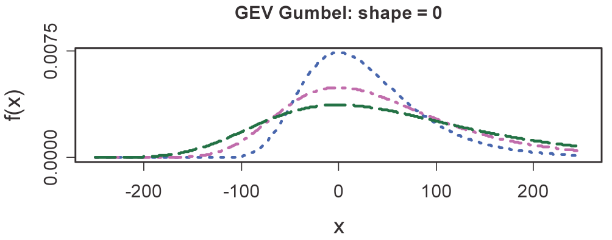
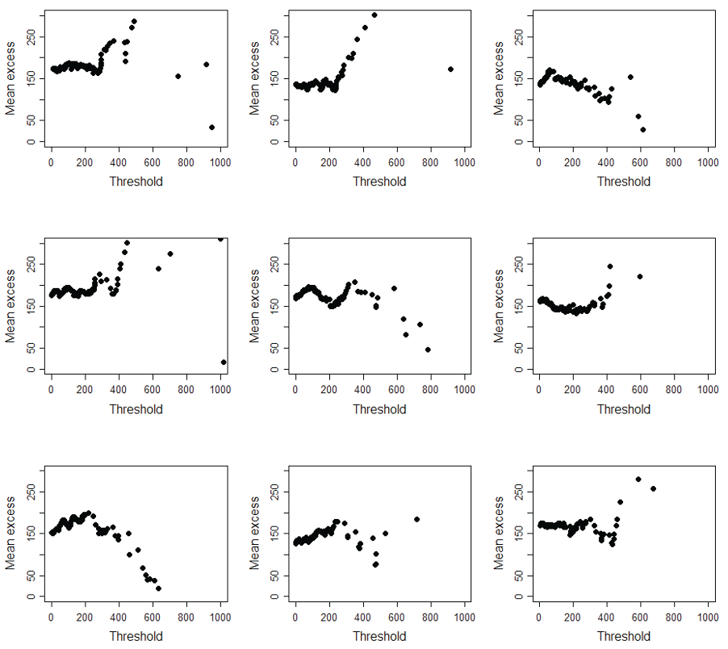

## Module Objective

Explain the importance of the tails of distributions, tail correlations and low freq/ high severity events

Demonstrate how extreme value theory can be used to help model risks that have a low probability

***

Look more closely at the tails of distributions

Focus is on considering the modeling of risks with low freq and high sev

Need to be able to recommend a specific approach and choice of model for the tails based on a mixture of quantitative analysis and graphical diagnostics

Should be able to describe how the main theoretical results can be used in practice

## Tail Distributions/ Correlations

Important to model the tail of a distribution accurately due to the potentially devastating impact on companies

### Low Freq/ High Sev Events

Low frequency $\Rightarrow$ Little data to model their effects accurately

Example:

* 2008 credit crisis generated more extreme movements in equity values and credit spreads than had been seen over the 20 years previously
* Oct 19 1987 Black Monday S&P fell by 20.5% (Which is a 1-in-2100 event based on the estimated return period)
* 9/11 and other natural disasters like 2013 Philippines typhoon

***Challenge of modeling the tail***

1. We can model the tail by modeling the full distribution but need make sure the **form of the distribution is correct in the tails**

    * Use data from both stressed and non-stressed periods to fit the distribution
    * Financial data is typically more leptokurtic (narrow peak and fat tail)
        * $\therefore$ Extreme values for equity occur more frequently than predicted with a normal distribution
        * A better distribution would be *t* distribution

    **Reasons for fat tails** in financial data

    * Heteroscedastic returns (i.e. volatility varies over time)
    * Innovation in a heteroscedastic model are best modeled using a fat tailed distribution

2. **Fitting the tail**

    * Difficult since paramter estimates are **heavily influenced** by the main bulk of the data in the **middle of the distribution**
    * This is where extreme value theory comes can help
    
## Extreme Value Theory

### Definition of Extreme

2 approach:

1. Consider an extreme value as the maximum value in a set of $n$ losses

    **Block maximum**
    
    e.g. $X_M = max(X_1,X_2,...,X_n)$

2. Consider all losses that exceed a certain **threshold** as being extreme

### Limiting Behaviour

For losses that have typical sizes (values from the central part of the distribution) we can use CLT

* CLT: standardized value of the average loss $\dfrac{\bar{X} - \mu}{\sigma/\sqrt{n}}$ can be approximated using a normal distribution
    * $\bar{X}$ is the mean of the $n$ samples from a distribution with mean $\mu$ and variance $\sigma$
    
Need similar method to estimate the behavior of the extreme values in the tail of the distribution

Extreme value theory has the 2 main results below

Key idea of extreme value theory is that there are certain families of distributions (Generalized Extreme Value and Generalized Pareto) that describe the behavior of the tails of many distributions

#### Maxima

The distribution of the block maxima $X_M = max(X_1, X_2,...,X_n)$ is approximately described by the **Generalized Extreme Value (GEV) family** of distributions if $n$ is sufficiently large

Look at $X_M = max(X_1, X_2,...,X_n)$, block maxima

If we look at a number of such blocks then these maxima can be standardized in a similar way

* i.e. We calculate expressions of the form $\dfrac{X_M - \alpha_n}{\beta_n}$
* Can approximate by an extreme value distribution

#### Threshold Exceedances

The tail of the distribution above a threshold $\Pr(X>x+u \mid X>u)$ can be approximated, for large values of $u$ by the **Generalized Pareto Distribution** (GPD)

* Consider the expected size of losses that exceed a certain thresholds

## Generalized Extreme Value Distribution

Generalized Extreme Value family of distributions are important in the study of limiting behavior of sample extremes

### Extreme Values Theorem (EVT)

Need distribution of $X_M = max(X_1, X_2,...,X_n)$ where each $X_i$ is an observed loss

If losses are *iid* with CDF $F$:

$\begin{align}
  P(X_M \leq x) &= P(X_1 \leq x, X_2 \leq x, ..., X_n \leq x) \\
  &= P(X_1\leq x)P(X_2\leq x)...P(X_n \leq x) \\
  &= \left[ P(X_1\leq x) \right]^n
  &= \left[ F(x) \right]^n
  &= F^n (x)\\
\end{align}$

Standardized for a sequence of real constants $\beta_1,...,\beta_n > 0$ and $\alpha_1,...,\alpha_n$ and consider the limit as $n$ increases:

Limiting distribution $H(x)$

$H(x) = \lim \limits_{n \rightarrow \infty} P \left(\dfrac{X_M - \alpha_n}{\beta_n} \leq x \right) = \lim \limits_{n \rightarrow \infty} F^n(\beta_n x + \alpha_n)$

Result applies for all commonly used statistical distributions from which the $X_i$ may originate

***Example***

Determine $H(x)$ where $X_i$ are exponentially distribution (i.e. $F(x) = 1 - e^{-\lambda x}$) by setting $\beta = \dfrac{1}{\lambda}$ (i.e. $\beta_n = \beta$ for all $n$) and $\alpha_n = \dfrac{1}{\lambda} \ln(n)$

Substituting the above into $\beta x + \alpha_n$:

$\begin{align}
  F(\beta x + \alpha_n) &= F\left( \dfrac{x + \ln(n)}{\lambda} \right) \\
  &= 1 - \exp\left\{-\lambda\left(\dfrac{x + \ln(n)}{\lambda}\right)\right\} \\
  &= 1 - \dfrac{1}{n}e^{-x} \\
\end{align}$

$\begin{align}
  \lim \limits_{n \rightarrow \infty} F^n(\beta_n x + \alpha_n) &= \lim \limits_{n \rightarrow \infty} \left( 1 - \dfrac{1}{n}e^{-x} \right)^n & \\
  &= e^{-e^{-x}} & \text{since } e^x = \lim \limits_{n \rightarrow \infty} \left( 1 + \dfrac{x}{n}\right)^n \\
\end{align}$
  
### GEV Distribution

GEV family of distributions havs 3 parameters

1. $\alpha$: location parameter
2. $\beta > 0$: scale parameter

    $\alpha$ and $\beta$ just rescale (shift and stretch) the distribution (similar to mean and s.d.)
    
3. $\gamma$: shape parameter

CDF of the GEV family:

$P(X_M \leq x) \approx H(x)
\begin{cases}
  \exp\left\{ -\left( 1 + \dfrac{\gamma(x-\alpha)}{\beta} \right)^{\frac{-1}{\gamma}} \right\} & \gamma \neq 0 \\
  \exp\left\{ - \exp\left\{ - \dfrac{(x-\alpha)}{\beta} \right\} \right\} & \gamma = 0\\
\end{cases}$

CDF of the **standard** GEV distribution has $\alpha=0$ and $\beta =1$

#### Three Forms of GEV

The forms of the GEV family distribution is determined by the sign of $\gamma$ ((+), (-), 0)

***Gumbel GEV***

$\gamma=0$

Tail falls exponentially

***Weibull GEV***

$\gamma<0$

Finite upper bound indicating an absolute maximum

Application:

* Distribution of **natural phenomenon**: e.g. temperature, wind-speed, age of human population etc
* When loss was certain not to exceed a certain value (e.g. reinsured)

***Fréchet-type GEV***

$\gamma > 0$

Tails of the distribution become heavier

* Follow a power law
* Infinite variance if $\gamma > \dfrac{1}{2}$

Application:

* Most suitable for modeling extreme financial loss events

Distribution has a lower bound since $x$ takes values such that  $1 + \dfrac{\gamma{x-\alpha}}{\beta}$ $\Rightarrow$ $x - \alpha > \dfrac{-\beta}{\gamma}$ $\Rightarrow$ $x > \alpha - \dfrac{\beta}{\gamma}$

### Underlying Distribution

If we know the form of the underlying loss distribution we can work out the limiting distribution of the maximum value ($H(x)$)(?)

Then we can classify the resulting distribution into one of the 3 types based on the sign of $\gamma$

GEV Distributions (for the maximum value) corresponding to common loss distributions

| Type | Weibull | Gumbel | Fréchet |
| ------------ | ----------- | -------------- | ---------------- |
| Shape Parameter | $\gamma < 0$ | $\gamma = 0$ | $\gamma >0$ |
| Underlying Distribution | `Beta` `Uniform` `Triangular` | `Chi-square` `Exponential` `Gamma` `Log-normal` `Normal` `Weibull` | `Burr` `F` `Log-gamma` `Pareto` `t` |
| Range of values permitted | $x < \alpha - \dfrac{\beta}{\gamma}$ | $-\infty < x < \infty$ | $x > \alpha - \dfrac{\beta}{\gamma}$ |

**Criteria** to predict which family a particular distribution belongs to

* **Finite upper limits** $\Rightarrow$ Weibull
* **Light tail** + **finite moments** $\Rightarrow$ Gumbel
* **Heavy tail** + **infinite moments** $\Rightarrow$ Fréchet

### Fitting a GEV Distribution

Need to subdivide data into groups and calculate the maximum for each group

#### Return levels and periods

GEV distribution can be used to analyse a set of observed losses in 2 different ways

1. **Return-level approach**

    Select the maximum observation in each block

2. **Return-period approach**

    Count the observations in each block that exceed some set level

***Number of blocks***

The **larger** the number of blocks, the fewer observations in each block $\Rightarrow$ Gives less information about extreme values (e.g. for approach 1. we get 1-in-100 rather than 1-in-1000)

* Gives more "extreme" values to fit $\Rightarrow$ reduces the variance of the parameter

The **fewer** blocks, more observation in each $\Rightarrow$ more information about the extreme  values

* Variance of parameter estimate is greater

#### Parameterization

One we selected the data, we can estimate the parameters for the GEV distribution using MLE or method of moments

e.g. using MLE to estimate the parameters of the GEV distribution if we have:

* Data divided into $m$ blocks of size $n$
* Maximum of the $j$^th^ block to be $M_{nj}$ (i.e. the maximum data are $M_{n1},...,M_{nm}$)

Using the density function of the GEV distribution $h(x)$, we can get the log-likelihood:

$\ln\left( L(\gamma, \alpha, \beta) \right) = \sum \limits_{i=1}^m \ln\left( h(M_{ni}) \right)$

Maximize with the following constraints:

* $\beta > 0$
* $\left(1 + \gamma \dfrac{M_{ni} - \alpha}{\beta} \right) > 0$

### Advantages/Disadvantages

We can use GEV distributions to investigate the limiting distributions for the minimum values of a distribution

Given $H(x)$: limiting dist^n^ for the maximum value for a particular $\gamma$ $\Rightarrow$ $1 - H(-x)$ is the limiting dist^n^ for the minimum value from the same original dist^n^

***Limitations**

1. A lot of **data (information) is lost**
    
    Everything apart from the maxima in each block is effectively ignored
    
2. Choice of **block size** can be subjective

    Compromise between `granularity` (1-in-100 vs 1-in-1000) and `parameter uncertainty`
    
## Generalized Pareto Distribution

Consider all claim values exceed some threshold as extreme values

For large samples, the distribution of these extreme values converges to the generalized Pareto distribution (GPD)

Need to select a suitably high threshold to fit the GPD

### Threshold Exceedances

If we let $X$ be a r.v. with distribution $F$

Then the XS distribution over the threshold $u$ has the distribution function:

$F_u(x) = P(X - u \leq x \mid X > u) \ \dfrac{F(x+u) - F(u)}{1 - F(u)}$

* For $x \leq x < x_F - u$ where $x_F \leq \infty$ is the right endpoint of $X$

If the losses are *iid*, as the threshold $\uparrow$, the distribution of the conditional losses $\lim \limits_{u \rightarrow \infty} F_u(x)$ will converge to the GPD $G(x)$

$G(x) = 
  \begin{cases}
    1 - \left(1+\dfrac{x}{\gamma \beta} \right)^{-\gamma} & \gamma \neq 0 \\
    1 - \exp\left\{ - \dfrac{x}{\beta}\right\} & \gamma = 0\\
  \end{cases}$

* $\beta > 0$: Scale parameter
* $\gamma$: Shape parameter
* CDF of the standardized GPD has $\beta = 1$

***Characteristics***

Bounds

* Lower bound: $x \geq 0$ when $\gamma > 0$
* Upper bound: $0 \leq x \leq - \gamma \beta$ when $\gamma < 0$

If $\gamma > 0$ then the GPD becomes the Pareto distribution

Mean of the GPD: $\mathrm{X} = \dfrac{\gamma \beta}{\gamma -1}$ provided $\gamma > 1$

If $\gamma >0$ then $\mathrm{E}(X^k) = \infty$ for $k \geq \gamma$

* e.g. if $\gamma \leq 2$ then we have $\mathrm{E}(X^2) = \infty$ (i.e. we have infinite variance)

### Asymptotic Property

When the maxima of a distribution converge to a GEV distribution, the XS distribution converges to a GPD distribution with an equivalent shape parameter $\gamma$

### Mean XS Function

**Mean XS function** $e(u)$:

$e(u) = \mathrm{E}(X-u \mid X > u)$

* Helps with fitting a GPD

**Empirical mean XS function** $e_N(u)$:

$e_N(u) = \dfrac{\sum \limits_{i=1}^N (X_i - u)I(X_i>u)}{\sum \limits_{i=1}^N I(X_i>u)}$

* Calculated for each of the $N$ observed data points by setting $u=X_i$ for $i=1,...,N$

**Mean XS plot**

Each of the observed losses has been treated as a potential threshold (on the x-axis) and the mean XS loss based on that threshold has been calculated and plotted (y-axis)

**Example**

Mean XS function for $X\sim Exp(\lambda)$

$\begin{align}
  F_u(x) &= P(X \leq x + u \mid x >u) & \\
  &= P(X \leq x) & \text{Since memoriness} \\
  &= F(x)\\
\end{align}$

So the XS distribution is also $Exp(\lambda)$ and the mean XS function is $e(u) = \dfrac{1}{\lambda}$, which is independent of $u$

### Fitting a GPD

Need to decide on the threshold $u$, above which we will approximate the underlying distribution with the GPD

Should consider the **context** when picking $u$

* e.g. XS over which a reinsurer might be liable to cover

Typically $u$ is around the 90-95^th^ percentile of the full distribution

**Consideration** for choosing threshold $u$

Trade off between `quality of the approximation` to the GPD (good for high $u$) vs `level of bias` in the fit we achieve (good for low $u$)

**High value** for $u$

* The asymptotic properties apply more accurately (as we are closer to $\infty$)
* But have few data values to work with (estimates may be unreliable)

Recall (asymptotic property):  
When maxima of a dist^n^ ($M_{ni}$) converge to a GEV, the XS dist^n^ ($F_u(x)$) converge to GPD w/ equivalent $\gamma$

Under the above circumstances $e(u)$ will become a linear function of $u$

* If we plot $e(u)$ against $u$ we should see linearity appear for higher values of $u$

    Slope of this line is related to $\gamma$ $\therefore$ facilitating the fitting of a GPD distribution to the empirical XS distribution
    
So to select a suitable threshold, we are looking for the mean XS to be linear to $u$

* Graphical test for tail behavior can then be based on the empirical mean XS function

In the $Exp(lambda)$ example above, the mean XS function was constant (i.e. slope was 0), but for other distributions the mean XS function will slope upwards it $\gamma$ is (+) and downwards if $\gamma$ is (-)

***Mean XS simulations***

Below is a selection of mean XS loss plots from simulation

* Each is based on the same underlying $Exp(\lambda)$ distribution

There is a large random element to the plots' appearance and many of them are far from horizontal

Therefore selecting a suitable threshold (and value of $\gamma$) is very difficult

***Example***

Based on the sample mean XS plot (from the mean XS function section)

Below shows the different possibilities for choosing the threshold

* Longest (solid) line is the least squares linear regression on the whole data set
* Shorter (dotted) line is a regression on just the tail (above 100,000)
* Shortest (dashed) line is a regression on the tail (above 100,000) excluding the final five points

This again, shows the subjectivity in the fitting process

#### Parameterization

Above the chosen threshold, we can fit a GPD by using standard techniques (e.g. MLE, Method of moments) to calculate $\gamma$ and $\beta$

***MLE Example***

Data before cut off $X = \{X_1,...,X_n\}$ is assumed to be *iid*

$Y_j = X_j - u$ is the amount of the XS loss when the threshold is exceeded

Assume $Y_j$ follow a GPD, not the $X_j$

Assume a random number of observations $N_u$ exceed the threshold

If we attempt to fit a GPD with parameters $\gamma$ and $\beta$ and probability density function $g(x)$ to the data $(Y_1, Y_2, ...,Y_n)$ then we get the following lo-likelihood function:

$\ln \left( L(\gamma,\beta; Y) \right) = \sum \limits_{j=1}^N_u \ln \left( g(Y_j) \right)$

Domain of valid values for $x$ will depend on the values of the parameters $\gamma$ and $\beta$