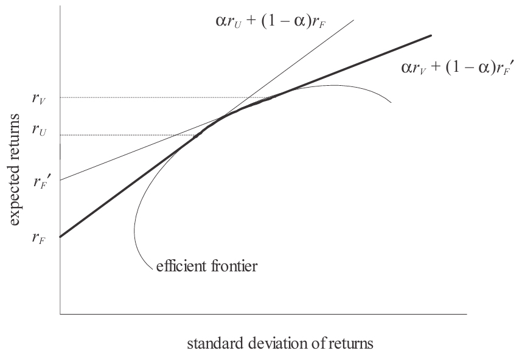

## Module Objective

Discuss the application of risk management control cycle including the relevance of external influences and emerging risk

Describe risk optimization and responses to risk

* How to optimize an objective, possibly subject to constraints
* Risk optimization and responses to risk using illustrative examples

Recommend approaches which balance benefits against inherent costs, that can be used to manage an org's overall risk profile

* How to reduce risk by transferring it
* How to reduce risk without transferring it
* Understand the importance of residual risks and new risks arising following risk mitigation actions
* Understand how an org's ability to manage risk is affect by regulatory, capacity and cost constraints

***

After analyzing and assessing risks, the next stage of the cycle is to decide how to deal with them

* This module discuss general risk responses, including optimization and constraints

Sec 1 is an overview of the aims of risk control and notes that selecting ERM responses bears similarities to the active management of a bond or equity portfolio

Sec 2 consider active portfolio management and what lessons are applicable to ERM

Sec 3 consider the possible responses to risks (reduce, removal, transfer, retain)

Sec 4 looks at alternative risk transfer which combine features of derivatives and insurance and offer innovative ways to transfer risk

## Risk Control

Risk management can **optimize** the `risk/return profile` of the organization by:

* Support **selective growth** of the business

    * Establish process for assessing new opportunities  
    (incl. assessment of risk adjusted return)
    * Allocate capital and other resources to BUs or activiteis with high risk-adjusted return 
    
* Support **profitability** through `risk-adjusted pricing`
  
    * Prices should reflect the cost of risk (capital)  
    (In addition to funding costs and operational expenses)
    * NPV and EVA do not fully reflect the cost of risk if it is based on book values of capital
    
* Use limit setting to `control` the size and probability of **potential losses**

    * Set basic **exposure** limits: provide absolute limits on exposure
    * Set **stop loss** limits: limits on actual losses, which if reached will trigger management action
    * Set **sensitivity** limits: keep potential losses from potential extreme events within acceptable bounds (avoid excessive concentration of risk)
    
* Employ techniques to manage existing risks

    * **Active portfolio management**: manage the company's portfolio of activities where each has their own risk/return characteristics
    * **Reduce risk**: e.g. duration matching to reduce interest rate risk
    * **Transfer risk** to a 3^rd^ party: e.g. with insurance or derivatives
    
    Active portfolio management and risk reduction strategy are often used in preference over risk transfer as they are usually more cost effective and longer term solutions
    
    Risk transfer tend to be quicker and easier to implement
    
## Portfolio Management Techniques and ERM

### Fundamental Concepts of Portfolio Management

Objective of RM is to **optimize** the balance between `risk` and `return`

* Optimatlity is judged by reference to **risk appetite**
* RM is not simply minimizing risk

5 ***fundamental concepts*** in the management of a **portfolio** of risks

1. **Risk**: typically expressed as the s.d. of returns
2. **Reward**: usually expressed as the expected return on investment
3. **Diversification**: reduce overall risk by investing in many different projects or assets whose returns are not perfectly correlated
4. **Leverage**: borrow money and investing it $\Rightarrow$ increase the potential risk and return profile of the overall portfolio
5. **Hedging**: entering into an agreement which reduces risk, usually because the position taken is negatively correlated with the org's existing position

### Risk-return Measures

ROA or ROE fail to reflect the risk taken to achieve the return

**Risk-adjusted return on capital**:

$RAROC = \dfrac{\text{risk-adjusted return}}{\text{capital}}$

* Can be calculated for an institution as a whole or for each separate activities
* Can be based on actual or expected return and capital

**Sharpe ratio**:

$SR = \dfrac{R_p -r_f}{\sigma_p}$

* Commonly used in the assessment of investment managers, compare those who have taken different level of risk
* Measures the out-performance (in XS of risk free return) compared to the riskiness of the portfolio ($\sigma_p$ volatility)

**Return on risk-adjusted assets** (RORAA)

$ROAA = \dfrac{\text{net income}}{\text{risk-adjusted assets}}$

**Risk-adjusted return on assets** (RAROA)

$ROAA = \dfrac{\text{risk-adjusted return}}{\text{assets}}$

**Return on risk-adjusted capital** (RORAC)

$ROAA = \dfrac{\text{net income}}{\text{capital}}$ or $\dfrac{\text{net income}}{VaR}$

**Risk adjusted return on risk-adjusted assets** (RARORA)

$ROAA = \dfrac{\text{risk-adjusted return}}{\text{risk-adjusted assets}}$

### Risk Optimzation

Orgs need to adopt a risk optimization strategy which can **aligned** to `stakeholder expectations`

* e.g. powerful segments may exist who are unwilling to accept any degree of risk exposure

Remember the BoD should aim to maximize s/h value

* Vital to remember that risk presents both upside and downside and it is the balance of risk against reward that drives optimization strategy

***2 types of risk***

* **Specific risk**: risk particular to a company, which can be diversify away
* **Systematic risk**: risk of being in the market, can not be diversified away

**Total Variance of a Portfolio of Equally Weighted Assets**

$\sigma^2_p = \underbrace{\overbrace{\dfrac{\bar{\sigma}^2}{n}}^{\lim \limits_{n \rightarrow \infty} \rightarrow 0}}_{\text{Firm Risk}} + \underbrace{\dfrac{n-1}{n}\bar{\operatorname{Cov}}}_{\text{Systematic Risk}}$

* Systematic risk remains even as $n \rightarrow \infty$

* Formula assumes each of the $n$ securities have the same $\sigma$ and $\bar{\operatorname{Cov}}$ with each other

* For a diversified portfolio the contribution to portfolio risk  will only depends on the covariance of the security's return with other securities

***Method based on MVPT***

* Consider the company to be a collection of projects with their own risk/return profile
* Then we can apply mean-variance portfolio theory to locate the efficient frontier for all available projects
* And determine the optimal mix of projects that leads to the highest level of return given the risk appetite of the org

The MVPT can be extended to any portfolio of risks through consideration of the potential rewards arising from the adoption of any of the wide range of different risk management strategies available

* THe optimization exercise should be carried out in relation to the characteristics of the portfolio and the risk appetite of the organization

#### Portfolio Mean and Variance

Portfolio expected return: $\mu = \sum \limits_{i} w_i \mu_i$

* $\mu_i$: expected return on asset $i$
* $w_i$: proportion invested in asset $i$

Portfolio variance: $\sigma^2 = \sum \limits_m \sum \limits_n w_m w_n C_{mn}$

* $C_{mn} = \rho_{mn} \sigma_m \sigma_n$ is the covariance of the returns on securities $m$ and $n$

***For 2 assets*** $A$ and $B$

$\mu = w_A \mu_a + \w_B \mu_B$

$\sigma^2 = w_A^2 \sigma_A^2 + w_B^2 \sigma_B^2 + 2 w_A w_B C_{AB}$

Minimum variance:

$w_A = \dfrac{\sigma_B^2 - C_{AB}}{\sigma_A^2 + \sigma_B^2 - 2 C_{AB}}$

#### Separation Theorem

Portfolios with the highest return for a given level of risk are said to be on the **efficient frontier**

$\alpha$ will be invested in 2 risky assets $U$ and $V$ and $1 - \alpha$  will be invested in a risk free asset

* If $0 < \alpha < 1$: positive exposure to the risk free asset which does not add to the overall risk of the portfolio
* If $\alpha >1$: negative exposure; borrow money at risk free or ($r_F'$ with a premium to risk free) and invest in risky asset

Assuming all investors have the same view of risk and return and behave rationally then security prices should result in equilibrium such that the expected return on any efficient portfolio is a linear function of its s.d.

The resulting set of possible efficient portfolios are shown as the boded line below:

The fact that the optimal risky portfolio can be determined without any of the investor's risk appetite accounted for is known as the separation theorem

In order to determine where on the boded line the investor will invest, we need to know the investors risk appetite (or utility function)

### Benefits of Portfolio Management in ERM

4 reasons portfolio management is useful in ERM and how it aid optimization of risk/reward

1. Encourages companies to **unbundle** the business into its component projects
    * Enables management to decide separately how to treat each project (e.g. retain, increase/decrease, or transfer risk)
    * May encourage companies to think about where they add value or can best compete (and focus on that risk area by transferring other risks to those who can manage them more efficiently)
2. Provides a **mechanism for aggregating risks** across the org
    * Useful for more transparent reporting and information purposes
    * Enables transfer of some or all of these risks to a central team (allows specialist team to hedge or otherwise manage the risk)(can also assess the risk-adjusted profitability if the BU was charged a price to transfer the risk to CRF)
3. Provides a **framework** in which `risk concentration limits` and `asset allocation targets` can be set
    * The two above operate together to achieve the org's desired risk/return profile
    * Risk concentration limit impose a minimum level of diversification for the portfolio
    * Asset allocation targets ensure most emphasis or resource is allocated to the more promising opportunities/projects
4. **Influences** `investment`, `transfer pricing` and `capital allocation` decisions
    * Org can vary the price it charges a BU to transfer a particular risk to the CRF, so influencing that unit to expand or contract in that area
    * Having identified the risk/return characteristics of the org's projects, management can allocate most capital to those expected to deliver the highest risk-adjusted return
    * Market value of an org is influenced not only by the products it is selling now, but the products that are in the pipeline (they represent options owned by the org)
    * MPT highlights the importance of diversification as a means of reducing risk without necessarily reducing expected return $\therefore$ MPT encourages orgs to invest in their pipeline products as well as a range of products that are currently generating revenue
    
### Does Portfolio Management Really Add Value?

Some argues that passive management (index tracking) is more sensible as there is little evidence that active management results in higher sustainable risk-adjusted returns in practice

However, when managing an organization's portfolio of risk, there is no appropriate index to track so it's not an option

It is sensible to use tools such as risk concentration limits and asset allocation targets and to apply the principles of MVPT in an attempt to determine the mix of projects that sits on the efficient frontier

(take a look at Lam's example from 105-107 to make sure the concept is understood)

## Risk Responses

### Developing a Response to Each Risk

Key types of responses to risk are:

* **Avoidance** (risk removal)
* **Acceptance** (risk retention)
* **Transfer** (risk transfer)
* **Management** (risk reduction w/o transfer)

4 steps process to developing risk responses:

1. Conduct research about possible responses and their costs
2. Determine a response for each risk, ensuring a deadline for implementation is specified
3. Assign a risk manager who is responsible for ensuring the response is implemented
4. Consider whether secondary risks (risks arising as a result of the response) might emerge and what the residual risks are

Key features of a good risk response

* **Economical**: cost of implementation $\ngtr$ the reduction in risk  
(however low freq/high sev risk may have low expected value but the impact could be catastrophic if realized)
* **Well matched** to the risk: avoid `basis risk`
* **Simple**: avoid mistakes in executing the response
* **Active**: should instigate action not just simply inform
* **Flexible** and **dynamic**: react to changing circumstances

The response chosen is necessary to :

* Allows for the cost of risk when pricing
* Optimize risk-adjusted performance through appropriate resource allocation

### Risk Transfer

Risk transfer = reassigning risk = deflecting risk

* Involve passing the risk to another org or another part of the same org

Ways in which risks can be reduced through transfer:

* Insurance: provides capital if an event occurs (contingent capital) in return for a premium
* Reinsurance
* Co-insurance
* Sharing the risk wit a policyholder via product design
* Securitization: packaging risk into a marketable investment
* Purchase of some forms of derivative
* Alternative risk transfer: combine features of derivatives and insurance
* Outsourcing

Common form of risk transfer within insurance is policy XS or co-payment, which returns some of the risk to the policyholder

Risk transfer must be based on good mutual understanding of each of the parties' objectives; Must also recognize the ability of the party assuming the risk to take action and understand the context of the risk, and it must be cost efficient

***Cost***

Cost is typically over and above the expected loss

* Cost includes the price that the assuming party requires in order to accept the risk
* When risk are transferred, the upside potential may also be removed as well

***Counterparty Risk***

Risk transfer introduces counterparty risk as it involves a 3^rd^ party

There may be regulatory restrictions that reduce the effectiveness of risk transfer (e.g. maximum permissible amount that can be transferred to a single counterparty; or the permitted reduction in regulatory capital may be capped for some forms of transfer)

The effectiveness of transfer might also be limited by the capacity of the market to which it is being transferred (e.g. there may be no appetite in the reinsurance market to accept significant quantities of longevity risk on immediate annuities)

ERM can aid the risk transfer process:

* Providing a framework in which:
    * An org's net exposure to each type of risk can be assessed an deiversification of risk can be recongized, so **avoiding the cost of over hedging**
    * Cost of different risk transfer strategies can be assessed
* Helping to establish consistent risk transfer policies across an org.

### Risk Reduction without Transfer

Risk reduction without transfer = risk management = risk treatment = risk mitigation

Generally risk may be reduced by reducing the likelihood or impact

Ways to reduce risk without transfer:

* Diversify overall risk by taking on uncorrelated risks  
(e.g. across types of products sold, socio economic status, geographic spread, investment asset types/sector)

* Reduce random fluctuation by increasing the size of a portfolio

* Some risks can be partially hedge by taking on risks with the opposite characteristics to those held  
(e.g. selling both insurance produces with mortality risk and longevity risk)

    * Important to understand the effectiveness of the hedge

* Greater asset liability matching

* Reduce op-risk through implementation of strong internal controls and governance

* Reduce underwriting and pricing risks through robust underwriting practices and intelligent data analysis using appropriate homogeneous groupings and taking into account both past and likely future trends

* Credit and counterparty risks can be reduced through robust due diligence practices and ensuring the agreements are tightly worded

* Reduce agency risk through the use of intelligent remuneration and bonus systems that align better the interest of different stakeholders

* Overall solvency or wind-up risk is reduced through increased capital or funding

There will be implementation cost and reduced potential for upside for most methods (more in mod 27 and 29)

### Risk Removal

Possible to get rid of risk entirely

* For op-risk, this is often easiest and cheapest to do in the planning phase of a project

Overall amount of risk taken on by a company can be reduced by avoidance, such as writing fewer "high risk" products, or investing in a lower proportion in "high risk" assets

**Factors** to consider for risk removal

* **Cost** of removing the risk
* Impact of removing the risk on the likelihood of the project meeting its **original objective**
* Whether any **opportunities will be lost** as a result of removing the risk

### Risk Retention

Risk retention = absorbing risk = accepting risk = tolerating risk

Day to day risk are usually more profitable to retain

Organization may retain risk if:

* the risk is a component of its core business
* it appears to be the most economical approach (e.g. expensive to document and settle relatively small losses)
* there is no alternative (e.g. no one to transfer the risk to at an acceptable cost)

### Residual Risk

3 circumstances that give rise to residual risk

* Decision was made to retain them
* Result of a risk response action (i.e. secondary risk like counterparty risk)
* Result from an imperfect hedge (i.e. basis risk)

Important to identify residual risk in the risk planning stage

For remaining residual risk that cannot be insured against or hedge, risk capital should be held in order to mitigate their impact

## Alternative Risk Transfer (ART)

### Summary of ART Products

**ART**: non-traditional risk transfer product which often combine features of both insurance and derivatives

Two broad categories:

1. Vehicles based on capital market instruments
2. Other unconventional vehicles used to cover conventional risks (e.g. non capital market risk transfer)

(Know the descriptions of ART products in Table 8.1 p.113 and p.123 of Lam)

In order to develop and offer ART products to be used by 3^rd^ parties an organization needs to be able to:

* Quantify risk in terms of both likelihood of occurrence and size
* Package, underwrite and sell securities

Also need to hold capital if the org retain any of the risk itself

### Advantages of ART

1. **Improved organizational focus**
    * Enable companies to transfer risk to another party, helping them to focus on their core business and maximize capital efficiency
    
2. **Customiztion and timing**
    * Typically customized to the org, enabling it to obtain the level and nature of cover it wants
    * Some can provide capital faster (e.g. cat-e-puts) than more traditional approaches (e.g. right issues) and at the precise time that it is most needed
    
3. **Cost reduction** and **simplified admin**
    * Multi-line policy generally cost less (than ala-cart) as any natural hedges or lack of correlations can be recognized in pricing
    * Multi-line policies reduce number of separate policies $\Rightarrow$ reducing admin cost
    * Tax efficient methods can be employed (e.g. offshore captives)
    * Pooling of risks can lead to cost savings due to diversification (e.g. risk retention groups)

4. **Earnings stability**
    * Can cover multiple types of risk for extended period of time  
    $\therefore$ enable an org to smooth earnings more easily than through a series of 1-yr contracts

5. **Marking-to-market**
    * Capital market risk transfer establishes a market based price for the risks being transferred
    
### Problems with ART

ART is relatively new (started in 1970s) and a rapidly developing area

Problems include

1. Higher **initial costs** than conventional products
2. Products are more complex than conventional products $\Rightarrow$ Increasing the time and cost of developing a solution for an org
3. An org may need to change the way it assesses and manages risk in order to gain maximum benefit from ART
4. Staff need to be educated about ART so they can
    * Understand the product
    * Assess any seller of ART products
    * Appreciate the impact of regulations and accounting standards

### Future of ART

Potential drivers for increased use of ART in the future

1. Conventional insurance becomes more expensive (cost savings offered by multi-line policies)
2. ERM becomes more widespread  
Orgs that integrate their risk assessment and management across the org are likely to appreciate integrated risk transfer mechanisms
3. It becomes widely recognized that companies should focus more on their core business and eliminate or transfer other risks