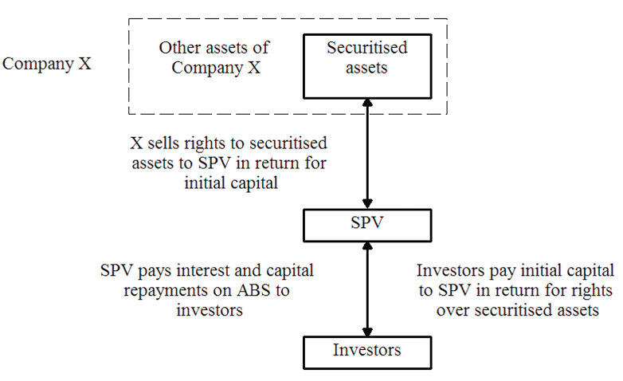
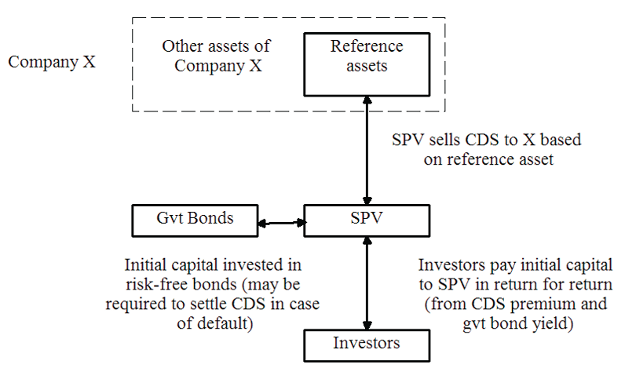

## Module 28 Objective

Describe the tools and techniques for identifying and managing credit and counterparty risk

***

Sec 1 & 2: Focus on the **normal view** of credit risk (i.e. risk of a counterparty defaulting on its obligations)

Sec 3: Consider managing a company's **own credit worthiness** (i.e. risk that the company defaults on its obligations to others)

***Exam note***:

* Need to **recommend strategies** for dealing with market and operational risks and likely applied to credit risk too

## Credit Risk Management Process

5 stages in the credit risk management process:

1. **Policy** and **infrastructure**

2. **Credit granting**

3. Exposure **monitoring**, **management** and **reporting**

4. **Portfolio management**

5. **Credit review**

### 1. Policy and Infrastructure

***Goal*** of this stage:

1. To have **documented** credit **policies** and **procedures**

2. To *ensure* credit risk can be effectively **identified**, **measured**, **monitored**, **controlled** and **reported**

This stage ***involves***:

1. **Establishing** an *appropriate* `credit environment`

2. **Adopting** credit risk `policies` and `procedures`

    * Appropriate to the company's business context

    * Address a range of topics

    * Adopted by senior management

3. **Implementing** credit risk `policies` and `procedures`

    * **Communicate** to all relevant employees

    * Review at least annually to reflect any change in the business context

4. *Developing* **methodologies** and **models** with appropriate systems

5. *Defining* **data standards** and **conventions**

### 2. Credit Granting

***Extending credit*** to customers or other counterparties:

1. Credit **analysis/rating** of counterparties

2. Credit **approval**

3. **Pricing** and setting **term and conditions** for credit

4. **Documentation**

Credit rating can be applied to the `transaction` or to the `counterparty`

***Characteristics*** of an **effective** and **efficient** credit rating system:

* Strike a **balance** between `effectiveness` (accurate, consistent and timely) and `efficiency` (low cost)

* May be based on **pure judegement** or **deterministic modeling** (or both)

* Should **respond to changes** in circumstances of the counterparty 

    (e.g. ratings being review regularly)

***Ratings*** should reflect the following ***factors***:

1. Borrower's repayment **history**

2. Analysis of the borrower's **ability to pay**

3. **Reputation**

4. Availability and enforceability of **guarantees** or **collateral**

### 3. Exposure Monitoring, Management and Reporting

***Purpose*** of this stage:

* **Prevent undue exposure** to an individual counterparty

* Ensure appropriate portfolio **diversification**

* Provide **early warning** of possible adverse credit events  

    (e.g. monitor indicators such as credit spreads and stock price volatility)

***2 types of credit exposure***:

1. **Current exposure**:

    Amount of risk **today** if all `credit transactions` were **settled** and `credit assets` **sold**

2. **Potential exposure**:

    Amount that **may be at risk in the future**
    
    Likely to be a function of `time to maturity` and `volatility` of the *underlying* instrument

Exposure may be calculated from the current exposure or using some rule of thumb (important to take consistent approach)

***Exposure limits***

* **Avoid concentration of risk** in a `single counterparties`, `connected counterparties` and `other groupings`

* Actual credit exposure should be compared to the limits

***4 uses*** of *exposure limits*:

1. **Risk control**:

    Prevent from engaging in overly risky business activities

2. **Allocation** of **risk bearing capacity**:

    Limits should reflect management's assessment of risk/return trade off

3. **Delegation** of **authority**:

    Ensure credit decisions are made by those with the appropriate skill and delegated authority

4. **Regulatory compliance**:

    Regulators maintain close scrutiny of credit risk controls

***Best practice*** credit risk **reporting**

* **Relevant** and **timely**

* **Reliable**

* **Comparable**

* **Material**

* *Should includes*

    * Trends
    
    * Risk-adjusted profitability
    
    * Large individual exposures
    
    * Aggregate exposures
    
    * Exceptions

### 4. Portfolio Management

***Credit portfolio management function***:

* **Optimize** the desired risk/return trade offs by *defining* a **target portfolio**

* Historically credit risk stayed on the company's b/s until settlement of the transaction

* **Strategies** and **financial vehicles** used for portfolio management includes:

    * **Buying or selling** assets

    * **Securitizing** assets

    * **Hedging** risks using derivatives

    * **Transferring** risk
    
Current trend is to **disaggregate** the business into: **origination**, **portfolio management** and **servicing**

* Enables loans to be *packaged* into various **asset-backed securities** 
    *Introduces* **market discipline** and **feedback** on `underwriting`, `pricing` and `documentation` as separate business components

* *However*, a **lack of controls** across these dis-aggregated business components is one of the key reasons for the credit crisis

### 5. Credit Review

***Role of credit review***:

* **Review** a **sample** of transactions and associated documentation to ensure data is correct

* Test that **systems are working**

* Enforce **underwriting standards**

* Check **policies** and **procedures** are being **followed**

Results of the review should be communicated to management

* Any exceptions or deficiencies should be highlighted, along with the established timeframes for their resolution

### Best Practices

|  | Basic | Standard | Best |
| --------------------- | --------------------- | --------------------- | --------------------- |
| ***Credit risk ratings*** | **Common definitions** of `risk` and `exposure` measurement across the business; Very **few risk ratings**; Focus on **individual transactions** | Better risk rating **linking** into `pricing`, `reserve` and `capital requirements`; Credit exposure **limits** by `counterparty`, `industry`, `country` | Risk managed at **individual** transaction and **portfolio** level |
| ***Modeling*** | Simple **spreadsheet** models and **credit bureau reports** | **Internal** and **3^rd^ party** model consider a **variety of indicators** | **Sophisticated tools** (incl. `simulation` models, `scenario` analysis and planning, `advanced credit scoring`, `surveillance` and `migration` models) |
| ***Credit risk function*** | **Policy**, **approval** and **monitoring** | More **integration** into `loan origination`; Performance measured by **risk-adjusted** profitability of BU | **Centralized active portfolio management** aim to **optimize** portfolio risk/return; **Strong credit culture** |

* The level of sophistication required depends on the risk profile of the company

* Even best practice companies can build up dangerous levels of concentration of risk

## Credit Risk Management Techniques

**Underwriting** and **due diligence**:

* Facilitate decisions as to the appropriate types of response to a particular credit risk exposure

    (i.e. avoidance, acceptance, transfer and or management)

**Transfer** of credit risk is often achieved by `credit insurance`, `credit derivatives` and or by the `securitization` of assets

### 1. Underwriting

**Approaches** to check creditworthiness

* **Credit scoring** approach (Module 23)

* **Component analysis** technique (Module 19)

* **3^rd^ party ratings** (e.g. Moody's or Experian)

2 ***potential outcomes*** of underwriting

1. **Decision**

    (e.g. approve or denied)

2. What **terms** should be placed on the loan

    (e.g. interest rate, requirement to provide collateral)

### 2. Due Diligence

***Due diligence***: Refers to the **care** a *reasonable person* should take *before* entering into any agreement or transaction with another party

* Should be done when a company enter into a major agreement with a 3^rd^ party

* Degree of due diligence varies depending on the type of relationship and value of the transaction

* Generally covers a **wide range of factors** (e.g. `public` and `internal documents`) including **subjective information** (e.g. `interview` with management and other stakeholders)

* Can be expensive and time consuming

* Process is very similar to that undertaken by credit-rating agencies when determining a rating

2 ***potential outcome*** of due diligence

1. **Avoidance** of exposure to the counterparty

2. Acting to **limit exposure**

    (e.g. through careful payment schedule)

Optional reading of an extensive due diligence checklist: "The Financial Risk Manual - A Systematic Guide to Identifying and Managing Financial Risk" J Holliwell

### 3.1 Credit Insurance

***Credit insurance***: One way to mitigate large exposures to particular types of credit risk

* Particularly for **incidental credit risk** (not related to core business)

***Benefits*** of credit insurance

1. Protection against some or all bad debts

2. Cover for some or all debtors

3. Cover for `domestic` or `international` trade

4. **Specialist advice** based on the experience of the insurer

5. Cover for expenses incurred

6. International cover for country risk, debt recovery services and any losses on forward foreign exchange commitments

7. Ability to **secure better terms** for financing (help to offset the cost of the insurance)

***Cost of the insurance*** will take into account: `Industry sector`, the `country risk`, the `nature of the goods and services`, the `term of trade` and the `track record of existing buyers`

When **settling claims** the insurer will ensure:

1. Goods and services have actually been provided

2. The debt exists

3. That credit limits have not been exceeded

4. Insurance premium has been paid

### 3.2 Credit Derivatives

2 types of instrument that can be used to manage credit risk are **Credit Default Swaps** (CDS) and **Total Rate of Return Swaps** (TRORS)

Liquidity of both the TRORS and CDS maybe better than the underlying asset

$\hookrightarrow$ Advantage of using them as **hedging tools** (Instead of directly selling the underlying credit risk in the cash markets)

Both TRORS and CDS introduce counterparty risk

#### CDS

***Use case***:

* Lenders who have **reached their internal credit limit** with a particular client, but wish to maintain their relationship with the client can use CDS

    e.g. CDS give Bank X the right to sell a bond, which was issued by Company Y to Bank Z for the face value of the bond should Company Y experience a pre-specified type of credit event

***Types of Credit Events***

1. **Bankruptcy**

    (e.g. insolvency, winding-up, appointment of a receiver)

2. Rating **downgrade**

3. **Repudiation**

    When debt issuer simply chooses to cancel all of the o/s interest payments and the capital repayment of the debt

4. **Failure to pay** a particular coupon

5. **Cross-default**

    A cross default clause on a bond means that a credit event on another security of the issuing firm will also be considered a credit even on the referenced bond

***CDS Structure***

* Payment of a fee (single or regular) by the party that is looking to hedge to the party that is selling the protection

* Seller of the protection will make a credit default protection payment if a credit default event on the reference asset occurs within the term of the contract

* Hedge the default risk but **does not explicitly hedge the price risk**

***Settlement types***

1. **Cash settlement**:

    Amount of the protection payment = **original price** of the reference asset $-$ **recovery value** of the reference asset
    
    **Disadvantage**:
    
    * Recovery **process takes time**, may invoke uncertain cost for the CDS owner and the ultimate recovery amount is uncertain
    
    * Contract needs to clearly state what is the recovery value
    
        If it's the market value, it is important to specify the time
    
2. **Physical settlement**:

    The seller pays the full notional amount and receives the defaulted security
    
    **Disadvantage**: Will be **more costly** than cash settlement

***Other features of CDS***
    
* CDS contract can *reference* a `portfolio of bonds` or a `whole bond index`

* Buyer of CDS **may not have any insurable interest** (no exposure to the reference entity)

    $\hookrightarrow$ CDS can be used as an alternative to short-selling the reference asset

#### TRORS

***Total rate of return swaps*** (total return swaps) can hedge *both* **price** and **default** risk

* Total return from one asset (or group of asset) is swapped for the return on another

* This creates a hedge for both market (price) risk and credit (default) risk of the reference assets

* Investors who cannot short securities maybe be able to hedge a long position by paying the total rate of return in a TRORS

***Use case***:

1. **Increase diversification**:

    Swapping one type of exposure for another without physically swapping the underlying assets

2. **Manage specific risk**

    (e.g. credit risk)

***Example***: 

* $A$ owns a risky bond from $B$

* $A$ pay coupons from bond to bank $C$

* Bank $C$ pays $A$ LIBOR + 2%

* If $B$ doesn't default, $A$ pay additional payment to $C$ = increase in the value of the bond from $B$

    (So $A$ overall pays the total return received on bond from $B$ in return for LIBOR +2%)

* If $B$ default, $C$ will receive from $A$ a net payment on default based on the face value of bond from $B$ less recovery

### 3.3 Securitization

Involves **pooling** together a group of assets, combined with the issue of one or more tranches of asset backed securities (ABS)

* Cashflows generated by the pool of assets are used to service the interest and capital payments on the ABS

#### Structure

***Framework of securitization***:

1. `Originator` *sells* those assets to a **special purpose vehicle** (SPV)

2. `SPV` raises the funds to purchase the assets by **issuing debt securities** such as bonds to investors (these are the ABS)

3. The receivables transferred into the SPV meet the principal and interest liabilities on the debt securities

    * SPV may grant security over the receivables to secure its obligation to repay principal and interest

    * In which case, investor in the SPV would be entitled to claim the underlying assets in the event of default
    
SPV will be ***structured to be bankruptcy remote*** in the event of the failure of the borrower (i.e. it is a separately legal entity, usually a company in its own right)

* Hence in the event of the default by the SPV, the investors has no recourse to the assets of the original owner and vice versa

***Example***

1. Company X sells the secured assets that will generate the future income stream to the SPV

2. SPV raises the required funds to purchase them by issuing (asset backed) bonds to investors

3. Cashflow generated by the secured assets is then paid to the SPV, which in turn uses them to meet the interest and capital payments on the ABS

#### Benefits

1. Converts a bundle of assets into a structured financial instrument which is then negotiable

2. A way for a company to **raise money**, that is linked directly to the cashflow receipts that it anticipate receiving in the future

3. An **alternate source of finance** to issuing "normal" secured or unsecured bonds

4. A way of **passing the risk** in the assets to a 3^rd^ party, removing them from the b/s and reducing capital

5. A way of effectively **selling exposure** to what may be an **otherwise unmarketable pool of assets**

#### Types of Securitized Assets

Originally they are **homogeneous** debt obligations (residential mortgages or trade receivables) subject to relatively **simple terms and conditions**

* *However*, scope of securitization and ABS grew rapidly prior to the credit crunch

***Examples of ABS***

1. **MBS** residential and commercial mortgage backed securities:

    Payments are secured or collateralized on the interest and capital payments made under mortgages used to buy property

2. **CCABS** credit card receivables:

    Based on the payments made by credit card holders to the credit card company

3. **CLO, CBO, CDO** Collateralized loan, bond and debt obligations:

    Typically collateralized on existing bank loans, bonds and a mixture of both bank loans and bonds respectively

4. **Insurance securitization**:

    Backed by the receivables arising from an insurance book

Almost any assets that generate a reasonably predictable income stream can in theory be used as the basis of an ABS

#### Tranches

Borrowing are normally made in a **multi tranche format** with credit ratings or credit default protection obtained for at least the major tranches

* Tranches are repaid according to the rules laid down in the documentation

* Actual returns will depend on the actual `timing of repayments` on the underlying assets, any `early repayments` and any `default losses` and `recoveries`

* **Expected returns** on each tranche are **highly sensitive** to the choice of **model/parameters** used to project these uncertain future cashflows

By working with credit rating agencies to structure the bond tranches in the way that best meets the various risk and return requirements of the different potential investors, it may be possible to reduce the overall cost of borrowing (i.e. raise a greater price in exchange for the transfer of assets to the SPV)

***Cashflows from the underlying portfolio*** might be used to create:

* Bond with **fixed coupon** rate:

    Most **senior** security and its coupons are paid first
    
    Senior debt that might carry AAA rating

* Bond whose coupons are paid as long as there is enough left from the senior debt:

    **Mezzanine** tranche, typically BB rating

* Claim on the residual cashflows from the original portfolio after the 2 senior classes are paid:

    High yield speculative bond, **equity** claim

Such a tranched structure is called a **collateralized debt obligation** (CDO) if the **underlying assets** are `bank loans` and or `bonds`

* Similar structure involving a number of different tranches of ABS can be used irrespective of the underlying securitized assets

***Key benefit***

* They combine the credit risks of different instruments into a portfolio which is then divided and repackaged as several new securities with **credit risk features different** to the `underlying instruments`

* These alternative **features** may be **more attractive** to particular investors

    $\hookrightarrow$ Proceeds of the securitization will be higher than if the underlying instruments had been securitized as a single tranche

#### Credit-linked Note

***CLN***: A collateralized vehicle consisting of a **bond** with an **embedded CDS**

* Can be used by the `holder of corporate bonds` (protection buyer) to **transfer the credit risk** on those bonds (reference asset) to other investors

***Process***:

1. Setting up an SPV

2. Sells the CLNs to investors

3. Uses the proceeds to buy risk-free government bonds

4. SPV also sells a credit default swap based on the original corporate bonds to the original bondholder

Investors receive a **total return** based on the **CDS premium income** and the **yield on the risk-free bond**

In return, their capital is at risk and may be required to recompensate the protection buyer in the event of a default on the reference bonds

If the CLNs are in a **multi-tranche format** then they provide not only a useful way of **transferring credit risk** but also a mean of **repackaging credit risk**

**CLN vs CDS**

* CLN may be more attractive to investors (protection seller) who are **not able to sell credit derivatives** (due to internal or external constraints) **but who are able to buy CLNs** (if classified as bonds rather than credit derivatives)

## Managing Creditworthiness

Company can manage the level of credit risk to which it exposes its own stakeholders by adjusting:

* **Capital structure**

* **Mix** and **volume of business** it writes

Entities can manage its own credit risk by **raising** (or **distributing**) capital, approach varies by entity types:

* **Investment banks**:

    Work backwards from the volumes of business they expect to write and their target credit rating to determine the amount of debt capital they need to hold
    
* **Insurance companies**:

    Follow a similar approach as investment bank but on a less tactical basis
    
    The raising (or distributing) of capital is more likely to result from strategic reviews (e.g. business mix)

* **Pension funds**:

    Will link capital decisions (affecting contribution rates, benefit levels and the mix of capital by source) to reviews of investment strategy

    They will be made in the light of the strength of the sponsor covenant and any alternative methods of contribution to cash payments that are being used

***Company with fixed capital based***

* Generally speaking, most orgs cannot change their capital base as readily as investment banks

* 3 ways in which a business whose capital base is fixed can **improve its creditworthiness**:

    1. **Writing less** of the same business, hence conserving capital

    2. Changing the mix within each particular class of business, which may have a **diversifying** effect
    
        (e.g. improve geographic spread)

    3. Changing the mix between the various class of business, again to diversify across classes with low correlations