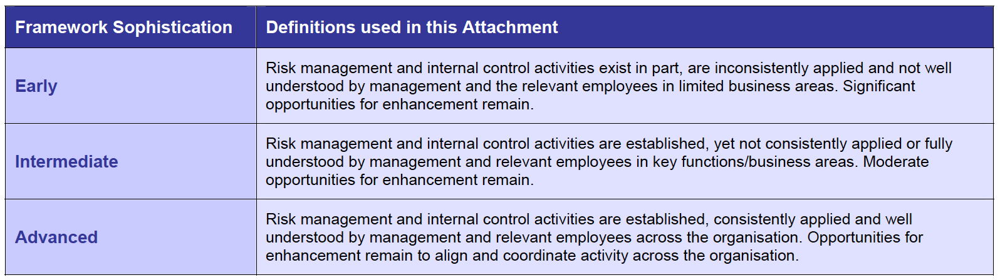

## Module Objective

Discuss the framework for risk management and control within a company

* Discuss how to adopt best practice in ERM in compliance and corporate governance

***

Focus on the process for implementing ERM successfully in an org

Themes in the module is similar to the prior modules, but in the **context of an org's implementation**, over time, of an ERM framework

Adoption of ERM must not be thought of as a one off exercise

It should be treated as a **dynamic process**, which is regularly reviewed, updated in light of internal changes and changes in the external business environment and improved as best practice regarding thinking in ERM evolves

## Application of ERM to Business

### Implementation Project Management

#### Resourcing

Company needs to decided on resources for implementing ERM:

* **Internally**:

    Current staff with risk expertise and training further staff

* **Externally**:

    Use risk professional on a consulting basis

* **Both**:

    Calling upon consultants where the org faces gaps in knowledge or needs specialist advice

Implementation of ERM typically takes several years and requires a **risk champion** (i.e. senior exec who is willing to act as project sponsor)

* Sponsor will need to judge that the benefits of an ERM program (e.g. improved efficiency and reduced loss) will outweigh the costs

#### Proportionality and the Pareto Rule

***Proportionality***

* ERM framework appropriate to one org (e.g. small auto insurer) will not be appropriate for a different org (e.g. global composite insurer)

* One size **does not** fit all

***Pareto Rule***

* To ensure ERM adds value, RM activities need to feed through into action

* Decisions on which actions to take are taken based on the data, information and analysis provided to the org decisions makers

* 80% of the effort should be in data collection, analysis and reporting

* 20% to be in the decision making

* BUT **80% of the value** of ERM **is a result of informed decision making**

Company should ensure that its ERM framework is **commensurate** with the `risks it faces` and the `size/sophistication` of the business; e.g.

* Small retail chain facing simple specific risk will not necessarily  need complex financial models and lots of resources applied to RM

* Large insurer selling a wide variety of products is likely to require sophisticated models, dedicated RM staff and extensive RM processes

#### Top Down / Bottom Up

***Different form*** of ERM implementation

* **Bottom-up**:

    Data is collected and analyzed and fed up to decision makers

* **Top-down**:

    Decision-making structure and policies etc are established and the information gathering and analysis is configured to support it

* Lam suggests that top-down is most efficient and effective

* In practice will be a hybrid of both (e.g. a top down approach that is constrained by existing systems of data recording / analysis)

### Implementation Requirements

***Key questions*** company should ask to ensure a successful ERM implementation

1. **Governance structure** and **politics**:  

    Who is responsible for risk oversight and critical RM decisions?

2. **Risk assessment** and **quantification**:  

    How (ex-ante) will they make these decisions?

3. **Risk management**:  

    What decisions will they make to optimize the risk/return profile of the org

4. **Reporting** and **monitoring**:  

    How (ex-post) will such decisions be monitored?

### Strage of Implementation

3 main ***business applications*** of RM (from Lam):

1. Loss reduction

2. Uncertainty management

3. Performance optimization

Business typically moves through these 3 stages as their RM capabilities mature

Overall combination of the 3 = ERM

#### 1. Loss Reduction

**First stage** of risk management: **protect against downside losses**

***5 types of controls*** aimed at limiting downside losses:

1. **Credit controls**:

    Reduce the probability of default and maximize recovery

2. **Investment and liquidity policies**:  

    Minimize portfolio losses and ensure liquidity, perhaps by adopting lower-risk investment policies

3. **Other internal control**:  

    Reduce the probability and severity of op-losses

3. **Audit** process:  

    Ensure the finances of the company are in order

4. **Insurance coverage**:  

    Transfer risk to 3^rd^ parties

`Loss reduction` is **necessary** but **not sufficient** for ERM

#### 2. Uncertainty Management

RM can help support a business's `profitability` and `business objectives` more positively

Sources and degree of volatility have increased greatly in recent decades while business are under pressure from their investors to reduce earnings volatility

***5 improved practices*** over loss control that may help to manage the increased volatility

1. **Credit model**:  

    Better understand credit risk, predict and make provision for losses

2. **Market risk measurement** and **management techniques**:  

    Simulation models and measurement tools, including VaR and economic capital

3. Increased **mangement of op-risk**

    Particularly `crisis management` and `prevention`

4. Improved **corporate governance policies**

5. **Wider application of risk transfer**:  

    Use `derivatives` and `sophisticated insurance products` including `ART`

Overall these developments improve the business's ability to view and understand its risks and return more **holistically** to the benefit of investors

#### 3. Performance Optimization

Final stage is to take a more **integrated** approach to risk management and to bring risk management into the **business's decision making** (e.g. product pricing strategic capital investment decisions and budgeting)

1. **Active management** of its `credit risk portfolio`:  

    Pricing for risk and disaggregating (breakdown) its credit business into distinct activities

2. **Active management** of its `balance sheet`:  

    Considering all assets and liabilities (not just in the investment portfolio) with a view to **optimzing** risk/reward trade off

3. **Re-engineering** of `processes` to minimize op-risk and to better understand and reduce costs

For financial companies, such activities are expected by regulators

### Challenges to Implementation

#### Promoting Risk Awareness

Successful strategies from improving risk awareness include:

1. Set the **tone form the top**
    
    * Critical that the CEO act as a role model by displaying the desired behaviors

2. **Ask the right questions** concerning risk

    * **Risk/return balance**

    * `Limits` and other `controls` to **minimize the downside risk**

    * **Systems**

    * **Knowledge**

3. Establish a common **risk taxonomy**

    Common language and risk classification structure ensures consistent measurement and facilitates aggregation when reporting

4. Provide **induction training** and **ongoing education**

5. **Link compensation** to `risk` to reward desired behaviors

#### Implementing culture change

Culture can only be changed effectively:

* **From the top** of the organization (i.e. led by the Board and sr management)

* On an **incremental** basis

* As the profile of **new recruits** changes the view of the staff

## ERM Maturity Models

Many version of ERM maturity models promoted by consultancies but there is no one right model

* We considered the evolution of RM practice from basic to best practice for market, credit and op-risk

* External stakeholders (rating agencies, regulators) also have a view on how sophisticated a company's ERM capabilities are

### Lam's 5 Stage ERM Maturity Model

1. **Definition** and **planning**

    Consists of organizing resources to define and scope an ERM program
      
    * Identify `internal` and `external` **requirements** for the ERM program
    
    * Obtaining Board and management **support**
    
    * Developing **overall framework** and **plan**
    
    * Appointing **key personnel**
    
2. **Early development**

    Consists of **formalizing** `roles and reponsibilities`, `identifying risks` and `education`
      
    * Establishing **ERM policies** and **risk functions**
    
    * Identifying **key risks**
    
    * **Co-ordinating** `risk` and `control processes` across the functions
    
    * **Educating** and **training** (esp. for the board)
    
3. **Standard practice**

    Consist of improving risk assessment capabilities and developing risk quanitification processes
      
    * Establishing **risk database** for events and losses
    
    * Developing **KRIs**
    
    * Establishing **risk models** for market, credit and op-risk
    
    * **Measuring** risk-adjusted performance
    
4. **Business integration**

    Consists of intergrating ERM into business management, operations and remuneration
      
    * Evaluating **business risk**
    
    * Quantifying the **cost of risk** to support pricing and risk transfer decisions
    
    * *Automating* **risk reporting**
    
    * **Allocating** capital according to risk
    
    * Using **risk triggers** to prompt business decisions
    
    * *Measuring* the **effectiveness** of ERM processes and **linking** to executive *remuneration*
    
5. **Business optimization**

    Consist of optimizing business performance, integrating ERM into strategy development and enhancing relationships with key stakeholders
      
    * Expanding the scope of ERM to include **strategic risk**

    * **Integrating** ERM into strategic planning processes

    *** Allocating capital** and **resources** to optimize risk-adjusted performance
    
### McKinsey 4-Stage Risk Maturity Model

This model focused more on outputs/benefits than on actions/processes

1. **Initial risk transparency**:

    * Compliance with basic standards
    
    * Reduction of regular surprises

2. **Systemic loss reduction**:  

    * Ability to avoid large losses
        
    * Stability to enable growth plan
      
    * Professionalized management

3. **Risk-return management**:  

    * Improved return on equity
      
    * Becoming competitive with industry standards

4. **Risk as competitive advantage**:  

    * Senior management focused on risk-adjusted performance

### Deloitte 5-Stage Risk Maturity Model

1. **Unaware/planning**: 

    * Ad-hoc / chaotic risk management
      
    * Depend primarily on individual capabilities

2. **Fragmented/specialist silos**:  

    * Reaction to adverse events by specialists
      
    * Discrete roles established for small set of risks
      
    * Basic regulatory compliance

3. **Top-down**: Tone set at the top  

    * Policies, procedures, risk authorities defined and communicated
      
    * Measurement is primarily qualitative, reactive risk management

4. **Systematic**:  

    * Co-ordinated risk management across silos
      
    * Integrated responses to adverse events, rapid escalation
      
    * Risk culture transformation underway

5. **Risk intelligent**:  

    * Risk management is everyone's job
      
    * ERM process is built into decision making using performance-linked metrics

### IAA Stages of ERM Maturity

1. **Early**

    RM and internal control activities **exist in part**
      
    * Inconsistently applied
      
    * Not well understood by management and the relevant employees in **limited** business areas
      
    * Significant opportunities for enhancement remain
    
2. **Intermediate**

    RM and internal control activities are **established**
      
    * Not consistently applied
      
    * Not fully understood by management and relevant employees in **key functions**/business area
      
    * Moderate opportunities for enhancement remain
    
3. **Advanced**

    RM and internal control activities are **established**
      
    * Consistently applied
      
    * Well understood by management and relevant employees across the organization
      
    * Opportunities for enhancement remain to align and coordinate activity across the organization
    
Appendix 2 of IAA note contains a table[^IAA-app2] describing a risk management maturity model

* Has more detail on the above 3 stages broken down by area: `role of the Board`, `RM policy`, `management accountability`, `reporting` and `monitoring`

[^IAA-app2]: ***Stages of Enterprise Risk Management Maturity***

    
    
    
    
    
    
    

***Key questions to consider*** when assessing the maturity of and ERM framework

* **The Board**:

    Role?

* **Risk appetite**:

    How well is it defined, reviewed and communicated?

* **RM policy**:

    How comprehensive is it?

* **Management accountabilities**:

    How clearly are they defined?

* **Management commitment and leadership**:

    How committed is the management to ERM?

* **RMF**:

    What responsibilities and resources does it have?

* **Risk language**:

    How well developed and documented is it?

* **Risk management culture**:

    How well developed is it?

* **Performance management and reward systems**:

    How well aligned with ERM are they?

* **Risk and solvency assessments**:

    How sophisticated are they?

* **Risk management processes**:

    How comprehensive are they?

* **Reporting and monitoring process and systems**:

    How comprehensive are they?

* **Internal audit of compliance with RM policy**:

    How comprehensive is it?

* **New activities**:

    What extent are risk management techniques applied?

* **Business continuity plans / analysis**:

    How comprehensive are they?

### Implementation case studies

Appendix 3 of IAA describes some examples of ERM programs in various business

* Successful implementation of an ERM strategy involving building a capital model in a large insurer

* Cautionary tale of an over-engineered ERM project in a large insurer

* Apparently successful ERM project in a global insurer, but one where success was measured by the quality of the process, not the quality of the impact on business outcomes