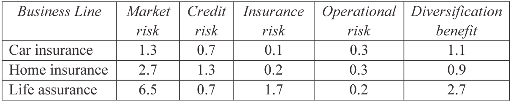

## Development Questions

1. Definition of: CRO, ART, COSO, AS/NZS 43600, ISO 3100

    See Module 33 Section "Glossary"
    
2. Define volatility and its use in ERM

    See Module 33 Section "Glossary"
    
3. Outline Basel II, SII and SOX

    See Module 33 Section "Glossary"
    
4. Outline how a factor table approach maybe used to calculate a company's capital

    * Break down a company's business into a number of specific risk types
    
    * Record the amount of business activity for each risk types
    
    * Use models to calculate factors to be applied to a specific unit of each risk type
    
    * Tables can be tailored to an individual company or industry wide tables can be used
    
    * Factors and the units of risk exposure are multiplied together and summed to determine the net capital requirement
    
    * Allowance can be made for correlation between risk types if desired
    
5. How credit risk model maybe used to assess capital requirement

    * Estimate expected loss based on historical data from company with a certain credit ratings
    
    * Companies in the same industry are assumed to behave in the same way w.r.t. credit default over a given time period
    
    * Correlations between different industry types are allowed for separately
    
    * Merton Model can be used and evaluated the chance of default based on the level of debt in the company, the current share price and the volatility of the share price
    
    * Separate model is needed to model the actual loss and loss amount given default
    
6. Main use of an internal capital model

    See Module 30 Section "Internal Capital Models"
    
7. Principle of the Merton Model

    See Module 23 Section "Merton Model"
    
8. Marginal allocation approach

    
    
    i. Gross just sum up the losses and net just include the diversification
    
    ii. Explain how the marginal approach may have been used to derive the figures
    
        See Module 30 Section "Allocation by Marginal Capital Costs"
    
    iii. Explain how this information could be used by the company
    
        * Allocating capital to LoBs
        
        * Determining appropriate risk limits for each LoB
        
        * Calculating return on capital for each LoB
        
        * Formulating investment strategies for each LoB
        
9. Capital and use of internal model

    i. Definitions of capital
    
        See Module 30 Section "Definitions of Capital"
        
    ii. Use of internal capital model
    
        See Module 30 Section "Internal Capital Models" $\rightarrow$ "Use of internal CM"
        
10. Describe the behaviors that a company with an advanced ERM program would be expected to exhibit

    See Module 31 Section "IAA Stages of ERM Maturity" links to the appendix
    
11. Description of a bunch of different risk

    See Module 33 Section "Glossary"

12. Give an example of each of the above risk

    See Module 33 Section "Glossary"

## Exam Style Questions