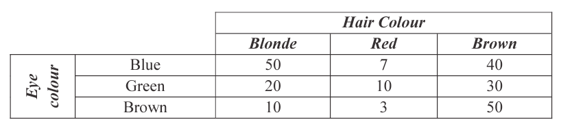

## Development Questions

1. Derive upper tail dependence on Gumbel copula given the Gumbel copula function and definition of the upper dependence

    Start with the upper tail dependence definition given:
    
    $_U\lambda = \lim \limits_{u \rightarrow 1^-} \dfrac{\bar{C}(1-u,1-u)}{1-u}$
    
    Based on the survivial copula relationship:
    
    $\begin{align}
      _U\lambda &= \lim \limits_{u \rightarrow 1^-} \dfrac{\bar{C}(1-u,1-u)}{1-u} \\
      &= \lim \limits_{u \rightarrow 1^-} \dfrac{1 - 2u + { _{Gu} }C_{\theta}(u,u)}{1-u} \\
      &= \lim \limits_{u \rightarrow 1^-} \dfrac{2(1-u) -1+ { _{Gu} }C_{\theta}(u,u)}{1-u} \\
      &= 2+ \lim \limits_{u \rightarrow 1^-} \dfrac{-1+ { _{Gu} }C_{\theta}(u,u)}{1-u} \\
      &= 2+ \lim \limits_{u \rightarrow 1^-} \dfrac{{ _{Gu} }C_{\theta}(u,u)-1}{1-u}
    \end{align}$
    
    Based on L'Hôpital's rule:
    
    * If $\lim \limits_{x \rightarrow c} \dfrac{f'(x)}{g'(x)} = A$
    
        $\hookrightarrow$ $\lim \limits_{x \rightarrow c} \dfrac{f(x)}{g(x)} = A$
        
        * *Where*: $f(c) = g(c) = 0$
    
    * We have:
    
        $f(u) = { _{Gu} }C_{\theta}(u,u) - 1$
        
        $\hookrightarrow$ $f'(u) = \dfrac{\partial}{\partial u} { _{Gu} }C_{\theta}(u,u)$
        
        *and*
        
        $g(u) = u-1$ $\Rightarrow$ $g'(u) = 1$
        
    * We also have:
    
        $f(1) = { _{Gu} }C_{\theta}(1,1) - 1 = 0$
        
        *and*
        
        $g(1) = 0$
        
    $\therefore$ we have:
    
    $_U \lambda = 2 - \lim \limits_{u \rightarrow 1^-} \dfrac{\partial}{\partial u} { _{Gu} }C_{\theta} (u,u)$
    
    Using the Gumble copula expression:
    
    $\begin{align}
      { _{Gu} }C_{\theta}(u,u) &= \exp \left\{ -\left( (-\ln u)^{\theta} + (-\ln u)^{\theta} \right)^{\frac{1}{\theta}} \right\} \\
      &= \exp \left\{ -\left( 2(-\ln u)^{\theta} \right)^{\frac{1}{\theta}} \right\} \\
      &= \exp \left\{  -2^{\frac{1}{\theta}}(-\ln u) \right\} \\
      &= \exp \left\{  2^{\frac{1}{\theta}}(\ln u) \right\} \\
      &= u^{2^{\frac{1}{\theta}}} \\
    \end{align}$

    $\therefore$ we have:
    
    $\begin{align}
        _U \lambda &= 2 - \lim \limits_{u \rightarrow 1^-} \left(\dfrac{\partial}{\partial u} u^{2^{\frac{1}{\theta}}}\right) \\
        &= 2 - \lim \limits_{u \rightarrow 1^-} \left( 2^{\frac{1}{\theta}} u^{2^{\frac{1}{\theta}}-1}\right) \\
        &= 2 - 2^{\frac{1}{\theta}} \\
      \end{align}$
      
2. *(i)* Special case for GIG with $\beta_1 = 0$ *(ii)* Calcuate $\Pr(X>0.25)$ if $X \sim Gamma(\beta = 0.05, \gamma =20)$

    i. $Gamma(2\beta_2, \gamma)$
    
        See Module 16 Section "Univariate Distribution" $\rightarrow$ "Generalized Inverse Gaussian (GIG)"
        
        Just properties of the GIG
    
    ii. Calculate $\Pr(X>0.25)$
    
        Need to convert the notations to the table
        
        * $\lambda = 1 / \beta$ and $\alpha = \gamma$
        
        $X \sim Gamma(\alpha = 5, \lambda = 20)$ then $40X \sim \chi^2_{10}$
        
        To get $X > 0.25% we consider the probability $40 X > 40 \times 0.25 = 10$
        
        Look up $\Pr(\chi^2_{10} < 10) = 0.5595$ so $\Pr(X > 0.25) = 1- 0.5595 = 0.4405$
        
3. Given joint distribution $F(x,y) = \exp\left( -\left( e^{-\alpha x} + e^{-\alpha y} \right)^{\frac{1}{\alpha}} \right)$

    i. Marginal distribution $F_X(x)$ and $F_Y(y)$
    
        $\begin{align}
          F_X(x) &= \lim \limits_{y \rightarrow \infty} F(x,y) \\
          &= \exp\left( -\left( e^{-\alpha x} \right)^{\frac{1}{\alpha}} \right) \\
          &= \exp -\left( -e^{- x} \right)\\
        \end{align}$
        
        Similarly for $F_Y(y)$
        
    ii. Value of $\alpha$ that imply independence of $X$ and $Y$
    
        Need $F(x,y) = F(x)F(y)$
        
        So $\alpha = 1$ based on formulas above
        
    iii. Derive copula function $C(u,v)$
    
        Let $u = F_X(x)$ so $u = \exp -\left( -e^{- x} \right)$
        
        Solving for $x$ we get $x = - \ln (-\ln u)$
        
        And similarly we get $y = - \ln (-\ln v)$
        
        $\therefore$ the copula is:
        
        $\begin{align}
          C(u,v) &= F(x,y) \\
          &= \exp\left( -\left( e^{\alpha  \ln (-\ln u)} + e^{\alpha \ln(-\ln v)} \right)^{\frac{1}{\alpha}} \right) \\
          &= \exp\left( -\left( (-\ln u)^{\alpha} +  (-\ln v)^{\alpha} \right)^{\frac{1}{\alpha}} \right) \\
        \end{align}$

4. 

    i. Probability function of eye color
    
        $\Pr(\text{Blue eyes}) = \dfrac{97}{220}$
        
        Do this for all color
        
    ii. Given green eyes, calculate conditional probability of red hair
    
        $\dfrac{10}{60}$
        
5. *(i)* Determine whether the matrix is positive definite *(ii)* Why valid correlation matrices are positive semi-definite

    i. See definition in Module 16 Section "Generating Multivariate Normal R.V."

        Multiply out $\mathbf{a'Ma}$ to see if the formula is always > 0 for any $\mathbf{a}$
    
    ii. Why valid correlation matrix are positive semi-definite
    
        Variance of a linear combination of 2 r.v. is:
        
        $\mathrm{Var}(aX + bY) = a^2 \sigma_X^2 + b^2 \sigma_Y^2 + 2ab\rho\sigma_X \sigma_Y$
        
        In matrix notation:
        
        $\mathrm{Var}(aX + bY) =
        \begin{bmatrix}
          a \sigma_X & b \sigma_Y \\
        \end{bmatrix}
        \begin{bmatrix}
          1 & \rho \\
          \rho & 1 \\
        \end{bmatrix}
        \begin{bmatrix}
          a \sigma_X & b \sigma_Y \\
        \end{bmatrix}'$
        
        Since variances cannot take negative values, the expression on the r.h.s must always be $\geq 0$
        
        $\therefore$ the matrix $\mathbf{M} = \begin{bmatrix} 1 & \rho \\ \rho & 1 \\ \end{bmatrix}$ must have the property that $\begin{bmatrix} s & t \end{bmatrix} \mathbf{M} \begin{bmatrix} s & t \end{bmatrix}' \geq 0$, whatever values (positive or negative) we use for $s$ and $t$
        
6. Cholesky decomposition

    $\boldsymbol{\Sigma} =
      \begin{bmatrix}
        36 & 12 & 12 \\
        12 & 53 & 34 \\
        18 & 34 & 194 \\
      \end{bmatrix}$

    Covariance must be positive definite so it can be written in the form:
    
    $\begin{bmatrix}
        a_{11} & 0 & 0 \\
        a_{21} & a_{22} & 0 \\
        a_{31} & a_{32} & a_{33} \\
      \end{bmatrix}
      \begin{bmatrix}
        a_{11} & a_{21} & a_{31} \\
        0 & a_{22} & a_{32} \\
        0 & 0 & a_{33} \\
      \end{bmatrix}$
    
    * Where $a_ij >0$
    
    We can then multiply out the matrix above and solve for all the $a_{ij}$ by setting the two matrices equal
    
    Then we get the Cholesky decomposition:
    
    $\begin{bmatrix}
        6 & 0 & 0 \\
        2 & 7 & 0 \\
        3 & 4 & 13 \\
      \end{bmatrix}
      \begin{bmatrix}
        6 & 2 & 3 \\
        0 & 7 & 4 \\
        0 & 0 & 13 \\
      \end{bmatrix}$
    
7. Generate a vector $\mathbf{X}$ with distribution $N(\boldsymbol{\mu}, \boldsymbol{\Sigma})$ where $\boldsymbol{\mu} = \begin{bmatrix} 22 \\ 13 \\ \end{bmatrix}$ and $\boldsymbol{\Sigma} = \begin{bmatrix} 36 & 18 \\ 18 &34 \\ \end{bmatrix}$ Using the pseudorandom numbers $u_1 = 0.587$ and $u_2 = 0.155$ and the Box-Muller algorithm (From p.39 of the *Tables*)

    Use Cholesky decomposition like in Question 6 and we get:
    
    $\begin{bmatrix} 6 & 0 \\ 3 & 5 \\ \end{bmatrix}
    \begin{bmatrix} 6 & 3 \\ 0 & 5 \\ \end{bmatrix}$
    
    Applying the Box-Muller algorithm with the given random numbers:
    
    $z_1 = \sqrt{-2\log u_1} \cos(2\pi u_2) = 0.58019$
    
    $z_2 = \sqrt{-2\log u_1} \sin(2\pi u_2) = 0.85372$
    
    We then set $\mathbf{X} = \boldsymbol{\mu} + \boldsymbol{\Sigma}^{1/2}\mathbf{Z}$
    
    $\mathbf{X} = \begin{bmatrix} 22 \\ 13 \\ \end{bmatrix} + \begin{bmatrix} 6 & 0 \\ 3 & 5\\ \end{bmatrix} \begin{bmatrix} 0.58019 \\ 0.85372 \\ \end{bmatrix} = \begin{bmatrix} 25.481 \\ 19.009 \\ \end{bmatrix}$
    
8. If $\mathbf{X} \sim N(\boldsymbol{\mu}, \boldsymbol{\Sigma})$ then $\mathbf{BX + b}$ has distribution $N(\mathbf{B} \boldsymbol{\mu} + \mathbf{b}, \mathbf{B}\boldsymbol{\Sigma}\mathbf{B}')$. Given that $\boldsymbol{\mu} = \begin{bmatrix} 5 \\ 3 \\ 4\\ \end{bmatrix}$ and $\boldsymbol{\Sigma} = \begin{bmatrix} 4 & 3 & 6 \\ 3 & 7 & 2 \\ 6 & 2 & 11 \\ \end{bmatrix}$. Derive the distribution of $\mathbf{BX + b}$ where $\mathbf{B} = (7 , 9, 3)$ and $\mathbf{b} = (9)$

    Just multiply everything out and we get a 1-dimentional distribution with $\mu = 83$ and $\sigma^2 = 1600$
    
9. Given covariance matrix of $\mathbf{X} = (X_1, X_2)$ is $\boldsymbol{\Sigma} = \begin{bmatrix} \sigma_{11} & \sigma_{12} \\ \sigma_{21} & \sigma_{22} \end{bmatrix} = \begin{bmatrix} 16 & 12 \\ 12 & 36 \end{bmatrix}$

    i. Calculate $\Delta(\boldsymbol{\Sigma}) = diag\left(\sqrt{\sigma_{11}} , \sqrt{\sigma_{22}} \right)$ and $\wp(\boldsymbol{\Sigma}) = \left( \Delta(\boldsymbol{\Sigma}) \right)^{-1} \boldsymbol{\Sigma}\left( \Delta(\boldsymbol{\Sigma}) \right)^{-1}$
    
        Easy just plug and play $\Delta(\boldsymbol{\Sigma})$ is just the diagonal matrix with those parameters as defined there
        
        Where $\left( \Delta(\boldsymbol{\Sigma}) \right)^{-1}$ is just the diagonal matrix with the diagonal ^-1^
        
        * I think this only works for the diagonal matrix
            
        Then just solve for the $\wp(\boldsymbol{\Sigma})$
        
    ii. Justify the assertion that $\wp(\boldsymbol{\Sigma}) = \mathbf{R}$, the correlation matrix of $\mathbf{X}$
    
        With the covariance matrix $\boldsymbol{\Sigma} = \begin{bmatrix} 16 & 12 \\ 12 & 36 \end{bmatrix}$, we can just plug the values into the corrlation formula $\mathrm{Corr}(X_i,X_j) = \dfrac{\mathrm{Cov}(X_i, X_j)}{\sqrt{\mathrm{Var}(X_1)\mathrm{Var}(X_2)}}$ and we can see that it equals to what we got above in part *i*
        
10. Describe the difference between strictly stationary and weakly stationary and give an example of each

    See Module 17 Section "Strict Stationarity" and "Weak and Covariance Stationarity"
    
11. Modeling a process and have fitted the $ARCH(1)$ model: $X_t = \mu + \epsilon_t \sqrt{\alpha_0 + \alpha_1 (X_{t-1} - \mu)^2}$ where $\epsilon_t$ is a strict white noise with mean 0 and variance $\alpha_0 > 0$ $\alpha_1 > 0$

    i. Show that for $s=1,...,t-1$, $X_t$ and $X_{t-s}$ are **uncorrelated**
    
        Uncorrelated iff $\mathrm{Cov}(X,Y) = 0 \Rightarrow \mathrm{E}[XY] = \mathrm{E}[X] \mathrm{E}[Y]$
        
        Go through the arithmetics and show that the above is true when we plug in $X_t$ and $X_{t-s}$
        
    ii. Show that for $s=1,...,t-1$, $X_t$ and $X_{t-s}$ are **not independent**

        If 2 r.v. are independent then $\Pr[f(X) \in A] = \Pr[f(X) \in A \mid Y=y]$
    
        Let $Y_t = X_t - \mu$ so $Y_t^2 = \epsilon^2_t \left(\alpha_0 + \alpha_1 Y_{t-1}^2\right) = \cdots = \epsilon^2_t f\left(Y_{t-s}^2\right)$
        
        * The bracked factor indicated is an increasing function of $Y_{t-s}^2$ since it only contains positive numbers and squares
        
        $\therefore$ for example $\Pr\left(Y_t^2 < 1 \mid Y_{t-s}^2 = 1,000,000\right) < \Pr\left(Y_t^2 < 1 \mid Y_{t-s}^2 = 1 \right)$
        
        So $Y_t^2$ is not independent of $Y_{t-s}^2$ which implies that $Y_t$ is not independent of $Y_{t-s}$ and hence that $X_t$ is not independent of $X_{t-s}$
        
12. Discuss the methods that can be used to check the goodness of fit of a chosen $ARMA$ with $GARCH$ errors model

    Need to look at the residuals from the model and there are 2 types of residuals we can assess:
    
    i. Unstandardized residuals $\hat{\epsilon}_i$ fromt he $ARMA$ model
    
        They should look like realization from a pure $GARCH$ process if fitted model is correct
        
    ii. The standardized residuals are the reconstructed residuals of the strict white noise process, which is assumed to be driving the $GARCH$ part of the model
    
        The residuals can be calculated as $\hat{Z}_t = \dfrac{\hat{\epsilon}_t}{\hat{\sigma}_t}$
        
        Where for a $GARCH(p,q)$ model:
        
        $\sigma^2_t = \hat{\alpha}_0 + \sum \limits_{i=1}^p
\hat{\alpha}_i \hat{\epsilon}_{t-i}^2 + \sum \limits_{j=1}^q \hat{\beta}_j \hat{\sigma}_{t-j}^2$

        We need some initial values to use in these equations (e.g. 0 for $\hat{\epsilon}_0$ and 0 for $\hat{\sigma}_0$)
        
        The standardized residuals should behave like strict white noise
        
        This can be tested by looking at **correlograms**, or using a **portmanteau test** (e.g. Ljung-Box) or the **turning point test**
        
13. For an $ARCH(1)$ process, show that the conditional PDF of the process is given by $g_{X_t \mid X_{t-1},...,x_0}(x_t \mid x_{t-1},...,x_0) = \dfrac{1}{\sigma_t} f \left( \dfrac{x_t}{\sigma_t} \right)$ where $f$ is the PDF of $Z_t$

    First, for $ARCH(1)$ the conditional PDF only depends on $X_{t-1}$ so the above is now just $g_{X_t \mid X_{t-1}}(x_t \mid x_{t-1})$
    
    Next we get the CDF of $X_t \mid X_{t-1}$:
    
    $\begin{align}
        g_{X_t \mid X_{t-1}}(x_t \mid x_{t-1}) &= \Pr(X_t \leq x_t \mid X_{t-1} = x_{t-1}) \\
        &= \Pr\left( dfrac{X_t}{\sigma_t} \leq \dfrac{x_t}{\sigma_t} \mid X_{t-1} = x_{t-1}\right) \\
        &= \Pr\left( Z_t \leq \dfrac{x_t}{\sigma_t} \mid X_{t-1} = x_{t-1}\right) \\
        &= \Pr\left( Z_t \leq \dfrac{x_t}{\sigma_t}\right) \text{as the }Z_t\text{ are iid} \\
        &= F_{Z_t}\left( \dfrac{x_t}{\sigma_t} \right) \\
    \end{align}$
    
    where $\sigma_t^2 = \alpha_0 + \alpha_1 x^2_{t-1}$
    
    Now we differentiate w.r.t. $x_t$ and we get the desired formula
    
14. Given the Frank copula's generator function, derive the multivariate Frank copula

    Archimedean class copulas can be expressed as:
    
    $C(u_1,...,u_N) = \Psi^{[-1]}\left( \sum \limits_{i=1}^N \Psi (u_i)\right)$
    
    So we need to derive the pseudo inverse function of the Frank function:
    
    $t = \Psi^{-1}(x) = - \dfrac{1}{a}\ln\left[ e^{-x}\left( e^{-\alpha} - 1 \right) +1 \right]$
    
    * In this case since the $\Psi(0) = \infty$, the pseudo-inverse is the same as the ordinary inverse
    
    Then by plugging in the inverse to the formula we get the desired multivariate Frank copula formula
    
15. Given $\mathbf{X} = \boldsymbol{\mu} + \sqrt{W} \mathbf{AZ}$ where:

    * $W$ is a non-negative scalar r.v. which is independent of $Z_i$
    
    * $\mathbf{Z}$ follows a $N_k(\mathbf{0}, \mathbf{I}_k)$ distribution
    
    * $\mathbf{A}$ is a $d \times k$ matrix
    
    * $\boldsymbol{\mu}$ is a vector of constants
    
    i. Find the distribution of $\mathbf{X} \mid W$ and derive its mean and variance
    
        This is a $d$ dimensional multivariate normal distribution
        
        $\mathrm{E}(\mathbf{X})$ is easy, you just plug in the formula and get $\boldsymbol{\mu}$
        
        $\begin{align}
          \mathrm{Cov}(\mathbf{X}) &= \mathrm{E}\left( \left( \sqrt{w} A \mathbf{Z} \right) \left( \sqrt{w} A \mathbf{Z} \right)^T \right) \\
          &= wAE(\mathbf{Z}\mathbf{Z}^T)A^T \\
          &= wAA^T \text{ as } \mathrm{E}(\mathbf{Z}\mathbf{Z}^T) = \mathbf{I}_k\\
          &= w \boldsymbol{\Sigma} \\
        \end{align}$
        
        So the conditional distribution of $\mathbf{X} \mid (W=w)$ is $N_d(\boldsymbol{\mu},w\boldsymbol{\Sigma})$ where $\boldsymbol{\Sigma} = AA^T$
        
        The mean is unaffected by the weighting variable $W$ but the variance is dependent on $W$
        
        $\boldsymbol{\mu}$ and $\boldsymbol{\Sigma}$ are sometimes called the location vector and dispersion matrix of the distribution
        
    ii. Explain how the mean can be allowed to vary as well as the variance
    
        This can be a normal mean variance mixture distribution where:
        
        $\mathbf{X} = \mathbf{m}(W) + \sqrt{W} A \mathbf{Z}$
        
        Where $\mathbf{m}$ is now a function that takes a scalar vector as its input and outputs a *d* dimensional vector
        
        The conditional distribution of $\mathbf{X} \mid W = w$ is now given by $N_d(\mathbf{m}(w),w\mathbf{\Sigma})$
          
16. Given a process $\left\{ X_t : t = ...,-2, -1, 0 ,1, 2,... \right\}$ is a $GARCH(p,q)$ process if it is strictly stationary and is of the form $X_t = \sigma_t Z_t$ where $\sigma_t = \sqrt{\alpha_0 + \sum \limits_{i=1}^p
\alpha_i X_{t-i}^2 + \sum \limits_{j=1}^q \beta_j \sigma_{t-j}^2}$

    i. Expressing $X_t$ in terms of $Z_t$ and $Z_{t-1}$, show that for a $GARCH(1,1)$ process $\mathrm{E}(X^2_t) = \dfrac{\alpha_0}{1-\alpha_1 -\beta_1}$
    
        

## Applied Calculation Questions

## Exam Style Questions