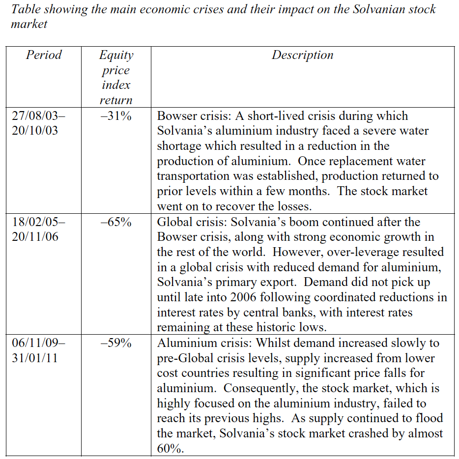
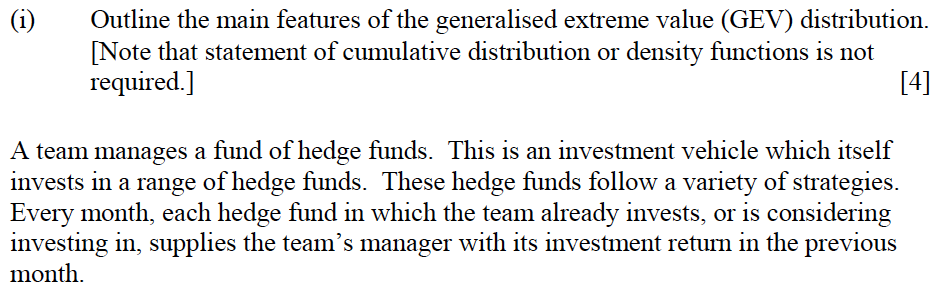
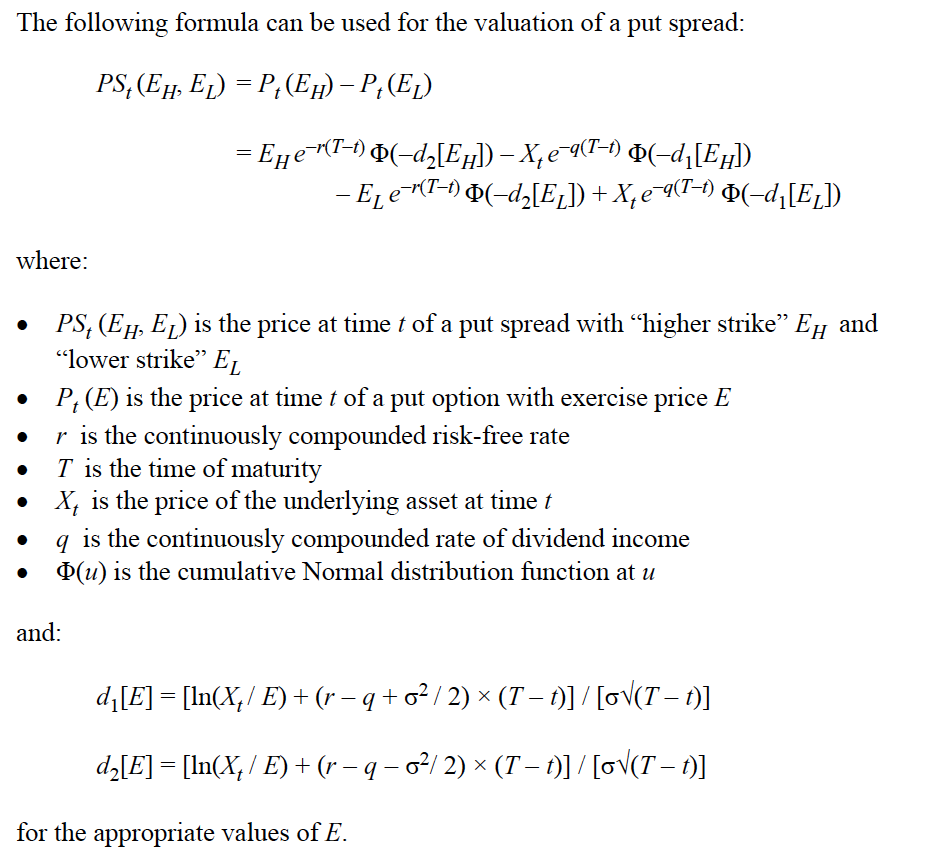

## 2016 April

[2016 April Exam](https://www.actuaries.org.uk/documents/subject-st9-enterprise-risk-management-exam-paper-april-2016)

[2016 April Examiners' Report](https://www.actuaries.org.uk/documents/subject-st9-enterprise-risk-management-examiners-report-april-2016)

### Question 1

#### Q1.i

Reasons to build an internal model for ERM

* Module 30 Section "Internal Capital Models"

* Module 21 Section "Model Development"

#### Q1.ii

Pros and cons of using standard formula vs internal model for SII

* Module 30 Section "Internal vs Generic Models"

* Key to focus is on the small size and niche risk of the company

* Make sure to discuss both sides

#### Q1.iii

Selection of models between 3 options

Some key points:

* Model 1:

    * Runtime okay
    
    * Less human error
    
    * Some approximation
    
    * Appropriate matching assets might be hard to find
    
* Model 2:

    * Least approximation
    
    * Hard to calibrate (due to high number of real world scenarios needed)
    
    * Long run time
    
    * Too complex hard to test
    
* Model 3:

    * Greatest level of simplification
    
#### Q1.iv

Additional information on the software to request

* A bunch of stuff easy

### Question 2

#### Q2.i

Propose practical cost effective ERM activities

* Make sure we're not just proposing mitigation activities

* Key is on the early steps of the ERM process and more focus on the governance

    * Identify
    
    * Risk register
    
    * Risk appetite and tolerance statement
    
    * RMC and have meetings and risk reports
    
    * Appoint risk manager
    
* Module 13 Section "Risk Identification and Assessment Process"

* Module 9 Section "Risk Management Policy"

    * Risk appetite, risk tolerance, risk limits

* Module 10 Section "Risk Reporting"

    * Not as much from here, mostly just report
    
#### Q2.ii

How bank would evaluate the credit risk of the company

* Should be mostly from Module 23 and 28

    * Module 28 Section: `Credit Granting`, `Underwriting`, `Due Diligence`

* List out the assumptions, how to access probability of default and loss given default

* Key is to have a wide range of ideas

* PD

    * Assess this for key possible reasons for default
    
    * 1 reason would be due to non payment
    
    * Another reason could be macro driven (e.g. property value < loan principal)
    
* LGD

    * Walk through what the LGD would be
    
#### Q2.iii

Improvement on corporate governance

* Module 4, 11, 12 (maybe 8 and 9)

* Some key themes

    * BoD structure
    
        * NEDs and its benefits
    
    * Incentivise the BoD
    
    * Expand shareholders
    
    * Board committees
    
    * Audit structure
    
#### Q2.iv

Risk identification tools

* Module 3

    * Section "Risk Identification Tools"
    
#### Q2.v

10 potential op risk

* List a bunch of op risk...

#### Q2.vi

Whether holding additiona capital is a suitable risk mitigation technique for op-risk

* Modeul 29 (maybe 24)

#### Q2.vii

Alternative mitigation techniques for the op-risk in v

* Modeul 29 (maybe 24)

#### Q2.viii

Modeling for flood risk

* EVT

#### Q2.ix

Information needed for modeling flood risk

* Module 20, 15

* Amount of data, for freq and sev

* Repair cost and expert judgement (for trends and changes)

#### Q2.x

Overall corporate risk exposure and importance of each risk after allowing for the impact of likely mitigation strategies

* Module 13

* Use Categorization technique to rank the risk

* State what are the objectives used to judge the risk

* Define what high risk is

* Categories of risk:

    * Operational

    list out the rating for freq and sev and any mitigations

    * Financial

    * Customer demand

    * Other

* Other considerations

    * Correlations
    
    * Company's mitigation process

* Conclusions

### Question 3

#### Q3.i

Ways to reduce financial market risk exposure without risk transfer

* Module 26, 27, 28

* Avoidance

* Diversification

* ALM

* Internal control

#### Q3.ii

ALM risk

* Module 22, 27

#### Q3.iii

Cashflow matching

* Module 22, 27

## 2015 April

[2015 Exam and Examiners' Report](#https://www.actuaries.org.uk/documents/subject-st9-enterprise-risk-management-exam-papers-and-examiners-reports-2015)

### Question 1

#### Q1.i

Assess the fitted *t* distribution

* Module 15, 16, 19

* Discuss data set size, applicability for future (regime shift)

* Shapes of the empirical

* Fitted vs empirical

* Data excludes dividend income

#### Q1.ii

Propose further analysis or adjustments

* Remove dependencies and overlap

* Longer period of data

#### Q1.iii

Assess the stress scenario picked

* See how it stacks with a normal distribution with the observed s.d.

* diversification (not bad at the same time)

* Comprae the series

#### Q1.iv

Discuss features on spread and how it should behave

#### Q1.v

Suggest possible extensions to the analysis

* Other consideration that impact the spread

* Split by industry, include other countries

#### Q1.vi

Model future risk free bond yields using PCA

* Module 22 and 16 (Maybe 19)

* Straight from the notes

* Module 22 talks about how to fit the data

* Modeul 16 talks about how to simulate with PCA

#### Q1.vii

How many PC are likely to be used

* 3: parallel shift, slope, yield curve to bend

#### Q1.viii

Currency movement impact on solvency ratio and how to hedge

* Explain why it would impact the ratio

* Propose how to hedge with forward

#### Q1.ix

Disadvantage of the above viii

* Ignores dependencies between risks

#### Q1.x

Propose alternative objectives for the currency risk hedging

* Intead of a fix 200%

* Introduce probabilitys

#### Q1.xi

Why hold captial for currency risk

* Not accounting for interdependences, regulatory requirement, counterparty risk, other assets

#### Q1.xii

How ERM will help with sovereign deft crisis before, during and after the crisis

* List out ERM benefits first

    * On risk identification, quantification, limits
    
    * Crisis plan
    
* Before crisis

    * Plan and prepare
    
* During

    * Reporting, operational effectiveness
    
    * Profit off the crisis, minimize impact
    
* After

    * Lessons learned, market confidence, contagion

#### Q1.xiii

Buying CBI insurance, risk that could arise during sovereign debt crisis (and how hard it is to quantify)

* lapse risk, new business volume, op-risk

### Question 2

#### Q2.i

Evaluate the risk culture

#### Q2.ii

Identify and analyse emerging risk

* horizon scanning

* holistic view

#### Q2.iii

Implications on diminishing natural resources

* On asset, liabilities and deficit

#### Q2.iv

Actions to take on the above

* Invest in energy and commodity

### Question 3

#### Q3.i

How to hedge the guarantee using HPI floors

#### Q3.ii

Describe the weakness of the hedge

* Basis risk (actual outperforming or underperformaing the HPI)

* High cost

* Liquidity, credit risks

#### Q3.iii

Using RPI instead of HPI

* Assess the basis risk

* Should remove trend before accessing correlation

* Time period chosen

* Difference in the cumulative increase

#### Q3.iv

Additional analysis

## 2015 October

[2015 Exam and Examiners' Report](#https://www.actuaries.org.uk/documents/subject-st9-enterprise-risk-management-exam-papers-and-examiners-reports-2015)

### Question 1

Reasons to have a global ethics officer

* Reduce, op-risk, reputational risk (examples)

* Improve future growth

### Question 2

#### Q2.i

ORSA and SII

* Quantitative, qualitative, dislosure

* ORSA: identify all risk, RM processes and controls and quntify ongoing ability to continue to meet its MCR and SCR

#### Q2.ii

Advantages of a standardized ORSA for local offices

#### Q2.iii

Challenge for pushing out standard risk report

#### Q2.iv

Scenario testing for local office based on local standard

* List both for and against

### Quesiton 3

#### Q3.i

Features of GEV

* Definition, location, scale and shape

#### Q3.ii

Fitting a GEV

* See Module 20

#### Q3.iii

Appropriateness of the GEV

* GEV assumes *iid* observations (not true, volatility cluster, different distribution due to different underlying mix)

* Lack of data

### Question 4

#### Q4.i

Risk associated with investing in the securitized bonds from solar

* Main risk is credit/counterparty risk (also discuss mitigation )

* Lower than expected revenue

    * What might impact the revenue
    
    * diversification of panels
    
* Legal risk

* Impact to the capital required

* Op-risk from lack of expertise

* Consider the limited time to make a decision and also losing first mover advantage

* Basis risk from the inflation linked

* ALM

#### Q4.ii

Suitability of asset based on the liability

* Duration

* Inflation sensitivity

* Currency

#### Q4.iii

How to set up stress test for 2 of the more material risk

* Collection of data and from where (suppliment form expert opinion if needed)

* Project historical trends and fit distribution

* How to se capital charge

### Question 5

#### Q5.i

Put option, spread, futures payoff and graph

#### Q5.ii

Pros and cons of each

* Future

    * Can fully hedge minus basis risk (best in an economic basis)
    
    * May introduce volatility due to the way Basis 1 is measured
    
    * Admissablity as well as hedging off balance sheet risk
    
    * Making margin call
    
* Put/spreads

    * Talk about the cost
    
* Other considerations

    * Exchange traded or not
    
#### Q5.iii

Justify the spread formula

#### Q5.iv

Plug an play on the put spread formula

#### Q5.v

Assess alternative scenarios under Basis 2

* look at the change in put spread price

#### Q5.vi

Impact of purchasing the put spread under Basis 1

#### Q5.vii

Stress (sensitivity) test

#### Q5.viii

Purchase or not

* Assess cost of captial

* Look at capital impact

* Internal expertise on handling derivatives

* Counterparty risk

## 2010 

[2010 Exam and Examiners' Report](https://www.actuaries.org.uk/documents/subject-st9-enterprise-risk-management-exam-papers-and-examiners-reports-2010-2014)

### Question 1

### Question 2

### Question 3

### Question 4

### Question 5

### Question 6
