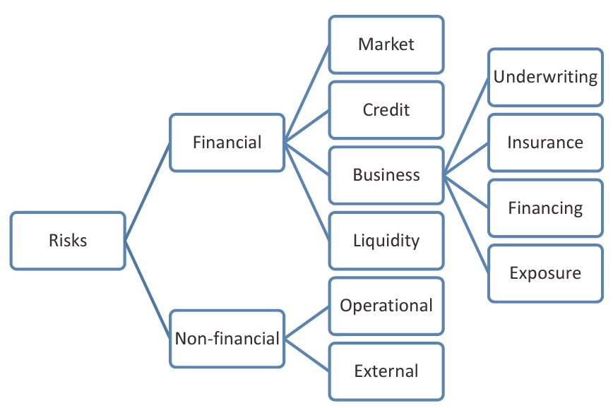

## Module Objective

Definitions and concepts of risks

Meaning of risk and uncertainty

Understanding of risk categories

* Market, economic, interest rate, FX, basis, counterparty, liquidity, insurance, operational, legal, regulatory, political, agency, reputational, project, strategic, demographic, moral hazard

Relationship between:

* systematic risk and non-systematic risk
* Specific risk and concentration risk

How contagion affects different stakeholders

## Intro to Risk Taxonomy

Risk taxonomy = definitions and categoriztions of risks

Risk = 

* Uncertainty of possible future random events
* Nature and degree of harm associated with each such event

Risk hierarchy based on Basel or SII

* Market risk: risks arising from changes in market values
* Credit risk: risk of failure oif a 3rd party to make promised payments
* Op risk: risk of loss resulting from deficient internal processes, people, or systems, or external events
* Insurance risk: risk of accepting risks which turn out to be inappropriate or pricing accepted risks inappropriately
* Strategic risk (from Lam)  
* Regulatory risk (from Lam)

Market + credit = financial risks

## Categorization of risk

List not necessarily complete

Definitions are not necessarily set in stone and can be inconsistent depending on the context (e.g. market risk)

### Market risk

* Risks from $\Delta$ investment market value
* Correlation with investment markets (e.g. interest and inflation)
* Investment market value $\Delta$ on liabilities
* Consequence of AL mismatch
* e.g. equity, commodity, FX, interest rate, basis

Sometimes can be confused with risk of lower sales or profit margins from changes in market conditions

* Here market = market where the products or services are sold

Market conditions are a fucntion of:

* Market construction:  
Size, barriers to entry
* Market participant action:  
Strategic choise (growth vs specialist penetration or diversification), method of implementation (expansion or acquisition)
* Market participant interaction:  
Price elasticity

Distinct elements of market risks:

* Risk arising from movements in own stock price related to:
    * acquisition strength and takeover risk
    * efficiency in raising capital
* Investment risks related to:
    * Interest rate risk associated with holding liquid funds in fixed income
    * ALM risk
    * Effect on pension scheme liabilities
* Uncertainty of input and output prices

Types of market risks

| Type | Cause | Characteristics | Exposed |
| ---- | ---------------------- | ----------------- | ------------ |
| Trading Risk | $\Delta$ prices or rates; Other market driven risks; Basis risks | Short term; Able to close-out or hedge in a few days | Investment bank; Dealers; Market-making energy fimrs; non-financials w/ trading book |
| ALM | Unmatched interest rate sensitivity; FX; basis | Takes longer to close out; Can be hedged more frequently | Banks; Investment banks; Insurance co.; Energy firms |
| Liquidity Risk | Inability to fund financial obligations without sizeable losses; Insufficient market capacity leading to adverse impact on market price when deal required | Short term | All companies and investors |

### Economic Risk

Risks arising from the impact of macro factors

* Aggregate supply and demand
* Government policies (own and foreign e.g. trade barriers)
* Unemployment levels
* Inflation, interest and FX
* Accomodation costs

### Interest Rate Risk

Risk from $\Delta$ interest rates

* Impact on customer behavior or financial impact

Subset of [market risk](#mkt-risk) or [economic risk](#econ-risk)

### FX Risk

Risk from exposure to movement in FX rates

Subset of [market risk](#mkt-risk) or [economic risk](#econ-risk)

Effect of FX rate movements:

* Transaction exposure: foreign revenues expressed in the home currency
* Economic exposure: prices of exported good affecting foreign sales
* Tranlsation exposure: consolidated accounts

### Basis Risk