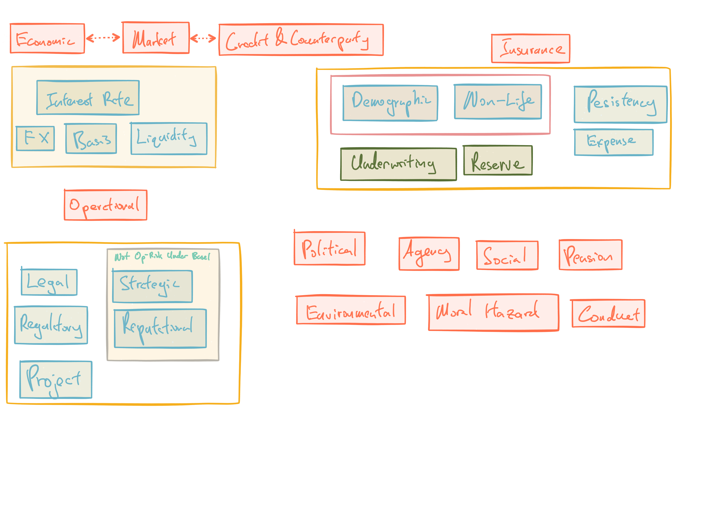

## Module Objective

Definitions and concepts of risks

Meaning of risk and uncertainty

Understanding of risk categories

* Market, economic, interest rate, FX, basis, counter-party, liquidity, insurance, operational, legal, regulatory, political, agency, reputational, project, strategic, demographic, moral hazard

Relationship between:

* systematic risk and non-systematic risk
* Specific risk and concentration risk

How contagion affects different stakeholders

## Intro to Risk Taxonomy

Risk taxonomy = definitions and categorizations of risks

Risk = 

* Uncertainty of possible future random events
* Nature and degree of harm associated with each such event

Risk hierarchy based on Basel or SII

* Market risk:  
Risks arising from changes in market values
* Credit risk:  
Risk of failure of a 3rd party to meet its obligations
* Op risk:  
Risk of loss resulting from deficient internal processes, people, or systems, or external events
* Insurance (Business) risk:  
Risk of accepting risks which turn out to be inappropriate or pricing accepted risks inappropriately

Additional major categorize from Lam

* Strategic risk:  
Risk that corporate and business strategies are flawed or ineffectively executed
* Compliance risk:  
Risk that the company may violate laws and regulations
* Liquidity risk:  
Risk that a company cannot raise cash to meet its requirements in a timely and cost effective manner

Market + credit = financial risks

## Categorization of risk {.tabset}

List not necessarily complete

Definitions are not necessarily set in stone and can be inconsistent depending on the context (e.g. market risk)

It is important to consider the root cause in risk identification and assessment

### Market risk

Market risk

* Risk from exposure to capital market
* Risks from $\Delta$ investment market value, or features correlation with investment markets (e.g. interest and inflation)
* Include investment market value $\Delta$ on liabilities
* Consequence of AL mismatch
* e.g. equity, commodity, FX, interest rate, basis

Sometimes can be confused with risk of lower sales or profit margins from changes in market conditions

* Where here market = market where the products or services are sold

Market conditions are a function of:

* Market construction:  
Size, barriers to entry
* Market participant action:  
Strategic choice (growth vs specialist penetration or diversification), method of implementation (expansion or acquisition)
* Market participant interaction:  
Price elasticity

Distinct elements of market risks:

* Risk arising from movements its own stock price related to:
    * acquisition strength and takeover risk
    * efficiency in raising capital
* Investment risks related to:
    * Interest rate risk associated with holding liquid funds in fixed income
    * ALM risk
    * Effect on pension scheme liabilities
* Uncertainty of input and output prices

**Types of market risks**

| Type | Cause | Characteristics | Exposed |
| ---- | ---------------------- | ----------------- | ------------ |
| Trading Risk | $\Delta$ prices or rates; Other market driven risks; Basis risks | Short term; Able to close-out or hedge in a few days | Investment bank; Dealers; Market-making energy firms; non-financials w/ trading book |
| ALM | Unmatched interest rate sensitivity; FX; basis | Takes longer to close out; Can be hedged more frequently | Banks; Investment banks; Insurance co.; Energy firms |
| Liquidity Risk | Inability to fund financial obligations without sizable losses; Insufficient market capacity leading to adverse impact on market price when deal required | Short term | All companies and investors |

Other market risk:  
Option risks (prepayment of mortgage), exposures to other market prices (real estate prices), etc

***

### Economic Risk

Risks arising from the impact of macro factors

* Aggregate supply and demand
* Government policies (own and foreign e.g. trade barriers)
* Unemployment levels
* (Salary) Inflation, interest and FX
* Accommodation costs

Closely related to market risk

***

### Interest Rate Risk

Risk from unanticipated  $\Delta$ in interest rates level or shape of the yield curve

* Impact on customer behavior or financial impact

Subset of [market risk](#mkt-risk) or [economic risk](#econ-risk)

***

### FX Risk

Risk from exposure to movement in FX rates

* Arise when CF received are in a currency different from the CF due

Subset of [market risk](#mkt-risk) or [economic risk](#econ-risk)

Effect of FX rate movements:

* Transaction exposure: foreign revenues expressed in the home currency
* Economic exposure: prices of exported good affecting foreign sales
* Translation exposure: consolidated accounts

***

### Basis Risk

Risk from differences in the movements of two comparable indices

* E.g. Different stock indices so that offsetting investments in a hedging strategy doesn't experience exactly offsetting movements

Risk of changes in the relative rates of two indices

* e.g. prime rate vs LIBOR

***

### Credit & Counterparty Risk

Credit Risk:

* Risk that a counter-party to an agreement will be unable or unwilling to make the payments required (Doesn't have to be bankruptcy)
* A more narrow definition:  
Risk that a borrower will partially or wholly default on repayment of debt; Only covers default and not spread risk

Counter-party risk:

* Risk that another party to an agreement fails to perform its contractual obligations (or perform in a timely manner)
* e.g. default on derivatives transaction or failure of an outsourcing company

Typically considered under the wider credit risk category or use interchangeably

* Risk of loss due to contractual obligations not being met (quantity, quality, or timing) either in part or in full, whether due to inability of, or decision by, the counter-party

Components of credit risk:

1. Probability of default (PD)
2. Loss given default (LGD)

Credit risk can sometimes include risks relating to variations in credit spreads in the market

* In Sweeting, $\Delta$ in asset value due to $\Delta$ credit spread is a market risk

Example of credit risk (Lam):

* Late payment by creditors
* Financial loss due to counter-party failure to uphold agreement
* Loss of provision or receipt of services by a 3^rd^ party (due to credit problems or bankruptcy)

***

### Liquidity Risk

Risk of not being able to meet short-term cashflow requirements

Funding liquidity risk:  
Risk of money markets not being able to supply funding to businesses when required

Market liquidity risk:  
Insufficient capacity in the market to handle asset transactions at the time when the deal is required (w/o material impact on price)

***

### Insurance Risk

Risk arises from fluctuations in the timing, frequency and severity of insured events, relative to the expectations of the firm at the time of underwriting or pricing (Mortality, morbidity, P&C risks)

* Can include persistency and expense risks for insurance companies
* Typically same as underwriting risk
    * Alternatively, u/w risk can mean risk of inappropriate selection and approval of insurance risks (for P&C company this is typically bucketed under Op-Risk)
* Lam calls this actuarial risk
    
Components of insurance risk

* Demographic risk
    * Mortality and longevity risks
    * Morbidity risks (diagnosis of critical illness)
    * Proportions married and age differences of partners
* Non-life insurance risk
    * Property or casualty risk
* Other insurance risk
    * Persistency risk (uncertainty in # of policies renewing)
    * Expense risk (expense not being as expected)
    
Further subcategory of non-life or demographic risk

* Underwriting risk (level risk):  
Risk that underlying claims incidence (and severity) is not as expected
* Reserving risk
    * Volatility risk: uncertainty due to only having a finite pool of policies (process variance)
    * CAT risk
    * Trend or cycle risk: risk of future changes in claims frequency and severity

***
    
### Operational Risk

Risk of losses resulting from inadequate or failed internal processes, people and systems or from external events

* Basel definition includes legal risk but exclude strategic and reputational risk

Components of Op-Risk:

**Process risk**

Ineffective (fail to achieve objective) or inefficient (excessive cost) processes

* Natural conflict between optimizing the two

Examples:

* Processing errors (like transaction processing) result in costs (customer turnover, loss of reputation, etc)
* Compliance is an important issue as well
* Inadequate documentations lead to costs (e.g. managing master agreements or communication with clients)
* Model and data risk (e.g. knight capital's automatic trading algorithm)

**People risk**

Staff constraints, incompetence, dishonesty or poor risk culture

Examples:

* Can't fill key positions
* Wrong people are hired/retained
* Absenteeism
* Agency risk
* Moral hazard
* Adverse selection

**System/technology risk**

Op-risk events due to systems failures, includes

* System availability, data integrity, systems capacity, unauthorized access and business recovery

It gives rise to risk because it requires significant investment, complex project management to introduce or change and effective oversight/governance

Examples:

* Out dated functionality
* Lack of sufficient access or capacity
* Unauthorized use or access to data
* Failure of technology
* Inadequate backup or disaster plan
* Software errors
* Faulty financial models
    
**Event risk**

Risk of loss due to single events that are unlikely but may have serious consequences

Can have implications for all other types of risk

Examples:

* Fraud, system failures, market dislocations, natural or man made disasters
* Business continuity risk (inadequate contingency plans)
* Ineffective internal change management (effecting a merger)
* Ineffective external change management (adapting to regulations change)
    
**Business risk** (including reputational risk)

Risk of loss that corresponds to unexpected changes in the competitive environment or to trends that damage the franchise and or operating economics of a business

Includes front office issues and is essentially risk that revenues will not over costs within a given period of time

This is heavily influenced by external factors

Examples:

* Inappropriate business strategy (e.g. refining railroad business to transportation)
* Inadequate business plans
* Change in business environment
* Results not meeting stakeholder expectations
* Damage to reputation or brand value

**Crime risk** (categorize under its origin)

* People risk (dishonest staff); technology risk (hacking); legal risk
* Other examples
* Deficient product $\Rightarrow$ liability claim
* Sub-optimal product development
* Human error $\Rightarrow$ CAT event
* Inappropriate corporate strategy
* Ineffective internal feedback mechanism

***

### Legal Risk

Risk from the understanding of and adherence to legislation, including changes in accepted interpretation

* Breaching the law (lack of awareness, understanding, changes in interpretation by courts, deliberate intent)
* Inability to demonstrate compliance

Consequences: fines, change in credit rating, loss of resources, reputational damage

Legal risks are threefold:

1. New legislation due to political or social pressures (can be +/-)
    * (+) Open up new business opportunities given that they responds to the new legislation before competitors
    * (-) Additional compliance costs or prohibit some of an organization's activities
        * Company should be aware at the earliest stage of the possibility of new legislation
        
2. Provisions in important contracts could give risk to significant problems if certain circumstances where to occur

3. Court judgement against an organization
    * e.g. Collapse of Equitable Life in UK
    * Need to consider whether the risk of an adverse legal judgement is worthwhile or not
    
Typically under Op-Risk

***

### Regulatory Risk

Risk of losses arising from changes in legislation or regulation

* May also cover compliance risk: losses due to failing to comply with existing legislation or rules

Typically under Op-Risk as it can be argue that it is a secondary-order risk that is a consequence of other primary risk factors

***

### Strategic Risk

Risks relates to the achievement of an organization's overall strategic business plans and objective

Covers all Op-Risk that might prevent an organization meeting its objectives

Basel II exclude strategic risk from op-risk (included in Sweeting though)

Need to measure and manage strategic uncertainties such as business plan assumptions, competitor responses, tech changes etc

Need to have feedback mechanisms and contingency plans to ensure the company's strategy is sound over time

***

### Reputational Risk

Risk that events of circumstances could have an adverse impact on an organization's reputation or brand value

Basel II exclude reputational risk from op-risk (included in Sweeting though)

***

### Project Risk

Risk of failure relating to a specific undertaken by an organization

Typically under Op-Risk

***

### Political Risk

Encompasses a wide range of risks

* Political decisions (social and fiscal) or indecision
* Changes in government
* Events related to political instability (terrorism and wars)

Different levels of political risk

* Micro level:  
Affecting specific firms, industry sectors, geographic regions
* Macro (national) level:  
e.g. Nationalization of an industry
* Macro (international) level:  
e.g. Potentially conflicting actions of different gov on an organization that operates across many countries (complex system of tariffs and quotas)

Boundary between risk categories can be blurred (e.g. action of a gov to devalue the currency will be both political and economic risk)

***

### Agency Risk

Risk resulting from the misalignment of interest between different stakeholders

* Can mean the specific risk that the management of an organization will not act in the best interest of other stakeholders
* (Systemic) bias, like overconfidence

(See Mod 11 for more)

Can be under people risk (Op-Risk)

***

### Demographic Risk

Risk arises from demographic changes such as mortality rates, impacting both customers and employment

Can be under: 

* Insurance risk
* Op-Risk (e.g. Not being able to fill key staff positions)
* Market risk (e.g. reduction in the size of the company's target market)

***

### Moral Hazard Risk

Action of a party who behaves differently from the way they would behave if they were fully exposed to the consequences of that action

Party behaves inappropriately or less carefully than they would otherwise, leaving the organization to bear some of the consequences of the action

Related to information asymmetry, with the party causing the action generally having more information than the organization that bears the consequences

***

### Conduct Risk

Risk that relate to directly to the relationship between a company and its customers

* Can include operational failures (e.g. poor control of distribution and/or servicing), information asymmetries, keeping pace with regulatory requirements and customer needs, market conditions, product development activities and strategic objectives

***

### Other Risks

List so far not exhaustive and they are non mutually exclusive either

**Environmental Risk**

Risk related to resources (regulation on use, depletion etc) and pollution (emission quotas, consequences of non-control)

Consequences with pollution:

* Fines, reputational damage, business interruption, global warming

**Social Risk**

Due to uncertainty over the future characteristics of a population

* Age profile, educational standards, health standards, economic wealth, attitudes and lifestyles

**Pension Risk**

Risk of losses to the sponsoring company due to unexpected shortfall of the value of the pension scheme's assets vs liabilities

* e.g. from poor investment returns, improving mortality
* Can derisk by switching to DC plans or buying-out liabilities or annuity contracts with insurance company

**Culture Risk**

* Corporate culture that limits innovation and resists change

**Residual Risk**

Risk that remain once any action has been taken to treat the risks

***

Maybe move to Mod 29

Pros and cons of **outsourcing**

* Pros:
    * Specialist organization can increase capacity, reduce costs, time, better quality etc.
    * Transfer operational and other risks to the 3^rd^ party
* Cons:
    * Introduce new risks e.g. legal
    * Lose direct control over the risks now being experienced and managed in the outsource (product quality)

***

## Consistency of Categorization

The precise categorization of a risk will be dependent on the context

Different definitions of Market Risk

* Risks related to $\Delta$ in investment market values and other factors correlated with such values (e.g. interest rates), or;
* Risk related only to stock market prices or more broadly to include interest rate risk, or;
* Risk of lower sales due to $\Delta$ in market conditions, where the market is where produces and services are sold

Different definitions of Credit Risk

* Risk of fluctuations in the value of corporate bonds due to changes in the credit spread can be either market or credit risk
* Credit risk and counter-party risk are use interchangeably sometimes

Different definitions of Business Risk

* All risks to which businesses are exposed
* Subset of risks which are specific to the type of business undertaken (e.g. insurance risks for insurance co.)

Other examples

* Actuarial risk can be risk of an investor failing to meet their objectives or insurance risk
* Insurance and u/w risk can the same thing sometimes
* Op-Risk doesn't really have a single definition
* Demographic risk can be an Op-Risk (people risk of not being able to fill key positions) or market risk (reduction in the size of the company's target market)
* Crime risks can be bucket based on the nature of the crime
* Earthquake will be an insurance risk for a P&C company while it'll be an external event under Op-Risk for a bank

## Systematic & Non-Systematic Risk

**Systematic risk**:  
Risk that is not diversifiable or which cannot be fully diversified because it affects a large number of quantities of interest

* Systemic can means the same but is often used more specifically to refer to the risk of problems spreading between entities following a trigger event (basically contagion risk)

Example:

* Market return, as the prices of all stocks are linked to some extent to the average market return
* Industry specific risk can not be fully diversify as there is a limited number of sectors to prevent complete diversification
* Pension liabilities that are linked to market interest rate

**Non-systematic risk**:  
Risk factors that are uncorrelated with or possibly independent from other sources of risk

* These risk are largely diversifiable

Example:

* The $\alpha$ individual company return component of the return on individual shares
* Typical insurance risks that we pool together

**Situation-Dependent Risk**

Risks might be uncorrelated in normal market conditions, but correlation might arise under extreme stress

A lack of past correlation might just mean that they are non-systematic under the conditions prevailing during the period of observations

**Concentration of Risk**

Concentration of risk can arise from:

* Inability to diversify risk (either self or externally imposed constraints)
* Deliberate decisions (taking advantage of risk as a opportunity)
* Poor risk management

Concentration of risk was the contributory factor for many risk management disasters

## Contagion

Financial contagion:  
Situations where financial losses in one company or sector or country lead to losses in another (can also be refer to as systemic risk like in Lam)

There are market wide contagion risks that can affect and destabilize whole sectors, particularly financial institutions

* Risk faced by institutions are often intertwined
* Institutions, markets and countries' economies are often interdependent

Example:

* Failure of a commonly used financial infrastructure (like VISA cards)
* Funding liquidity risk as we saw in 2008
* Common market positions, where a change in share price results in further change (e.g. short squeeze)
* Exposure to a common counter-party, where a failure in one organization causes another to fail or creates a lack of confidence in the sector
    * E.g. Default of a company and lead to its creditors and suppliers experience financial difficulties and create a chain reaction
    * Therefore some institutions are "too big to fail"
* Credit contagion when failure of one bank leads to losses at another; Market participants reduce the amount of credit available due to imperfect information about the scale and location of losses $\Rightarrow$ Increase the likelihood of further bank failure

Loss of reputation and confidence can precipitate collapse

* Event doesn't have to cripple the company but just triggers a death spiral
* e.g. run on bank
* Modern technology driven media can further increase the speed of collapse

Contagion can arise from many investors using the same flawed logic

* Financial economics has only been around for 100 years and some of its theories are still at a relatively early stage of development
* E.g. Quant Fund crisis in 2007