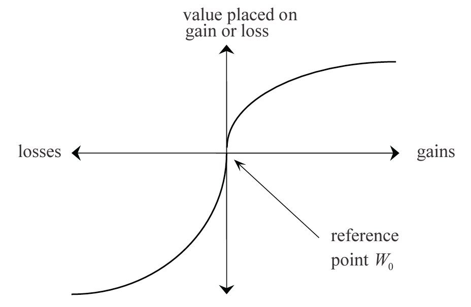

## Module Objective

Describe how to determine a company's risk appetite, risk capacity and risk objectives

* Describe how a board might express and communicate its expectations and requirements by means of a **risk policy** (including risk appetitie statement)
* Consider how an organization may assess and describe its risk appetite
* Consider how an organization maybe make use of a risk appetite statement when managing its risks (including establishing risk tolerances)

Exam note:  
Will need to demonstrate how to articulate a desired risk appetite and profile; demonstrate understanding of how business decisions both reflect and instigate changes in the risk profile, particularly taking into account the balance between risk and reward

## Terminology

Definitions varies, so best to focus on the underlying principles

***Risk Profile***  
Complete description of the risk exposures of an organiztion

* Includes: Risk that might emerge in the future and that will affect the current business of the organization

***Risk Exposure***  
Maximum loss that can be suffered if a risk event occurs

***Risk Appetite***  
Reflecting the setting of targets and limits across the organization as a whole + the breakdown of these high level statements into more detailed risk tolerances

* Lam regards risk appetite as a desire/target level of risk

***Risk Tolerance***  
A more detailed set of statements (from risk appetite), many quantitative or statistical in nature (May apply to specific categories of risk and/or units of business)

* Note that IAA use risk tolerance to refer to higher level board statements
* Lam regards risk tolerance as the maximum for the organization

***Risk Limits***  
Group of guidelines that set limits on acceptable actions that might be taken today

* Each BUs need to work withint the risk limits to be deemed working within it permitted risk tolerances
* Risk limits is a component of risk capacity

***Risk Capacity***  
Volume of risk that an organization can take as measured by some consistent measure e.g. economic capital

* If there's spare capacity, then we can take positive actions that add economic value to the organization w/o breaching existing risk tolerances or risk limits

***

Note that IAA and Lam uses different terminology from the above

Regardless of the definitions, the key is to establish risk management policy with clear statements as to:

* Upper bound for risk exposures (can be driven by regulators, legislative limits, or stakeholders preferences)
* Current risk exposures
* Desired risk exposures
* Breakdown of the upper bound and risk targets into more detailed statements
* Detailed operational guidelines for managers so that they can ensure the boundaries are not breached

The risk appetite (amount of risk the organiztion is willing to take) can be considered as the lower of the organization's risk capacity and its desired risk exposure/profile

* $\text{Risk Appetite} = \mathrm{min}[\text{Risk Capacity}, \text{Desired Risk Exposure/Profile}]$

Operationally, risk managers should ensure that the people they work with all have a common understanding of the terminology being used in discussions

* Failure to do so is an example of an operational risk

## Utility Functions

Ultility function is an expression of risk aversion

* Useful when considering a companies' risk appetite

***Utility Function***

$u: \mathbb{R} \rightarrow \mathbb{R}$

Measure of happiness (or satisfaction) as a function of wealth ($W$)

Different org. or indiv. will have their own utility funtion $u$

* Each will gain a certain amount of satisfaction from a given amount of wealth

$\therefore$ Each will have a different attitude to potential gains or losses when presented with a certain risk/reward opporunity

**Features**:

* Monotonicaly increasing i.e. more is better
* Concave down so the amount of marginal utility decreases with marginal increase in wealth e.g. people are risk averse

**Absolute risk aversion**:

$a(W) = - \dfrac{u''(W)}{u'(W)} > 0$

**Relative risk aversion**:

$r(W) = W \times a(W)$

### Common utility functions

***Quadratic***

$u(W) = \alpha W - \dfrac{1}{2}W^2$

* Maximize expected wealth subject to volatility
* Increasing absolute and constand risk aversion i.e. $a(W)$ increase with $W$

***Exponential***

$u(W) = - \dfrac{e^{-\alpha W}}{\alpha}$

* Constant absolute risk aversion i.e. $a(W) = \alpha$
* Increasing relative risk aversion

***Power***

$u(W) = 
  \begin{cases}
    \dfrac{W^{1-\alpha}}{1-\alpha} & \alpha > 0, \alpha \neq 1 \\
    \mathrm{ln}(W) & \alpha = 1 \\
  \end{cases}$

* Decreasing absolute risk aversion
* Constant relative risk aversion i.e. $r(W) = \alpha$

***

Power utility function can be more intuitively attractive than exponential or quadratic

* Exponential and quadratic has increasing absolute risk aversion
    * This is unlikely to be realistic as it implies an investor with a risky and risk-free asset would choose to decrease the nominal amount of the portfolio held in the risky asset if they experience an increase in wealth
* Constant relative risk aversion of the power function is intuitively attractive
    * The implication is that investor with a risky and risk free asset will choose to keep unchanged their asset allocation if they experience an increase in wealth
    
### Propsect Function

S-shaped and measured relative to some starting reference point $W_0$

* Above $W_0$ the utility curve is concave in $W$
* Below $W_0$ the curve is convex

**Advantages of a prospective function**

* It consider the investor's starting point for their wealth $W_0$
    * More realistic: Decision makers tend to be risk seeking when facing losses and risk averse when facing gains
* At either end the curve flatten (0 risk aversion) reflecting ambivalence to extremes of additional gains/losses in wealth

## Risk Management Policy

Risk management policy:  
Sets out how an org. will manage each category of risk to which it is exposed

Includes the following 3 sections

****Objective and definitions***

* **Aim** of the ERM activities (e.g. how it links to the company's objectives and strategy, benefits, success criteria)
* Statement of the organiztion's philosophy as to risk management (e.g. **guiding principles**) and **desired risk culture**
* Risk categories and definitions (**taxonomy**)

***Risk management structure***

* **Role** of risk managers (e.g. CEO, CRO, exec. mgrs, risk sponsors, risk owners, risk committee members)
* **Structure** of the corporate governance (e.g. committee roles, delineation of accountabilities)

***Risk management processes and benchmarks***

* Overview of each stage of the risk managment process
* Risk appetite and tolerance statements
* Risk policy standards, to ensure risk policies are consistent across the org.

***

Policy generally cover a similar time period to that of the company's business plans (3 to 5 years) and should be reviewed at least annually

## Expressing Risk Appetite

Risk appetite: degree of risk that an org. is willing to accept in order to achieve objectives

* Reflect the org. capacity to absorb risk

**Factors** that impact the company's risk appetite:

* Objective and culture
    * Consideration of the level and types or risk that are desired in order to meet objectives (including objecives of value creation and growth)
* Current overall business environment
* How successful the company is currently
* Risk tolerance (i.e. how much risk the org. is prepared to retain or how much variability it is prepared to withstand)

Cleary articulated risk appetite can then be translated into a desired risk profile for the org.

* Not an easy task especially for multinational org. with numerous semi-autonomous subsidiaries

Job of the risk mangers (and all managers):  
Work towards the desired risk profile through taking actions at the org. level, at the level of individual LoB, and with reference to individual risk categories

Key role of the RM function:  
Establish at Board level the company's appetite for risk and to translate this guidance into a set of risk tolerances for the whole of the org.

Difficult to set tolerances with many subsidiaries

* One way to spread the risk appetite is to require business units to bid for a chunk of the company's overall risk appetite

***Board's Role***

Successful RM operation requires the active interest of the Board

* Process of establishing risk appetite and risk tolerance is therefore part of this engagement

Board's expression of its risk appetite need not to be complex, can be expressed as a short and clear set of statements related to one or more measure of risks

* Company's solvency level
* Credit rating
* Earnings and ability to pay dividends
* Economic value
* etc

The statement often needs to be translated into a more probabilistic statement as breaches can not be completely prevented

e.g.  
The solvency level *SCR* should stay above *140%*  with *99.5% probability over *one year* horizon  
Probability that the company's credit rating is reduced from AAA to A or worse in the next 12 months should be < 1%  
[Other examples](http://www.lloydsbankinggroup.com/globalassets/documents/investors/2014/2014_lbg_annual_report.pdf)

Board may express their risk appetite using a combination of statements linked to several metrics

Lam shoes one potential template for a risk appetite statement subdivided by risk type (strategic, financial, operational, compliance, reputational, etc)

### Example of Risk Appetite Statements

From [Lloyd's banking](http://www.lloydsbankinggroup.com/globalassets/documents/investors/2014/2014_lbg_annual_report.pdf)]

Credit risk:

Credit risk appetite is described and reported on a monthly basis through a suite of Board metrics derived from a combination of accounting and credit portfolio performance measures, which include the use of credit risk rating systems as inputs...

The metrics cover but are not limited to geographic concentration, single name customer concentration, mortgage exposure, Loan to Value ratios (LTVs), higher risk sector concentration, limit utilisation, leveraged exposure, equity exposure, affordability and the quality of new lending

Conduct risk:

The Group has no appetite for systemic unfair customer outcomes arising from any of its activities: through product design, sales or other after sales processes

Operational risk:

The Group’s Operational risk appetite is designed to safeguard the interests of customers, internal and external stakeholders, and shareholders. Appetite is expressed through six high level statements summarised below, each of which are defined with limits and triggers approved by the Board, and are regularly monitored by executive and Board risk committees

Financial loss: The Group does not expect to experience cumulative fraud or operational losses above a defined level of budgeted Group income, or individual losses above a defined amount

### Different Stakeholders

Different stakeholders have differnet risk tolerance (e.g. bondholders have lower risk tolerance than equity investors)

Board might state different objectives each with different stakeholders in mind, e.g.

* Reference to solvency level will be relevant to policyholders and regulators
* Earnings and dividends will be relevant to others such as equity investors
* As a variant, express the objective to maximize economic vallue for s/h subject to one or more constraints that focus on the p/h or regulators (e.g. keeping solvency level > than a threshold with a given probability)

Risk tolerances of different stakeholders will be difficult to determine

* Possible to use utility (or preference) function but that can be equally difficult to express

## Translating Risk Appetite to Action

## Establishing Risk Tolerances and Risk Limits

