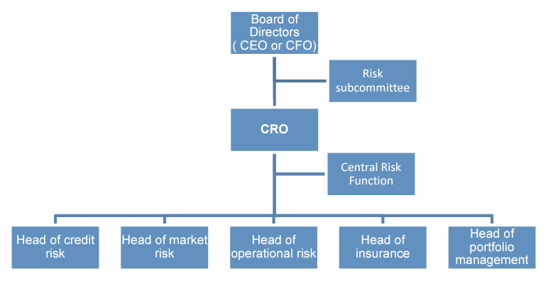

## Module Objective

Discuss the framework for risk management and control within a company

* Describe governance issues including market conduct, audit and legal risk

Describe and assess the elements and structure of a successful risk management function, including the ERM roles and responsibilities of the people within an organization, and how the different groups should interact, and recommend a structure for an organization's risk management function

***

Recall Mod 4:  
Risk subcommittee should have at least one risk management expert, usually the CRO

Recall Mod 8:  
3 lines of defense, risk management function and role of CRO

This module will deep dive into:

* Role and responsibilities of the CRO
* Issues to consider when establishing a risk management function (RMF) or central risk function (CRF)
    * How to embed risk management within an organization
    * Issues regarding the relationship between business managers and risk management staff
* Compliance
* Audit

## CRO

Need to have effective risk governance structure at Board level

CRO needs to improve the effectiveness of an org.'s RM function by:

* Filling in any gaps in the skill, knowledge and/or experience in a management team
* Providing additional resources for a risk management function
* Being prepared to escalate issues directly to the Board w/o fear or prejudice to their own job security or remuneration

### Corporate Structure

CRO will either sit on the Board or will report to the Board through the CEO or CFO

Important that the relationships between the CRO and other C suites are unambiguous

CRO reporting to the CFO or CEO may mean conflicts of interest inhibit communication to the Board

* Added "dotted" lines can help address this if there is a clear risk escalation rules and communication protocols are established

***Risk subcommittee***

Delegated responsibility from the Board to risk management strategy and policies and monitoring

Independent from the day-to-day business and those appointed to it should be suitably qualified

Need to have clearly defined and distinct account abilities, responsibilities, and relationships between the Board, risk subcommittee, CRO and line management

Board needs to retains overall accountability for risk management even with the risk subcomm.

* Delegation should go to the risk subcomm. and not the audit subcomm.

### CRO Responsibilities

CRO is accountable to the Board for developing, implementing and maintaining an ERM strategy

* Managing the various risk functions
* Providing leadership and direction
* Designing and implementing and ERM framework across the company
* Ongoing risk policy development
* Risk reporting (int. and ext.)
* Allocating capital across the firm
* Communicating with stakeholders about the org.'s risk profile
* Developing systems to analyze, monitor and manage risk

See IAA app 5 for more on the roles and responsibilities of CRO and job specification

### Key Skills Required

Key skills required of CRO

* Business acumen
* Act professionally in the long term interests of the org.
* Relevant industry experience and knowledge

Further more from Lam

* Leadership:  
To develop the ERM vision and recruit/retain a risk management team
* Communication skills:  
Influence and persuade the business about ERM
* Stewardship:  
Ability to act as a guardian of the org.'s assets
* Technical competence:  
To manage financial and operational risks
* Consulting skills:  
To influence and educate the Board and implement policy

More from Lam (not on syllabus) on criteria for a risk management expert

* Understanding risk management and governance:  
Setting risk appetite, risk policies and reporting
* Knowledge of relevant regulation and legislation
* Experience of identifying, assessing and managing risk
* Knowledge of ERM and business inter-dependencies
* Ability to lead, advise the Board and challenge management on risk strategies

### Initial Priorities

Bring together existing disparate risk related teams or functions to operate under a common framework

Need to establish:

* Clear understanding of the company's risk tolerance
* Management's compensation is aligned with prudent risk management
* Good risk reporting channels, so that risks are assessed and information about them is shared in a timely manner
* Whether there are any gaps in the skills, capability and experience of the team
* Whether each part of the insurer's business increase its overall value
* Risk management to linked into capital management, pricing and reserving
* Whether the quality and extent of the information given to stakeholders enables them to assess the financial condition of the insurer
* Robust governance structures
* Whether the risk management operating model is appropriate

CRO will need to:

* Establish a close working relationship with the CFO
    * They each have a role to play to make earnings more predictable and less likely to reduce in future
* Authority within the organization (on, or close to the Board)
* Understand the insurer's key stakeholders and drivers of performance

## Risk Management Function

### Central Risk Function

RMF can be a team with distinct functions from different part of the business

Dedicated CRF is key for successful governance models

* Reports to the Board through the CRO
* Team of specialist risk managers (or just 1 in a small org.)
* CRF does not manage risk itself (it's responsibilities of line managers)

Roles of CRF:

* Give advice to the Board on risk
* Assess the overall risk being run by the business (accounting for hidden risks and correlations and general uncertainty)
* Compare the overall risk being run by the business with its risk appetite
*  Act as a central focus point for staff to report new and enhanced risks
* Give guidance to line managers about the identification and management of risks
* Make suggestions for risk responses
* Monitor progress on risk management
* Pull the whole picture together

### Relationship Between Lines of Defence

Recall from Mod 8

* 1st line: line management staff in the BUs
* 2nd line: CRO, CRF and compliance team
* 3rd line: Board and IA

#### Relationships between 1st and 2nd

***Offence vs defence***

Setup in opposition of each other

* BU maximize income
* RM minimize losses

Disadvantage

* Destructive relationship
* Damaging to the org. as BU and RM have opposing objectives and incentives

***Policy and policing***

BU operate within rules set by R< function and policed by the RM, audit and compliance functions

Disadvantage

* Policies can become outdated as the RM function is not in touch with day-to-day operation
* Audit and compliance review do no occur continuously so may fail to identify problems
* Friction between line management and RM as each fails to understand the others POV
* Line management may have little incentive to report problems, policy violations and issues where it is uncertain whether a violation has occurred
    * Issue is mitigated somewhat by arguments of "greater good" or if incentives are linked to policy compliance and reporting violations

***Partnership***

RM staff are integrated into the BU and the 2 functions share some measures of performance

* BU and RM staff work together in a client-consultant type relationship to manage risk
* BU must recognize the benefit to long term performance of a RM function
* RM staff must recognize the importance of their role as consultants (i.e. meeting the needs of the BU)

Disadvantage

* Independence may suffer
* Difficult for RM staff who are integrated into the BUs to have a corporate oversight role

***

Appropriate governance structure depends on:

* Structure of existing committees and decision making bodies
* Size and nature of the business
* Risk faced by the business
* Autonomy and accountability of the elements in the current corporate structure
    * e.g. if individual BU are fun autonomously, the RM function needs to support each individual BU, rather than only operating at the "whole organization" level
    
Solution: Mix organizational structures

* Large business' RM function may need to split between central team and units embedded in each BU
* Important to ensure there is no "silo" mentality
    * Matrix reporting framework (each member reports to a number of people across the business) can help avoid the silo mentality
    
Risk management committees should include both BU and RM staff

### Challenges in Relationship Management

4 **key challenges** in managing the relationship between BU and RM staff

* Conflict and conflict resolution
    * Conflict arise from different perspective of risk (opportunity for profit or loss?)
    * BU will want to increase volumes and pricing based on marginal cost; Finance will want to grow revenue and control risk and argue for full cost pricing
* Management of RM staff within BUs
    * RM staff embedded may not be trusted by BU staff (stuck between 2 opposing sides)
    * Best if the RM staff report to the BU head and have a dotted line to CRO
    * CRO should have input into the performance review of the risk management staff embedded in BU
* Aligning incentives
    * Can reduce conflict
    * In practice it is difficult to design a suitable performance measurement and incentive systems
* Measuring operational risks
    * Op risk can be difficult to assess and take into account in performance measurement systems
    * Important to ensure a common taxonomy around op-risk to help minimize the risk of confusion

### Skill Required within Risk Function

5 key skills

* Project management
* Change management
* Relationship management
* Technical expertise
* Implementation

## Line Management

Sustainable ERM framework requires support by:

* Process for engaging with BUs
* Common risk taxonomy
* Standard risk management processes
* Appropriate incentives for employees (linked to agreed behaviors)
* Clear monitoring and risk reporting

Risk management should be incorporated into line management processes (incl. business strategy, new product dev., product pricing, business performance measurement and remuneration)

### Business Strategy

RM should be considered when developing the plans and strategy for each BU (i.e. **ask risk-foucsed questions**)

* What risk may prevent us from achieving our objectives
* How to assess and monitor these risk
* How to mitigate or transfer these risk
* What level of risk adjusted performance to expect
* What risk limits/tolerances should be adopted
* Who will measure and monitor the risks involved

**Benefits** of addressing the questions above:

* BU will focus on their key risks and way to mitigate them
* Management receives advance warning of changes in the risks to which the company is exposed
* Encourage RM and line management staff to work together at early stage in a project to address risk and business issues
* Promote effective risk management by linking high level business objectives and risk appetite to risk reporting (KRIs linked to KPIs)

### New Product/Business Development

Product development decisions rely on many assumptions about the business (e.g. likely sales, cost, etc)

How to manage the risk that these assumptions do not pan out

* Set **trigger points** for each assumption that will trigger a specific action or plan when breached
* Set specific risk committee for new product and business development, particularly when expanding into new/foreign markets

### Product Pricing

Pricing should account for all cost of risk

* Expected losses
* Cost of capital
* Cost of risk transfer

Inaccurate pricing can lead to (adverse) selection

### Measureing Business Performance

BU's performance should be risk adjusted (as with the BU's goals)

Balanced scorecard integrates business and financial reporting and should also incorporate risk assessment along with 

* Finance
* Key stakeholders
* Growth
* Learning
* Internal business processes

### Risk Incentive Compensation

Link between executive comp. and RM should be disclosed

* incl. salaries, incentive based comp. and stock options

Comp. arrangements should not encourage excessive or inappropriate risk taking

If practical, clawback provisions should be implemented to recoup incentive based comp. if risk taking, with hindsight was deemed excessive

## Compliance

Typically a separate function in financial services

Compliance with relevant laws, rules and regulations is a responsibility for all companies and their employees

### Complaince Process

Requires good knowledge of the legislation and other rules that the org. must comply

* e.g. stock exchange reg., accounting standards, etc

Traded companies need to observe market conduct standards

Consequence of failings

* Loss of reputation
* Entail providing insider information to outside investors
* Provision to the market of false or misleading information

Need systems to prevent abuse

M&A requires additional compliance

If not fully compliance, risk of non-compliance must be identified and plan should be drawn up for achieving compliance within a suitable timescale

Need to decide whether to notify regulators in case of non compliance

Need to monitor progress towards compliance and take corrective action if necessary

Penalties for non compliance can be severe

e.g. see example on employee killing someone driving on company business

## Audit

### Internal Audit

IA review the risk management process (on top of checking financial transactions and information)

IA responsibilities examples

* Monitor compliance with laws and regulations
* Check for system errors
* Look for non-observance of internal governance codes
* Examine key spreadsheets to be free of errors
* Examine procedures for paying insurance premiums on time, observing insurance conditions, and ensure that there is no risk of an org. being left uncovered when a claim arises
* Review the effectiveness of risk management decisions and investigate risk management failures

###External Audit

Validation of the RM process by a separate entity

* May be required by regulator (Basel II, SII)
* Potentially provides an additional source of learning